# app-client（外壳。Tauri的命令、状态机、启动与后台的队列、与OS的接点）

## 承担的节
- 第1章：[6.1 应用的层](../../../../docs/cn/design/01_基本设计书_整体结构.md#61-应用的层)、[6.2 界面与核心之间](../../../../docs/cn/design/01_基本设计书_整体结构.md#62-界面与核心之间)、[7 运行时的场景](../../../../docs/cn/design/01_基本设计书_整体结构.md#7-运行时的场景)（启动的顺序与8个状态、7.1〜7.9）、[9.3 单一启动](../../../../docs/cn/design/01_基本设计书_整体结构.md#93-单一启动)
- [第2章 2.1 输入的步骤](../../../../docs/cn/design/02_基本设计书_签名信息与比对.md#21-输入的步骤)
- 第9章：[2.3 “清除此终端的记录”的步骤](../../../../docs/cn/design/09_基本设计书_分发与更新.md#23-清除此终端的记录的步骤)、[4.1 流程与状态](../../../../docs/cn/design/09_基本设计书_分发与更新.md#41-流程与状态)、[4.5 失败与劫持](../../../../docs/cn/design/09_基本设计书_分发与更新.md#45-失败与盗用)、[5 获取途径](../../../../docs/cn/design/09_基本设计书_分发与更新.md#5-获取途径)（随身套件的制作）
- [第10章 8 与OS的集成](../../../../docs/cn/design/10_基本设计书_界面与设计.md#8-与操作系统的集成)
- [第1章 13 终端与人](../../../../docs/cn/design/01_基本设计书_整体结构.md#13-终端与人)（多台终端・继承・仅用于核验的人的状态。备份的内容为core-backup，对齐为core-sync）
- 只读：第10章 3.1・3.2（界面与迁移。命令的群组与界面对应）、第1章 10.6（输入的确认）、第11章 4.1（Tauri的插件）。

## 依赖
- 下层：全部区块（[core-common](core-common.md)、[core-store](core-store.md)、[core-net](core-net.md)、[core-hash](core-hash.md)（SHA256SUMS）、[core-image](core-image.md)（QR图片的确认）、[core-render](core-render.md)（线索的PDF）、[core-identity](core-identity.md)、[core-mark](core-mark.md)、[core-sign](core-sign.md)、[core-rights](core-rights.md)、[core-work](core-work.md)、[core-case](core-case.md)、[core-guidance](core-guidance.md)、[core-ref](core-ref.md)、[core-backup](core-backup.md)、[core-sync](core-sync.md)）。不持有业务的判断，接收命令后交给业务的区块，并把通知发送到界面（第1章 6.1）。
- 上层：[ui](ui.md)（调用命令，订阅通知。依赖的反转为`Event`的类型由本区块定义）。
- Linux密钥存储口令（第2章 7.5）的强度：因core-identity不依赖core-backup，由本区块先通过`PassphrasePolicy::check`（B-245）后再传给`Keystore::unlock`。
- 与外部的边界：B-331（分发物的获取。Tauri的更新组件）、B-336（opener：`mailto:`、URL、`.ics`）、B-339（OS的通知）、B-340（deep-link、保存文件夹的监视）、B-341（OS代码签名的验证）。
- 跨区块的接线由本区块进行：把参考信息（core-ref）传给core-case・core-guidance・core-identity，把个人根证书重新制作（core-identity）的行放到core-sync的对齐上，把扩展的`.wacz`交给core-case，把`Device`的备份存放处从core-sync的`backup_folder`交给core-backup，把`RetentionNotice`（清除前的请求期间）交给ui。

## 类图

```mermaid
classDiagram
  class AppState {
    <<enumeration>>
    BeforeFirstRun
    VerifyOnly
    NoConsent
    Normal
    Over20Years
    BelowMinimumVersion
    MigrationFailed
    Successor  %% 作为继承打开（只读。第8章 5.3）
  }
  class Startup {
    +run() AppState  %% 串行：CPU → 单一启动 → --crash-handler的子进程（CrashReport::init）→ update-pending → running的标记 → 设置・同意・条款的变更 → 迁移 → 最低版本 → 签名信息与密钥存储 → 界面
    +crash_handler_main()  %% 以--crash-handler启动时的入口（minidumper的server）
    +second_instance(args)  %% 从第2次启动接收的照片・文件夹
  }
  class BackgroundJobs {
    +schedule_all()  %% 启动后向core-net的Scheduler（B-044）按第1章 7的后台顺序schedule。队列在那里（本区块不持有）。种类为core-net的JobKind
  }
  class Commands {
    +startup_cmds()  %% B-280
    +identity_cmds()  %% B-281、B-289
    +backup_cmds()  %% B-282
    +home_cmds()  %% B-283
    +export_cmds()  %% B-284
    +works_cmds()  %% B-285
    +case_cmds()  %% B-286
    +guidance_cmds()  %% B-287
    +grants_and_contacts_cmds()  %% B-288
    +settings_cmds()  %% B-290
    +notices_help_about_cmds()  %% B-291
    +template_edit_cmds()  %% B-292
    +os_cmds()  %% B-293
  }
  class Guard {
    +check_state(cmd, state) Result  %% 按状态限定可调用的命令
    +validate(input) Result  %% 第1章 10.6
    +scope(path) Result  %% Tauri的scopes
  }
  class Events {
    +emit(e: Event)
  }
  class Event {
    <<enumeration>>
    Progress
    Notice
    SaveState
    UpdateReady
    StartupPrompt
    DroppedFiles
    PeerEvent
  }
  class Updater {
    +check() Option~Available~  %% 启动时与每24小时
    +download(available) Staged  %% 空余2倍、临时位置。把core-net的Sources::ordered传给更新组件的endpoints。按流量计费的线路不获取（设置。Reachability::is_metered）。整体30分钟・500MB（第1章 4.2）：时间以更新组件的timeout，大小在获取后实测超过则丢弃（组件没有上限的设置。需实测）
    +verify(staged) Result  %% TUF（core-ref）→ 更新的电子签名
    +apply_on(trigger: Close | Now | NextStart)
    +import_update_file(path) Result  %% 随身套件。至多500MB，代码签名也核对
  }
  class OsBridge {
    +deep_link(url) Result  %% c2pa4cosplayer://import?path=…
    +watch_folder(path)
    +drop(paths, screen)
    +notify(kind, text)  %% 仅完成与期限
    +open_url(url)
    +open_mailto(to, subject, body)
    +pick_files(filter) [Path]
    +pick_folder() Path
  }
  class Wipe {
    +retention_notice() RetentionNotice
    +wipe_device(confirm_word) Report  %% 第9章 2.3的顺序
  }
  class PortableKit {
    +portable_kit(dest) Path  %% dist/、reference/、SHA256SUMS
  }
  Startup --> AppState
  Startup ..> BackgroundJobs

  Commands ..> Guard
  Commands ..> Events
  Events --> Event
  Commands ..> Updater
  Commands ..> OsBridge
  Commands ..> Wipe
  Commands ..> PortableKit
```

## 桥（本区块所有的命令与通知。由ui调用）
|编号|命令|界面|由来|
|---|---|---|---|
|B-280|`get_startup_state`、`set_language`、`get_terms`、`record_consent`|G-01、G-02|第1章 7.1|
|B-281|`validate_identity_input`、`identity_draft_save`／`load`、`create_identity`、`keystore_status`、`set_keystore_passphrase`、`unlock_keystore`、`notice_code`、`notice_texts(level, lang, platform)`|G-03、G-04|第2章 2.1|
|B-282|`backup_destinations`、`add_destination`、`remove_destination`、`check_passphrase`、`set_backup_options(include_originals)`、`create_backup`、`set_backup_schedule`、`emergency_kit`、`restore_backup(path, secret, merge)`、`decode_recovery_qr(image)`、`open_as_successor`|G-05、G-06|第1章 7.7|
|B-283|`home_summary`、`recover_after_crash`、`pending_timestamps`、`session_rename`、`session_delete`|G-07|第1章 7.8、7.9|
|B-284|`probe_photos`、`create_session`、`open_session`、`list_presets`、`session_grid`、`auto_place_all`、`bulk_edit`、`adopt_template_version`、`get_scope_options`、`available_countries`、`set_scope`、`preview_enclosure`、`precheck`、`start_export`、`cancel_export`、`export_result`、`platform_residual(preset)`、`open_output_folder`|G-08〜G-11|第1章 7.2|
|B-285|`list_works`、`work_detail`、`regenerate_enclosure`、`corrections_pending`、`errata`、`correct_work`、`record_published`、`link_original`、`search_urls`、`inspect_image`、`match_image`、`verify_enclosure_folder`、`clues`、`export_clues`|G-12、G-13、G-24|第1章 7.4|
|B-286|`normalize_url`、`match_image`、`import_capture`、`register_case`、`tsa_accounts`、`list_cases`、`case_detail`、`check_now`、`record_status(id, kind, fields)`（事业者的应答・删除・再发布）、`export_bundle`、`withdraw_case`、`case_deadlines`、`export_ics`|G-14〜G-16|第1章 7.3、第6章 6.1|
|B-287|`guidance_options`、`guidance_draft`、`record_filing`、`references`、`operator_steps`|G-17|第7章|
|B-288|`list_grants`、`create_grant`、`create_revoke`、`co_rights_draft`、`co_rights_countersign`、`import_grant`、`renewals_due`、`send_document`、`contact_qr`、`contact_passphrase`、`add_contact`、`safety_number`、`confirm_contact`、`remove_contact`、`send_template`|G-18|第2章 5|
|B-289|`identity_status`、`update_identity`、`rotate_root`（重新制作的行以`sync_now`发往其他终端）、`identity_history`、`add_past_root_from_image`|G-19|第2章 3.4、3.6|
|B-290|`get_settings`、`set_setting`、`open_log_dir`、`device_link_qr`、`link_device`、`devices`、`remove_device`、`portable_kit`、`import_update_file`、`import_reference_file`、`set_tsa_account`／`remove_tsa_account`（存入密钥存储。`settings.json`只有编号与名称）、`wipe_device`、`consent`|G-20|第9章 2.3、5、第10章 10|
|B-291|`notices`（汇总参考信息・订正・更新・备份・期限・空余・VEX・密钥的期限）、`mark_read`、`help(screen)`、`compose_feedback`、`open_mailto`、`crash_reports`、`send_crash_report`、`about`（含自身代码签名的发布者）、`licenses`、`terms_full`|G-21〜G-23|第10章 6.3、9|
|B-292|`templates_*`、`open_edit`、`preview`、`apply_edit`、`undo`、`redo`、`history`、`goto`、`import_layer_image`、`import_font`、`missing_glyphs`、`set_sample_photo`、`save_template`|G-25|第4章 9、13|
|B-293|`open_url`、`pick_files`／`pick_folder`|全部界面|第1章 6.2、第10章 8|
|B-294|通知：`progress`、`notice`、`save_state`、`update_ready`、`startup_prompt`、`dropped_files`、`peer_event`（`inbound_document`・`inbound_template`・`sync_request`。来自core-sync的`Endpoint::accept`）（只有CPU的窗口是界面之前的OS dialog）|全部界面|第1章 6.2|
|B-295|启动时的值`webview_info { user_agent, accept_language, lang }`|—|第1章 6.2|
- 命令与类型从边界的一览（本页的表与各区块的桥）生成（第1章 6.2、第11章 8.1。P-13）。

## 算法（trait之后）
- 本区块不持有算法。CPU的确认（第11章 3.1）与单一启动（tauri-plugin-single-instance）为组件的调用。

## 数据设计（本区块持有形式的记录）
|记录|形式|栏|由来|
|---|---|---|---|
|`state/running`|空文件|启动时创建，正常关闭时删除|第8章 2.1、第1章 7.8|
|`state/update-pending`|空文件|OS关机时放置，下次启动替换后删除|第9章 4.1|
|`consent.json`（`nrsd.consent/1`）|JSON|同意的条款的版本、日期时间、语言|第12章 4.3、第2章 2.1|
|`identity/draft.json`（`nrsd.identity_draft/1`。写入者为core-identity的`Draft`）|JSON|首次输入的中途（第2章 2.1“中途停止也”）|第2章 2.1、第8章 2.1|
|已读的通知|`settings.json`的`notices.read`（不依赖终端。core-store的`Settings`）|通知的编号与已读的日期时间|第10章 10|
|`kits/`（缓存）|文件夹|随身套件用分发物的副本（1个版本）|第9章 5|
