# app-operator（外壳。运营者工具M-01・M-02。不分发给使用者的另一个可执行文件）

## 承担的节
- [第1章 19 运营者工具](../../../../docs/cn/design/01_基本设计书_整体结构.md#19-运营者工具)（M-01 参考信息、M-02 发布的电子签名、原稿的形式、从离线PC带出）
- 只读：第8章 3.4（信息包的形式。所有为core-ref）、3.5（主分支的规则）、第9章 4.3（TUF的元数据）、6.1（发布的步骤）、DD-9-4（密钥的存放处）、第11章 7.1（`reference/`、`tools/`）。

## 依赖
- 使用的下层区块：core-common、core-store（ZIP、`AtomicFile`）、core-hash、core-net（IANA引导的获取。仅M-01的PC）、[core-ref](core-ref.md)（`Writer::write_bundle`・`diff_bundle`・`iana_bootstrap_diff`・`budget_check`・`mark_errata`、`BundleSigner`的trait、TUF元数据的生成与验证）、core-render（原稿的插入的确认）。
- 依赖的反转：`BundleSigner`由core-ref定义，本区块以硬件令牌（yubikey的PIV。每次签名输入PIN）实现。
- 外部：tauri-cli（`tauri signer sign`）、git（带电子签名的提交与拉取请求）、硬件令牌、USB（M-02不联网）。
- 上层：无。界面在本区块之内（Tauri的另一个可执行文件。标识符`jp.nrsd.c2pa4cosplayer.operator`）。

## 类图

```mermaid
classDiagram
  class Workspace {
    +Path clone  %% 公开仓库的本地副本
    +open(path) Workspace
    +sources() Sources  %% reference/src/的YAML・Markdown
  }
  class Editor {
    +edit_table(file: Yaml, row_id, lang) 
    +edit_text(file: Markdown)
    +validate() [Issue]  %% 栏的缺失、插入的名称、3种语言的齐全
  }
  class BundleBuilder {
    +build(sources, version) RefBundle  %% 从原稿（YAML・Markdown）转为core-ref的形式。差分・预算・订正的标记・写出只调用core-ref的Writer（B-229・B-310）
  }
  class IanaBootstrap {
    +fetch() Files  %% core-net的Http::fetch。差分为core-ref的Writer::iana_bootstrap_diff
  }
  class TokenSigner {
    +sign(bytes) (Sig, Attestation)  %% BundleSigner的实现。主・备用的令牌
    +sign_targets(role: reference | release, targets) Metadata
    +sign_root(root) Metadata
  }
  class Publisher {
    +commit_and_pr(workspace, message)  %% 带电子签名
    +export_usb(items, dest) Path  %% 与manifest-sha256.txt一起
  }
  class ReleaseSigner {
    +verify_hashes(artifacts, sums) Result
    +sign_update(artifact, version) Sig  %% tauri signer sign、以口令加密的密钥
    +make_app_tar_gz(app) Path
    +make_update_json(artifacts, sigs, notes) Json  %% 第9章 4.3的形式
  }
  Editor ..> Workspace
  BundleBuilder ..> Workspace
  BundleBuilder ..> TokenSigner
  Publisher ..> Workspace
  ReleaseSigner ..> TokenSigner
```

## 桥（本区块所有的操作）
|编号|操作|对方|由来|
|---|---|---|---|
|B-310|`TokenSigner::sign`（`BundleSigner`的实现）。M-01调用core-ref的`diff_bundle`・`iana_bootstrap_diff`・`budget_check`・订正的标记|core-ref|第8章 3.4|
|B-311|`ReleaseSigner`（`tauri signer sign --app-version`、`.app.tar.gz`、更新清单）|tauri-cli|第9章 4.3、6.1|

## 算法
- 本区块不持有算法。信息包的形式・TUF的验证为core-ref，哈希为core-hash。

## 数据设计
|记录・输出|形式|栏|由来|
|---|---|---|---|
|`reference/src/`（仓库）|YAML（表。1表1文件，行的键为编号，`ja:`・`zh:`・`en:`）、Markdown（长文。1文档1语言1文件）、原格式（RDAP的引导、ClearURLs、VEX）|第1章 19|第1章 19|
|信息包`reference/<版本>/`、`latest.json`、`tuf/`|core-ref的形式|第8章 3.4、第9章 4.3|第8章 3.4|
|USB的带出|`release/`的`.sig`・更新清单・`targets.json`、`manifest-sha256.txt`|第1章 19|第1章 19|
|运营者PC的设置（`jp.nrsd.c2pa4cosplayer.operator`之下）|JSON|clone的位置、令牌的选择（主・备用）、更新电子签名密钥的存放处（以口令加密的文件）|第1章 19、第9章 DD-9-4|
