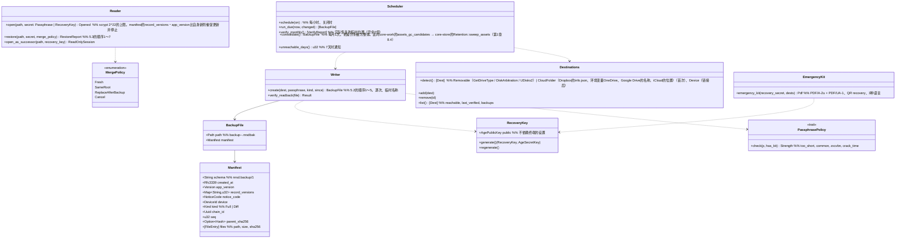

# core-backup（业务。备份的创建・恢复・存放处・自动备份・紧急套件）

## 承担的节
- [第2章 7.3 多台终端](../../../../docs/cn/design/02_基本设计书_签名信息与比对.md#73-多个终端)
- 第8章：[5.1 格式](../../../../docs/cn/design/08_基本设计书_仓库与数据管理.md#51-格式)、[5.2 创建方法](../../../../docs/cn/design/08_基本设计书_仓库与数据管理.md#52-制作方法)、[5.3 恢复方法（导入）](../../../../docs/cn/design/08_基本设计书_仓库与数据管理.md#53-恢复方法导入)、[5.5 备份的存放处与自动备份](../../../../docs/cn/design/08_基本设计书_仓库与数据管理.md#55-备份的存放处与自动备份)、[5.6 备份放置方法的指引](../../../../docs/cn/design/08_基本设计书_仓库与数据管理.md#56-备份存放方式的指引)、[8 失败的处理](../../../../docs/cn/design/08_基本设计书_仓库与数据管理.md#8-失败的处理)
- 只读：第8章 2.1“配置”的“包含在备份中”列（放入什么）、5.4的对齐方法（整合由core-work的`Merge`与core-store的`Chain`进行）。

## 依赖
- 下层：[core-common](core-common.md)（`Qr`・`AppUrl::Recovery`、`Clock`、错误编号）、[core-store](core-store.md)（`Chain`（对齐・验证）、`AtomicFile`、ZIP的确认、`Space`、`Settings`（恢复密钥的公钥、最后备份的日期时间、存放处）、`Retention::sweep_assets`）、[core-hash](core-hash.md)（SHA-256）、[core-identity](core-identity.md)（`current`、`export_keys`／`import_keys`、`os_user_verify`）、[core-render](core-render.md)（紧急套件的PDF/A-2u＋PDF/UA-1）、[core-work](core-work.md)（`Merge::merge_remote`（模板・作业的整合）、`Templates::assets_gc_candidates`）、[core-sign](core-sign.md)（`Works`：原图差分的估算）。
- 上层：[app-client](app-client.md)（G-05、G-07主页的“最后的备份”、G-20设置、启动时的`run_due`、关闭时）。`Device`的存放处由app-client以[core-sync](core-sync.md)的`backup_folder`连接（本区块不依赖core-sync）。
- 外部：OS的可移除介质的检测与Cloud同步文件夹的默认位置（第8章 5.5。直接调用OS的API的是本区块）。

## 类图

## 桥（本区块所有的操作）
|编号|操作（上图）|使用方|由来|
|---|---|---|---|
|B-240|`Writer::create`、`Scheduler::schedule`、`run_due`|app-client|第8章 5.2、5.5|
|B-241|`Reader::restore`|app-client|第8章 5.3|
|B-242|`Reader::open_as_successor`|app-client|第8章 5.3、第1章 13|
|B-243|`EmergencyKit::emergency_kit`|app-client|第8章 5.1|
|B-244|`Destinations`（`detect`・`add`・`remove`・`list`。最初的`add`时`RecoveryKey::generate`）|app-client|第8章 5.5、5.1|
|B-245|`PassphrasePolicy::check`|app-client|第8章 5.2|
|B-246|`Scheduler::verify_monthly`、`consolidate`|app-client|第8章 5.5、5.6|

## 算法（trait之后）
|trait|实现|切换|由来|
|---|---|---|---|
|`PassphrasePolicy`|zxcvbn的方式、随附的一览（10万条）、长度（15字。打印了紧急套件的人为8字）|初始值的常量|第8章 5.2|
|备份的加密|age（scrypt 2^18、向恢复密钥的X25519的加密，以及用口令包裹秘密密钥的附件）|固定|第8章 5.1|
|差分的选法|前次`manifest.json`以后的新链行与新证据・原图。Cloud的存放处不含原图|`Dest.kind`|第8章 5.5|

## 数据设计
|记录・输出|形式|栏|由来|
|---|---|---|---|
|`backup-<日期时间>-<seq>.nrsdbak`|age（外侧）＋ZIP（`manifest.json`、`keys/`、`data/`）＋用口令包裹恢复密钥的秘密密钥的附件|`Manifest`的栏|第8章 5.1、5.6|
|紧急套件|PDF/A-2u＋PDF/UA-1、1页、3种语言|第8章 5.1的紧急套件的内容|第8章 5.1|
|设置（放在core-store的`Settings`中。不依赖终端）|—|恢复密钥的公钥、存放处的一览、最后备份的日期时间、最后验证通过的日期时间（按存放处）|第8章 5.5、第10章 10|
|`state/backup-progress.json`（`nrsd.backup_progress/1`）|JSON|创建中的临时名称、恢复中的临时位置（用于中断的清理）|第8章 8、第1章 7.8|
