# core-case（业务。转载的登记、证据的保全、案件记录与状况、证据一套）

## 承担的节
- 第2章：[4.3 声明所在账号的被盗](../../../../docs/cn/design/02_基本设计书_签名信息与比对.md#43-声明所在账号被盗用)、[4.4 出现冒充权利人者时的线索](../../../../docs/cn/design/02_基本设计书_签名信息与比对.md#44-冒充权利人者出现时的线索)
- 第6章：[2.1 步骤](../../../../docs/cn/design/06_基本设计书_登记与证据保全.md#21-步骤)、[2.2 不执行脚本的获取](../../../../docs/cn/design/06_基本设计书_登记与证据保全.md#22-不执行脚本的获取)（2.2.1 WARC与WACZ、2.2.2 屏幕图像与扩展的接收口）、[2.3 应保留证据的输入栏](../../../../docs/cn/design/06_基本设计书_登记与证据保全.md#23-应保留证据的输入栏)、[2.4 登记数据的项目](../../../../docs/cn/design/06_基本设计书_登记与证据保全.md#24-登记数据的项目)、[2.5 收集的记录](../../../../docs/cn/design/06_基本设计书_登记与证据保全.md#25-收集的记录)、[2.6 来自第2阶段的接收口](../../../../docs/cn/design/06_基本设计书_登记与证据保全.md#26-来自第二阶段的受理口)、[3.1 与日后应出示事项的对应](../../../../docs/cn/design/06_基本设计书_登记与证据保全.md#31-与事后应显示事项的对应设计计划书103)、[3.2 可信时间戳](../../../../docs/cn/design/06_基本设计书_登记与证据保全.md#32-可信时间戳)、[3.3 获取的失败](../../../../docs/cn/design/06_基本设计书_登记与证据保全.md#33-获取的失败)、[3.4 导出](../../../../docs/cn/design/06_基本设计书_登记与证据保全.md#34-导出)、[4.1 一致度的显示方法](../../../../docs/cn/design/06_基本设计书_登记与证据保全.md#41-一致度的显示方式)、[4.2 抵触了什么](../../../../docs/cn/design/06_基本设计书_登记与证据保全.md#42-违反了什么)、[5 是谁、在哪里（④）](../../../../docs/cn/design/06_基本设计书_登记与证据保全.md#5-谁在何处④)、[6.1 状况的记录](../../../../docs/cn/design/06_基本设计书_登记与证据保全.md#61-状况的记录)、[6.2 当前状态的确认](../../../../docs/cn/design/06_基本设计书_登记与证据保全.md#62-当前状态的确认)、[7 订正](../../../../docs/cn/design/06_基本设计书_登记与证据保全.md#7-订正)、[8 一览与手段](../../../../docs/cn/design/06_基本设计书_登记与证据保全.md#8-一览与手段)
- [第7章 6.2 共同的应对与优先](../../../../docs/cn/design/07_基本设计书_法律应对指引.md#62-共同的应对与优先)（“优先”标记的加法）
- 扩展P-14（`extension/`）输出的形式依第6章 2.2.1・2.2.2。本区块为其导入侧。

## 依赖
- 下层：[core-common](core-common.md)（URL的规范化、识别编号、`Clock`、错误编号）、[core-store](core-store.md)（`Chain`、`AtomicFile`、ZIP的确认、回收站、`Space`）、[core-net](core-net.md)（`Http::fetch`（`Target::RepostPage`、`Target::Rdap`。转发的各段为`Response.exchanges`）、`Dns::resolve`／`reverse`（B-045。原始应答）、`Scheduler`）、[core-hash](core-hash.md)（SHA-256、PDQ、ISCC）、[core-image](core-image.md)（获取图片的读取、屏幕图像的日期时间）、[core-identity](core-identity.md)（`with_signing_key`、声明码）、[core-mark](core-mark.md)（水印的读出）、[core-render](core-render.md)（报告的PDF/A-3u、验证手册文字的插入）、[core-rights](core-rights.md)（与许可范围的对照：第5章 2.3的规则）、[core-sign](core-sign.md)（`Inspector::inspect`、`Timestamps::timestamp`・`verify_tsr`・`ers_for`、`Works`）。
- 参考信息（窗口的一览、平台判定的表、RDAP的引导、`tsa.json`）由调用方从[core-ref](core-ref.md)取得后传入（本区块不依赖core-ref。表的行的类型与判定为core-common的B-007）。
- 上层：[core-guidance](core-guidance.md)（`case`、`list`、`append_status`、`whois`、`deadlines`）、[app-client](app-client.md)、[core-backup](core-backup.md)（`cases/`的列举）。
- 与外部的边界：转载页面（B-334）、RDAP・DNS（B-333）、TSA（B-332。经core-sign）、OS的回收站（B-338）、扩展（P-14。deep-link与保存文件夹的监视由app-client接收，传给`import_capture`）。

## 类图

```mermaid
classDiagram
  class Case {
    +CaseId id
    +Source source  %% Manual | Auto
    +Urls urls  %% input, normalized, final
    +Platform platform
    +[WorkRef] work_refs
    +[Evidence] evidence
    +Option~Whois~ whois
    +UserNotes user_notes
    +Option~RightsRef~ rights_ref
    +[Violation] violations
    +Signer signer
    +Rfc3339 created_at
    +ClockStamp clock
    +ChainLink chain
    +Collection collection  %% 2.5的表单
    +bool page_capture_declined
  }
  class Evidence {
    +String original_name  %% 仅在一览中
    +EvidenceKind kind  %% Warc | Wacz | Screenshot | Image | RdapWarc
    +Hash sha256
    +u64 size
    +Provenance provenance  %% UserProvided | AppFetched | Extension
    +Rfc3339 taken_at
    +Option~DateSource~ date_source  %% Exif | FileMtime | None。与登记的日期时间相差24小时以上则要求确认（2.2.2）
    +bool truncated  %% 在50MB处截断（3.3）
  }
  class Input {
    +String url
    +Option~ImageInput~ image  %% File(path) | Url（获取在第6段）
    +Option~Path~ screenshot
    +Option~Path~ wacz
    +bool capture_page  %% 默认真
    +UserNotes notes
    +TsaChoice tsa  %% Free | Paid(id)
    +Rfc3339 screen_opened_at  %% 收集的开始（2.5）
  }
  class UserNotes {
    +Option~String~ account  %% 转载者的账号名・显示名
    +Option~String~ posted_at_shown
    +Option~String~ counts  %% 浏览数・点赞等
    +[CommercialKind] commercial  %% PaidDistribution | Advertising | Merchandise | AiTraining | NoneOrUnknown
    +[Url] other_posts
    +Option~String~ free_text
  }
  class Collection {
    +String collector_handle
    +NoticeCode collector_code
    +Rfc3339 started_at
    +Rfc3339 finished_at
    +[Url] target_urls
    +[IpAddr] server_ips
    +[(String, Hash)] evidence_hashes
    +Hash evidence_hashes_sha256  %% 可信时间戳的对象
    +String app_version
    +String tool_version
    +Option~Duration~ clock_skew
    +Option~ExtensionInfo~ extension  %% 版本、浏览器的名称与版本、记录的日期时间
  }
  class FetchOutcome {
    <<enumeration>>
    Ok Gone LoginRedirect Unreachable TooLarge  %% 第6章 3.3的表
  }
  class StatusRow {
    +StatusKind kind  %% registered filed response removed reposted checked timestamped withdrawn
    +Rfc3339 at
    +Option~Filing~ filing  %% 窗口、方法、受理编号、立场、副本的SHA-256
    +Option~CheckResult~ check  %% HTTP的状态、正文的哈希、图片的有无、WARC的SHA-256
    +Option~[TsResponse]~ timestamps
    +Option~WithdrawReason~ reason
    +ChainLink chain
  }
  class Registrar {
    +register(input: Input, refs: CaseRefs) Result~Case, Event~  %% 第6段。按段在state/做标记。evidence_size在获取前（估算）与获取后（实测）确认，超过1GB则拒绝
    +CaseRefs refs  %% platforms、rdap_bootstrap、tsa（不知道core-ref的类型）
    +normalize_and_hint(url, platforms) Hint
    +resume_pending() [Case]
    +accept_auto(registration) Result~Case~
    +search_urls(work) [Url]
  }
  class Capture {
    +fetch_page(url) (WarcFile, FetchOutcome)  %% 2.2：GET，以html5ever取og:image与img（srcset的最大）前5，转发的各段记入request/response
    +import_capture(path) Captured  %% .wacz的确认、compat.yaml、哈希、签名与timeSignature
    +screenshot_date(path) (Rfc3339, DateSource)
  }
  class WarcWriter {
    +begin(path) WarcWriter
    +warcinfo(software)
    +request(req)
    +response(resp)
    +metadata(fields)
    +resource(uri, bytes)
    +finish() Hash
  }
  class Wacz {
    +pack(warcs, pages, screenshots) WaczFile
    +unpack(path, limits) Unpacked
    +sign(datapackage_digest, signer, ts) 
    +verify(path) Verified
  }
  class Matcher {
    +match_image(path, works) MatchResult  %% 水印 → PDQ → ISCC。4.1的6段
    +clues(path) Clues  %% 第2章 4.4的5项
    +violations(work, notes, rights) [Violation]
  }
  class Whois {
    +lookup(final_url, bootstrap) WhoisResult  %% DNS、RDAP（IP与域名）、反向查询、ICP
  }
  class Status {
    +append_status(id, row: StatusRow, filing_copy: Option~String~)
    +check_now(id) StatusRow  %% 6.2
    +withdraw(id, reason) RetentionNotice
    +deadlines(id, rules) [VTodo]
    +ics(id) Bytes
  }
  class Bundle {
    +export_bundle(id, user_fields, include_clues) Path  %% BagIt、ZIP、报告TXT与PDF/A-3u、手册、ERS
  }
  class Cases {
    +case(id) Case
    +list(filter) [DomainSummary]  %% 按域名、件数、最初・最后、状况、优先的标记
    +verify_evidence_files() [Missing]
    +evidence_size(id) u64  %% 1GB的上限
  }
  Registrar --> Case
  Registrar ..> Capture
  Registrar ..> Matcher
  Registrar ..> Whois
  Registrar ..> Status
  Capture ..> WarcWriter
  Capture ..> Wacz
  Status --> StatusRow
  Bundle ..> Cases
  Cases --> Case
  Case --> Evidence
  Case --> Collection
  Registrar ..> Input
  Input --> UserNotes
  Capture --> FetchOutcome
```

## 桥（本区块所有的操作）
|编号|操作（上图）|使用方|由来|
|---|---|---|---|
|B-180|`Registrar::register`|app-client|第6章 2.1、2.4|
|B-181|`Registrar::normalize_and_hint`|app-client|第6章 2.1、第2章 2.3|
|B-182|`Capture::import_capture`|app-client|第6章 2.2.2、第1章 4.1|
|B-183|`Matcher::match_image`|app-client|第6章 4.1|
|B-184|`Cases::case`、`list`|app-client・guidance|第6章 8、第10章 G-15|
|B-185|`Status::check_now`|app-client|第6章 6.2|
|B-186|`Status::append_status`|app-client・guidance|第6章 6.1、第7章 6.1|
|B-187|`Status::withdraw`（返回的`RetentionNotice`由ui显示）|app-client|第6章 7|
|B-188|`Bundle::export_bundle`|app-client|第6章 3.4|
|B-189|`Matcher::clues`|app-client|第2章 4.4|
|B-190|`Status::deadlines`、`ics`|app-client|第6章 6.1、第7章 6.3|
|B-191|`Registrar::accept_auto`|app-client|第6章 2.6|
|B-192|`Registrar::search_urls`|app-client|第6章 2.1、第10章 G-12|
|B-193|`Whois::lookup`|guidance|第6章 5、第7章 5|
|B-194|`Registrar::resume_pending`|app-client|第1章 7.8、第6章 2.1|
|B-195|`Cases::verify_evidence_files`|app-client|第8章 4、第6章 7|

## 算法（trait之后）
|trait|实现|切换|由来|
|---|---|---|---|
|`MatchLevel`（一致度的段）|水印 → PDQ 0〜15 → 16〜31 → ISCC → 他人的编号 → 无法确认|阈值为初始值的常量|第6章 4.1|
|`ImagePicker`（获取图片的选法）|`og:image`与``（`srcset`的最大）按大小顺序5件|常量|第6章 2.2|
|`WorkRefOrder`|水印的一致 → PDQ的距离 → 从新到旧，以原图的SHA-256归并|固定|第6章 4.1|

## 数据设计（本区块持有形式的记录与输出）
|记录|形式|栏|由来|
|---|---|---|---|
|`cases/<案件编号>/case.json`＋`.sig`（`nrsd.case/1`。链）|JSON|第6章 2.4的表（`Case`）、2.5的收集记录|第6章 2.4、2.5|
|`cases/<案件编号>/status/<终端编号>.jsonl`＋`.sig`（`nrsd.status/1`。链）|JSON Lines|第6章 6.1（`StatusRow`。可信时间戳的应答也在此）|第6章 6.1、3.2|
|`cases/<案件编号>/evidence/<SHA-256>.<扩展名>`|文件|WARC（`capture-<连号>.warc.gz`）、WACZ、屏幕图像、获取的图片|第6章 2.4、2.2.1|
|`cases/<案件编号>/filings/<UUID v7>.txt`|TXT|申诉的副本（已`[REDACTED]`）|第6章 6.1|
|`state/case-<案件编号>.json`（`nrsd.case_progress/1`）|JSON|第6段中已完成的段的标记（保全、记录、保存、可信时间戳）|第6章 2.1、第1章 7.8|
|输出：证据一套|`evidence-<案件编号>-<日期时间>.zip`（BagIt。`data/`、`manifest-sha256.txt`、`bag-info.txt`、`tagmanifest-sha256.txt`）|第6章 3.4的内容|第6章 3.4|
|输出：`.ics`|VTODO|期限（第7章 6.3）|第6章 6.1|
- `Whois`放入`case.json`的`whois`栏，原始的请求与应答作为WARC的`RdapWarc`放在`evidence/`（第6章 5）。
