# core-common（基础）

## 承担的节
- [第1章 8.2 标识符的体系](../../../../docs/cn/design/01_基本设计书_整体结构.md#82-标识符的体系)、[8.6 多语言的文件名与字符](../../../../docs/cn/design/01_基本设计书_整体结构.md#86-多语言的文件名与文字)、[10.3 错误](../../../../docs/cn/design/01_基本设计书_整体结构.md#103-错误)、[10.4 操作的记录（日志）](../../../../docs/cn/design/01_基本设计书_整体结构.md#104-操作日志)、[10.5 并行处理](../../../../docs/cn/design/01_基本设计书_整体结构.md#105-并行处理)、[10.7 时刻](../../../../docs/cn/design/01_基本设计书_整体结构.md#107-时间)、[10.10 URL与QR的形式](../../../../docs/cn/design/01_基本设计书_整体结构.md#1010-url与qr码的形式)
- [第2章 2.4 声明码的生成方法](../../../../docs/cn/design/02_基本设计书_签名信息与比对.md#24-声明码的生成方法)
- 职责与外部的组件：[第11章 7.1](../../../../docs/cn/design/11_基本设计书_开发基础.md#71-rust组件的划分)

## 依赖
- 下层：无。上层：全部区块依赖本区块。不依赖tauri。

## 类图

```mermaid
classDiagram
  class WorkId {
    +u64 bits61
    +from_bits(u64) WorkId
    +parse(text) Result~WorkId, Fault~
    +display() String  %% 5-5-3的13个字符。CRC-4在低位
    +to_bits() u64
  }
  class NoticeCode {
    +from_spki_der(bytes) NoticeCode  %% 第2章 2.4
    +parse(text) Result~NoticeCode, Fault~
    +display() String  %% NRSD-XXXXX-XXXXX-XXXXX-XXXXX
  }
  class DeviceId {
    +from_pubkey(Ed25519) DeviceId  %% SHA-256的前40位，Base32 8个字符
    +display() String
  }
  class Base32 {
    <<module>>
    +encode(bits) String
    +decode(text) Result~bits, Fault~  %% I・L→1、O→0、小写→大写
  }
  class Crc4 {
    <<module>>
    +g704(bits61) u4
  }
  class Category {
    <<enumeration>>
    IMG SIG TSA NET STO REF UPD CAS BAK INP SYN AUT
  }
  class Event {
    +Category category
    +u16 number  %% 正常系的事件（台账的“正常系”行）
    +Vec~Arg~ args  %% 文字的插入值。文句由界面套用
    +key() String  %% err.NNN.what / .safe / .next
  }
  class Fault {
    +Category category
    +u16 number  %% 异常检测（台账的“异常检测”行。未登记为NNN-000与检测的位置）
    +String detail  %% 只写入日志
    +raise() Fault  %% 写入日志，并CrashReport::request（向子进程请求minidump）。倒向保护原图与记录的一侧由调用方负责
  }
  class ClockStamp {
    +Rfc3339 wall
    +Option~Duration~ skew
    +u64 mono
    +bool estimated
    +bool jumped  %% “时钟已改变”的标记
  }
  class Clock {
    +init(state_dir)  %% clock.json与seq的存放处。由app-client传入
    +now_utc() Rfc3339
    +now_estimated() Estimated  %% 按偏差校正。带标记
    +stamp() ClockStamp  %% 放入记录的行的值（core-store的Row、第6章 2.4的clock）
    +set_skew(sample: Duration)  %% TSA的genTime − 请求的时刻。最近10次，state/clock.json
    +monotonic_seq() u64
    +detect_jump() Option~Jump~  %% 墙上时钟的回拨・跳跃
    +check_wall(last_record_at: Rfc3339) Option~Fault~  %% 早于构建日期、早于上次记录为异常
  }
  class SkewEstimator {
    <<trait>>
    +estimate(samples: [Duration]) Duration
  }
  class UrlKind {
    <<enumeration>>
    Account  %% 去除查询与片段
    Repost  %% 保留输入原样，按ClearURLs的规则取规范形式
    Venue  %% 窗口的URL
  }
  class UrlNormalizer {
    <<trait>>
    +normalize(input, kind: UrlKind, rules: TrackingRules) Result~NormalizedUrl, Event~  %% 不展开短链接
  }
  class NormalizedUrl {
    +String canonical
    +String as_entered
    +String host_punycode
    +String host_unicode
    +String path
    +bool mixed_script  %% UTS #39。显示时附注意
  }
  class PlatformRule {
    +PlatformId id
    +[HostPattern] hosts
    +[PathPattern] paths  %% 帖子・个人资料的路径的型（第7章 2.1的行）
  }
  class Platforms {
    <<module>>
    +detect(url: NormalizedUrl, table: [PlatformRule]) Option~(PlatformId, PathKind)~  %% 不匹配则为一般网站。表由调用方传入
  }
  class AppUrl {
    <<enumeration>>
    Import(path)  %% 仅OS的URL方案。不放入QR
    Contact(code, root_hash, dev_pub)
    Link(dev_pub, nonce16)
    Recovery(age_key)
    +parse(text) Result~AppUrl, Event~  %% 确认方案・种类・值的形式
    +to_url() String  %% c2pa4cosplayer://<种类>?<名称>=<值>
  }
  class Qr {
    <<module>>
    +encode(AppUrl) Png  %% ISO/IEC 18004、纠错M、字节模式。拒绝Import
    +decode(pixels: Pixels8) Result~AppUrl, Event~  %% 图片的读取与上限（10.6）由调用方经core-image进行
  }
  class Pixels8 {
    +u32 width
    +u32 height
    +Bytes rgb  %% RGB 8位、行序。像素面的共通类型（core-hash・core-mark接收。由core-image的Image生成）
  }
  class Progress {
    +u32 done
    +u32 total
    +Option~Seconds~ eta
  }
  class Cancel {
    +is_requested() bool
    +request()
  }
  class CrashReport {
    +init(handler: ChildProcess)  %% app-client启动--crash-handler的子进程并传入
    +request(extra: CrashExtra) Path  %% 异常检测时向子进程请求
    +on_crash(extra)  %% OS的异常。由子进程写入
    +pending() [Report]
    +discard(id)
    +keep(id)
    +set_last_operation(kind)  %% 上一操作的种类
  }
  class CrashExtra {
    +String app_version
    +String os
    +Option~String~ error_number  %% 未登记为NNN-000与检测的位置
    +String last_operation_kind
  }
  class Secret~T~ {
    +expose() &T  %% zeroize。不出现在Debug・日志
  }
  class Logging {
    <<module>>
    +init_logging(dir)  %% tracing的JSON Lines、英文、info。NRSD_LOG=debug。10MB切换，合计50MB
    +recent_errors(n) [String]  %% 从新到旧10件（初始值）
    +path_for_log(path) String  %% 仅文件名
    +url_for_log(url) String  %% 去掉查询部分
  }
  class Text {
    <<module>>
    +text(key, args, lang) String  %% 文字文件的core.<区块>.<名称>（第10章 5）。formatjs_icu_messageformat
  }
  class Ids {
    <<module>>
    +new_id_v7() Uuid
    +case_id() String
    +sanitize_filename(name) String
  }
  WorkId ..> Base32
  WorkId ..> Crc4
  NoticeCode ..> Base32
  DeviceId ..> Base32
  Clock ..> SkewEstimator
  Clock --> ClockStamp
  Qr ..> AppUrl
  Platforms ..> PlatformRule
  UrlNormalizer ..> UrlKind
  Event ..> Category
  Fault ..> Category
  Fault ..> CrashReport
```

## 桥（本区块所有的操作。编号为边界的流水号）
|编号|操作（上图）|使用方|由来|
|---|---|---|---|
|B-001|`Event`・`Fault`・`Category`|全部|第1章 10.3|
|B-002|`Logging`、`Secret<T>`|全部|第1章 10.4|
|B-004|`WorkId`、`Base32`|sign・identity・mark・app-client|第1章 8.2、第2章 2.4|
|B-005|`NoticeCode`|identity・sign・sync|第2章 2.4|
|B-006|`Clock`、`ClockStamp`（记录的行的`clock`）|全部|第1章 10.7|
|B-007|`UrlNormalizer`（`UrlKind`与规则由使用方传入）、`Platforms::detect`、`PlatformRule`（`platforms.json`的行的形式。core-ref读取并转为此类型）|identity・case・ref|第1章 10.10、第7章 2.1|
|B-008|`Ids::new_id_v7`、`case_id`|store・case・work・identity|第1章 8.2|
|B-009|`Text::text`（含插入规则`{name}`・`{{ }}`）|rights・case・backup・sign・guidance|第1章 10.3|
|B-010|`CrashReport`|app-client|第1章 10.3、第10章 9|
|B-011|`Ids::sanitize_filename`|sign・work・store|第1章 8.6|
|B-012|`Progress`、`Cancel`|全部|第1章 10.5|
|B-013|`Qr`、`AppUrl`（QR的内容与OS的URL方案的4种）|backup・sync・app-client|第1章 10.10|
|B-014|`Pixels8`（像素面的共通类型。core-hash・core-mark不依赖core-image而接收此类型）|hash・mark・image|第3章 5、6|
- `DeviceId`的值由core-identity从终端密钥生成（B-023）。本区块只持有形式与显示。
- `Ids::sanitize_filename`规范化为NFC后，把OS中不能使用的字符换为`_`（第1章 8.6）。输出名称的规则（第3章 10.1）由core-sign的`NameSanitizer`叠加在其上。
- `CrashReport`的子进程（`--crash-handler`）由app-client在启动之初建立并传给`init`（第1章 10.3）。
- 本区块不知道存放处（第1章 9.1）（core-store在其上层）。`Logging::init_logging(dir)`、`CrashReport::init`、`Clock::init(state_dir)`（`state/clock.json`・`state/seq`）的存放处由app-client从core-store的`Paths`传入。

## 算法（trait之后。选择在`algo.rs`的1处）
|trait|实现|切换|由来|
|---|---|---|---|
|`SkewEstimator`|中位数，排除离群值|固定|第1章 10.7|
|`UrlNormalizer`|WHATWG URL、UTS #46、ClearURLs的规则|规则为参考信息|第1章 10.10|

## 数据设计（本区块写入的记录）
|记录|存放处|形式|栏的定义|
|---|---|---|---|
|操作的记录（日志）|记录位置的`logs/`（10MB切换，合计50MB。90日的删除为core-store的`Retention::sweep`）|JSON Lines（tracing）|[第1章 10.4](../../../../docs/cn/design/01_基本设计书_整体结构.md#104-操作日志)|
|崩溃时的报告|`crashes/<UUID v7>/`：`minidump.dmp`、`extra.json`（`CrashExtra`的4栏）|与Breakpad相同的形式|[第1章 10.3](../../../../docs/cn/design/01_基本设计书_整体结构.md#103-错误)|
|时钟偏差的样本|`state/clock.json`：`samples[]`（`requested_at`、`gen_time`、`tsa`）|JSON|[第1章 10.7](../../../../docs/cn/design/01_基本设计书_整体结构.md#107-时间)、[第8章 2.1](../../../../docs/cn/design/08_基本设计书_仓库与数据管理.md#21-配置)|
|错误的台账（类型的生成源）|`dev/errors.yaml`（P-13）。`Category`与编号在构建时由此生成|YAML|第1章 10.3（与上一行同节）|
- 记录中的值的形式：识别编号为13个字符的显示形式，声明码为28个字符，终端编号为8个字符，时刻为RFC 3339 UTC（推定的时刻带`estimated: true`标记）。
