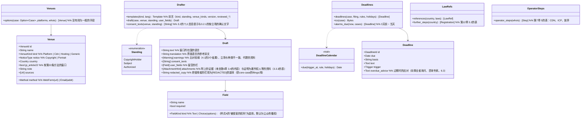

# core-guidance（业务。窗口的候选、申诉的草稿、期限、各国法律的参照处、运营者的识别步骤）

## 承担的节
- 第7章：[3.1 范本的种类](../../../../docs/cn/design/07_基本设计书_法律应对指引.md#31-范本的种类)、[3.2 个人信息会传给对方的提示](../../../../docs/cn/design/07_基本设计书_法律应对指引.md#32-关于个人信息会被交给对方的指引)、[3.3 范本的内容](../../../../docs/cn/design/07_基本设计书_法律应对指引.md#33-范本的内容)（3.3.4 肖像・隐私、3.3.5 托管・CDN）、[3.4 申请者的立场](../../../../docs/cn/design/07_基本设计书_法律应对指引.md#34-申请人的立场)、[5 运营者的识别](../../../../docs/cn/design/07_基本设计书_法律应对指引.md#5-运营者的确定)、[6.3 程序期限的显示](../../../../docs/cn/design/07_基本设计书_法律应对指引.md#63-程序期限的显示)
- [第12章 3.2 使用者的自愿（本系统仅作指引）](../../../../docs/cn/design/12_基本设计书_与法务的接点.md#32-使用者的任意本系统仅作指引)
- 只读的节（所有为参考信息P-7）：第7章 2.1“初版的窗口一览”、3.3.1〜3.3.3（范本的正文）、4“各国法律的参照处”。形式为第8章 3.4的`platforms.json`・`templates/`・`laws.json`・`deadlines.json`・`holidays.json`。

## 依赖
- 下层：[core-common](core-common.md)（插入的规则`{field}`、`Clock`、语言）、[core-ref](core-ref.md)（从`Reference::current()`取上述各文件）、[core-case](core-case.md)（`Cases::case`、`Status::append_status`、`Whois::lookup`的结果）。
- 上层：[app-client](app-client.md)。界面为G-16（案件的详情）、G-17（应对的指引）、G-24（线索的比较。无案件时的`options`）。
- 使用者填写的栏（姓名、住址、电话、电子邮件、原帖子的URL、签名）只经过本区块，不写入任何记录（第7章 3.1）。保存的只有core-case的申诉副本（已`[REDACTED]`。第6章 6.1）。

## 类图

## 桥（本区块所有的操作）
|编号|操作（上图）|使用方|由来|
|---|---|---|---|
|B-200|`Venues::options`|app-client|第7章 2、5|
|B-201|`Drafter::draft`（含`consent_texts`的`Draft`）|app-client|第7章 3|
|B-202|`Deadlines::deadlines`、`ics`、`alarms_due`|app-client|第7章 6.3|
|B-203|`LawRefs::references`、`further_steps`|app-client|第7章 4、第12章 3.2|
|B-204|`OperatorSteps::operator_steps`|app-client|第7章 5|

## 算法（trait之后）
|trait|实现|切换|由来|
|---|---|---|---|
|`DeadlineCalendar`|日历日加天数。工作日除去周六日与`holidays.json`中该国的节假日计算|`deadlines.json`的`unit`|第7章 6.3|
|范本的选法|立场 × 窗口的种类 × 国家 → `templates/<种类>.<语言>.md`（被摄者为`portrait`，CDN・托管为`hosting`，第22条的窗口为`jp_form_a`）|参考信息的前言`standing`・`venue_kinds`|第7章 3.1、3.4|

## 数据设计
- 本区块在终端不持有记录。读取的形式为参考信息（第8章 3.4），写入处只有core-case的状况追记（B-186）。
|输出|形式|栏|由来|
|---|---|---|---|
|申诉的文字|TXT（原文与参考译文）|填入范本的栏之物。不保存在应用中|第7章 3.3|
|`.ics`|iCalendar（RFC 5545）|第7章 6.3的VTODO与VALARM|第7章 6.3|
