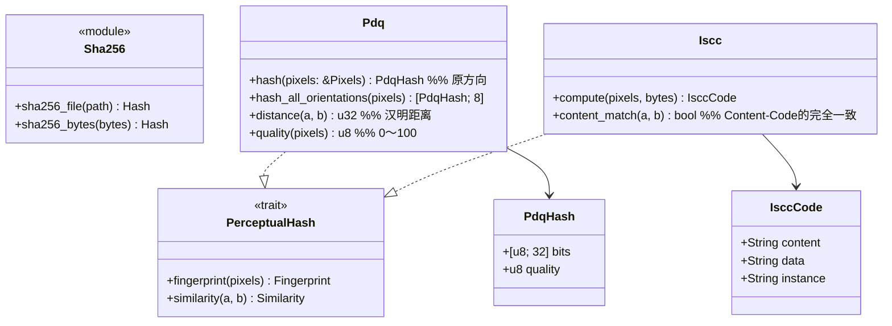

# core-hash（业务）

## 承担的节
- [第3章 6 比对用哈希](../../../../docs/cn/design/03_基本设计书_签名处理.md#6-比对用哈希)（PDQ、ISCC、距离的参考、8个方向、画质的分数）
- 职责与外部的组件：[第11章 7.1](../../../../docs/cn/design/11_基本设计书_开发基础.md#71-rust组件的划分)

## 依赖
- 下层：[core-common](core-common.md)。

## 类图

## 桥（本区块所有的操作）
|编号|操作（上图）|使用方|由来|
|---|---|---|---|
|B-050|`Sha256`|sign・case・work・backup・rights・image・app-client（SHA256SUMS）|第3章 2|
|B-051|`Pdq`|sign・case|第3章 6、第6章 4|
|B-052|`Iscc`|sign・case|第3章 6|
- 阈值（距离15・31、画质50）不由本区块持有。判定为core-case的`MatchPolicy`。
- `Pixels`为core-common的`Pixels8`（B-014）。由core-image的`Image`生成，由调用方传入（core-hash不依赖core-image）。

## 算法（trait之后）
|trait|实现|切换|由来|
|---|---|---|---|
|`PerceptualHash`|PDQ（pdqhash。与原版的测试值不一致则用pdq-rs）、ISCC（iscc-lib）|两者总是都计算|第3章 6、第11章 DD-11-4|

## 数据设计
- 本区块不写入记录。值的形式：PDQ为256位（16进制64个字符）与画质的分数，ISCC为ISO 24138的3个字符串。记录处为作品数据（第3章 7.2。core-sign的页面）与案件记录（第6章 2.4。core-case的页面）。
