# core-identity（业务。签名信息、证书、密钥存储、声明码、文件）

## 承担的节
- [第2章 2.3 输入的确认](../../../../docs/cn/design/02_基本设计书_签名信息与比对.md#23-输入的核对)、[3.1 构成](../../../../docs/cn/design/02_基本设计书_签名信息与比对.md#31-构成)、[3.2 签名用证书的要件](../../../../docs/cn/design/02_基本设计书_签名信息与比对.md#32-签名用证书的要求c2pa规范)、[3.4 期限与输入的错误](../../../../docs/cn/design/02_基本设计书_签名信息与比对.md#34-期限与输入的错误)、[3.5 各项目](../../../../docs/cn/design/02_基本设计书_签名信息与比对.md#35-各项目)、[3.6 过去的个人根证书](../../../../docs/cn/design/02_基本设计书_签名信息与比对.md#36-过去的个人根证书)、[4.1 与声明所在账号的比对](../../../../docs/cn/design/02_基本设计书_签名信息与比对.md#41-与声明所在账号的比对)、[5.1 授权书](../../../../docs/cn/design/02_基本设计书_签名信息与比对.md#51-授权书)、[5.2 共同的权利](../../../../docs/cn/design/02_基本设计书_签名信息与比对.md#52-共同权利摄影者与cosplayer)、[5.3 文件的格式](../../../../docs/cn/design/02_基本设计书_签名信息与比对.md#53-文书的格式)、[5.4 文件的确认](../../../../docs/cn/design/02_基本设计书_签名信息与比对.md#54-文书的核对)、[6 权利人信息](../../../../docs/cn/design/02_基本设计书_签名信息与比对.md#6-权利人信息)、[7.1 生成与保管](../../../../docs/cn/design/02_基本设计书_签名信息与比对.md#71-生成与保管)、[7.2 丢失・泄露](../../../../docs/cn/design/02_基本设计书_签名信息与比对.md#72-丢失与泄露)、[7.4 使用应用时的认证](../../../../docs/cn/design/02_基本设计书_签名信息与比对.md#74-使用应用时的认证)、[7.5 各OS的保管方式](../../../../docs/cn/design/02_基本设计书_签名信息与比对.md#75-各操作系统的保管方式)、[7.6 使用时的处理](../../../../docs/cn/design/02_基本设计书_签名信息与比对.md#76-使用时的处理)、[8 失败的处理](../../../../docs/cn/design/02_基本设计书_签名信息与比对.md#8-失败的处理)
- 职责与外部的组件：[第11章 7.1](../../../../docs/cn/design/11_基本设计书_开发基础.md#71-rust组件的划分)

## 依赖
- 下层：[core-common](core-common.md)（`NoticeCode`、`WorkId`、`UrlNormalizer`、`Platforms::detect`、`PlatformRule`、`Ids`）、[core-store](core-store.md)（`Chain`、`AtomicFile`、`Paths`、`Schema`）。
- 依赖的反转：core-store的`RecordSigner`由本区块实现并传入（`sign`用签名用证书的密钥，`own_roots`为现在与过去的个人根证书，`device_id`由终端密钥生成）。
- 不依赖core-ref：发布网站判定的表由调用方（app-client）从B-221传入。
- 与外部的边界B-337（OS的密钥存储、OS的本人确认）。

## 类图

```mermaid
classDiagram
  class Input {
    +String handle
    +Role role
    +[String] accounts
  }
  class Normalized {
    +String handle
    +Role role
    +[NormalizedUrl] accounts
  }
  class FieldError {
    +Field field
    +Event reason
  }
  class Validator {
    +validate_input(input, platforms: [PlatformRule]) Result~Normalized, [FieldError]~  %% 判定为core-common的Platforms::detect
    +skeleton(name) String
    +restriction_level(name) Level
  }
  class Draft {
    +draft_save(input)
    +draft_load() Option~Input~
  }
  class Identity {
    +CertChain cert_chain
    +NoticeCode notice_code
    +String handle
    +Role role
    +[NormalizedUrl] accounts
    +Serial signing_serial
  }
  class IdentityStore {
    +current() Identity
    +create(n: Normalized) Identity
    +update_profile(n: Normalized) Identity
    +rotate_root(reason: RotateReason) HistoryRow
    +history() [Change]
    +expiry_status() ExpiryStatus  %% 从epoch.json（首次获得可信时间戳之日，没有则为创建日）起19年・20年
    +set_epoch(first_timestamp: Date)  %% 仅首次。extend_root（notAfter延至40年后）→ 签名用证书也以同一密钥重新制作 → 履历中记cert行（第2章 3.1）
  }
  class RotateReason {
    <<enumeration>>
    TwentyYears LostWithoutBackup SuspectedLeak
  }
  class ExpiryStatus {
    <<enumeration>>
    Ok Warn19 Stop20
  }
  class CertBuilder {
    +root(handle, not_after) Cert  %% 第2章 3.5：自签名、cA真・路径长度0、keyCertSign、SKI为公钥的SHA-1、序列号为128位随机数、notBefore 2020-01-01、2050年以后为GeneralizedTime
    +signing(root, handle, accounts: [Url]) Cert  %% cA假、digitalSignature、EKU c2pa-kp-claimSigning + id-kp-documentSigning、SAN为输入顺序的URI、AKI为root的SKI
    +extend_root(root, new_not_after) Cert
  }
  class PastRoots {
    +is_own_root(cert) Option~Period~
    +past_roots() [PastRoot]
    +add_past_root(cert, period, reason, provenance: Provenance)
  }
  class PastRoot {
    +Cert cert
    +NoticeCode notice_code
    +Period period
    +RotateReason reason
    +bool suspected_leak
    +bool unverifiable
  }
  class Keystore {
    +status() KeystoreStatus
    +unlock(passphrase)
    +with_signing_key(reason, f)
    +begin_batch()
    +end_batch()
    +export_keys() Secret~Pkcs8~
    +import_keys(Secret~Pkcs8~)
    +device_key() Ed25519
    +device_id() DeviceId
    +set_secret(name, Secret)
    +get_secret(name) Secret
    +delete_secret(name)
    +wipe_keys()
  }
  class OsAuth {
    +os_user_verify(reason) bool  %% LAContext.evaluatePolicy / IUserConsentVerifierInterop / polkit。可在设置（G-20）中关闭。OS不支持则为真。自动处理不调用（第2章 7.4）
  }
  class Grants {
    +create_grant(to: NoticeCode, scope, term, text) Document  %% 期限默认90天，文字至多500字
    +create_revoke(target_id) Document
    +co_rights_draft(...) Document
    +co_rights_countersign(doc) Document
    +import(bytes) ImportResult  %% 第2章 5.4的5项确认。结果与日期时间记入approvals/<终端>.jsonl
    +list() [Document]
    +renewals_due() [Document]  %% 期限的30天前
    +auto_renew() [Document]  %% 30天前自动制作带renews的新授权书（第2章 5.1）。发送由app-client经core-sync进行
    +active_for(root_fp, shoot, date) [Document]  %% 拍摄名称为NFC・去除前后空白后不区分大小写的完全一致，期限按日历日且含两端（第2章 5.3）
    +is_revoked(grant_id) bool
    +by_hash(sha256) Option~Document~  %% 从清单中授权书的哈希查找（G-13的标记）
  }
  class Document {
    +Kind kind
    +Uuid id
    +Issuer issuer
    +Option~Counterparty~ counterparty
    +Option~Scope~ scope
    +Option~Term~ term
    +String text
    +Rfc3339 created_at
    +Option~Uuid~ renews
    +[Jws] signatures
  }
  class ImportResult {
    <<enumeration>>
    Imported(Document) NotForMe Invalid(Event) OutOfTerm(Document) SuspectedLeakCode(Document)
  }
  class NoticeCodeCalc {
    <<module>>
    +expected_notice_code(cert_chain) Option~NoticeCode~
  }
  IdentityStore --> Identity
  IdentityStore ..> CertBuilder
  IdentityStore ..> Keystore
  IdentityStore ..> PastRoots
  IdentityStore ..> Validator
  Grants --> Document
  Grants --> ImportResult
  Grants ..> PastRoots
  Grants ..> NoticeCodeCalc
  Keystore ..> OsAuth
```

## 桥（本区块所有的操作）
|编号|操作（上图）|使用方|由来|
|---|---|---|---|
|B-080|`IdentityStore::current`|sign・case・backup・sync・app-client|第2章 2、3|
|B-081|`Validator::validate_input`、`Draft`|app-client|第2章 2.3|
|B-082|`IdentityStore::create`（制作个人根证书・签名用证书・终端密钥3者）|app-client|第2章 3、7.1|
|B-083|`IdentityStore::update_profile`、`history`|app-client|第2章 3.4、6|
|B-084|`IdentityStore::rotate_root`|app-client|第2章 3.6、6、7.2|
|B-085|`PastRoots`|sign・store・app-client|第2章 3.6|
|B-086|`Keystore::with_signing_key`、`begin_batch`／`end_batch`|sign・case・store（`RecordSigner`的实现之内）|第2章 7.4、7.6|
|B-087|`IdentityStore::expiry_status`、`set_epoch`|app-client・sign|第2章 3.4、8|
|B-088|`Grants`|app-client・sync・sign|第2章 5、5.3|
|B-089|`NoticeCodeCalc::expected_notice_code`|sign・case・P-6（同一计算）|第2章 4.1、DD-2-9|
|B-090|`Keystore`（状态、解锁、终端密钥、秘密项目、清除）|app-client・sync|第2章 7.5、8|
|B-091|`Keystore::export_keys`／`import_keys`|backup・sync（终端链接时经线路交付）|第2章 7.1、第8章 5.4|
|B-092|`OsAuth::os_user_verify`|backup・sync・app-client|第2章 7.4|
|B-093|`Validator::skeleton`、`restriction_level`|sign|第2章 2.3、4.1|

## 算法
- 没有可切换的算法。证书的各项目（3.5）、声明码的计算（core-common）、UTS #39（unicode-security）为固定。

## 数据设计（本区块持有形式的记录）
|记录|形式|栏|由来|
|---|---|---|---|
|`identity/draft.json`（`nrsd.identity_draft/1`）|JSON|`Input`的3栏|第2章 2.1|
|`identity/`的证书|PEM/DER|个人根证书与签名用证书（3.5的列）。密钥在OS的密钥存储|第2章 3、7.5|
|`identity/epoch.json`（`nrsd.epoch/1`）|JSON|`first_timestamp_date`、`root_created_at`|第2章 3.4|
|`identity/history/<终端编号>.jsonl`＋`.sig`（`nrsd.history/1`。链）|JSON Lines|第2章 6的5栏。`root`行持有新根证书的证书・理由・日期时间，以旧密钥签名|第2章 6、3.6|
|`identity/past_roots/<SKI>.json`（`nrsd.past_root/1`）|JSON|`PastRoot`的6栏|第2章 3.6|
|`approvals/<终端编号>.jsonl`＋`.sig`（导入的行。链）|JSON Lines|`doc_id`、`kind`、`imported_at`、`result`、`out_of_term`|第2章 5.4|
|`approvals/docs/<kind>-<id>.nrsdgrant`（`nrsd.grant/1`）|JSON|`Document`的栏（第2章 5.3的表）|第2章 5.3|
|OS密钥存储的项目|第2章 7.5的4种|PKCS#8、Ed25519、TSA的账号|第2章 7.5|
|密钥文件（无Secret Service的Linux）|age|密钥2个|第2章 7.5|
