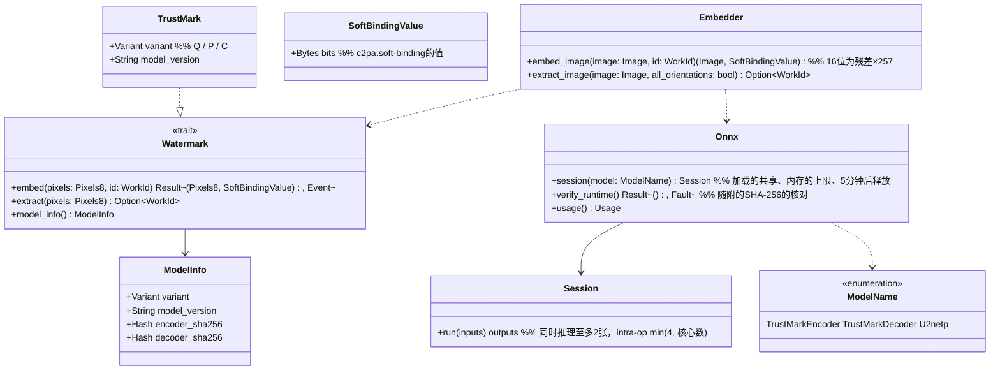

# core-mark（业务。不可见水印、ONNX运行时的共享）

## 承担的节
- [第3章 5 不可见水印](../../../../docs/cn/design/03_基本设计书_签名处理.md#5-隐形水印)（方式、8个方向的读出、推理的上限、随附的核对、16位、处理时间）
- 职责与外部的组件：[第11章 7.1](../../../../docs/cn/design/11_基本设计书_开发基础.md#71-rust组件的划分)、[DD-11-14](../../../../docs/cn/design/11_基本设计书_开发基础.md#1-设计决定的一览)

## 依赖
- 下层：[core-common](core-common.md)（`WorkId`、`Fault`、`Pixels8`）、[core-image](core-image.md)（`Image`、`ColorEngine::to_8bit`：16位残差的处理）。
- ONNX运行时的加载与共享由本区块持有，core-work的自动布局（u2netp）也使用`Onnx::session`（只加载使用的模型。第3章 5）。

## 类图

## 桥（本区块所有的操作）
|编号|操作（上图）|使用方|由来|
|---|---|---|---|
|B-100|`Embedder::embed_image`、`Watermark::model_info`|sign|第3章 5|
|B-101|`Embedder::extract_image`（比对为8个方向，回读仅原方向）|sign・case|第3章 5、第6章 4|
|B-102|`Onnx::session`|work・app-client（启动时的延迟加载）|第3章 5|
|B-103|`Onnx::verify_runtime`|app-client|第3章 5、DD-11-14|
- 水印的variant与模型的版本记录在输出的作品数据・案件记录的`app`中（core-sign・core-case从`model_info()`复制）。
- `Onnx::session(model)`不同时持有水印与自动布局的模型（加载使用的一方，释放另一方。第4章 14.4）。ONNX运行时动态加载（ort的`load-dynamic`）。`verify_runtime`不一致则为`Fault`（异常检测），不输出没有水印的内容（第3章 5）。

## 算法（trait之后）
|trait|实现|切换|由来|
|---|---|---|---|
|`Watermark`|TrustMark Q（默认）・P・C|以实测决定，按版本固定（记录在输出中）|第3章 DD-3-2、5|

## 数据设计
- 本区块不写入记录。随附的素材（P-8）：`assets/models/encoder_Q.onnx`・`decoder_Q.onnx`（第11章 4.3）、ONNX运行时的共享组件。期望的SHA-256在构建时从`assets/manifest.json`（第11章 6）嵌入。
- 值的形式：`SoftBindingValue`为嵌入的位串（TrustMark BCH_5的数据部分的61位）。向清单的记录为core-sign（第3章 3.1）。
