# core-net（基础）

## 承担的节
- [第1章 4.2 与外部的往来](../../../../docs/cn/design/01_基本设计书_整体结构.md#42-与外部的交互)（对方的表、超时与上限、重试、获取源的顺序、代理服务器、TLS、按流量计费的判定）
- 职责与外部的组件：[第11章 7.1](../../../../docs/cn/design/11_基本设计书_开发基础.md#71-rust组件的划分)

## 依赖
- 下层：[core-common](core-common.md)。
- 与外部的边界：B-330〜B-334的HTTP全部经由本区块（直接连接B-335为core-sync的iroh，密钥存储B-337为core-identity）。

## 类图

```mermaid
classDiagram
  class Target {
    <<enumeration>>
    PublicPage Mirror Tsa Rdap Dns RepostPage Direct Dht  %% 第1章 4.2的表的行。Direct・Dht由core-sync只使用Limits
  }
  class Limits {
    +Duration connect
    +Duration total
    +u64 max_bytes
    +u8 max_redirects  %% TSA的POST为0
    +for_target(Target) Limits  %% 第1章 4.2的表的值（本区块的常量。1处）
  }
  class RawExchange {
    +Bytes request_head  %% WARC的request记录用
    +Bytes response_head
    +Url url
  }
  class Response {
    +Bytes body
    +Headers headers
    +Url final_url
    +IpAddr ip
    +Option~String~ tls_subject
    +Option~String~ tls_issuer
    +[RawExchange] exchanges  %% 转发的各段（第6章 2.2.1）
  }
  class Http {
    +fetch(target: Target, url, headers: Headers) Result~Response, Event~  %% 边流式接收边按上限截断
    +post_timestamp(tsa_url, request_der, auth: Option~Basic~) Result~Bytes, Event~  %% 不跟随转发。收费的TSA用Basic（第3章 4）
  }
  class DnsAnswer {
    +[IpAddr] a
    +[IpAddr] aaaa
    +[String] ptr
    +Bytes raw  %% 应答的原始数据（证据）
  }
  class Dns {
    +resolve(name) Result~DnsAnswer, Event~  %% hickory-resolver、OS的DNS服务器、连接5秒・整体10秒
    +reverse(ip) Result~DnsAnswer, Event~
  }
  class Headers {
    +for_page(user_agent, accept_language) Headers  %% 不发送Cookie・Referer
    +for_app() Headers  %% c2pa4cosplayer/<版本>
  }
  class Sources {
    +ordered() [Source]
    +report_failure(source)
    +report_bad_content(source)
    +mark_checked(kind: Ref | Update)  %% fetch-state.json的last_ref_check / last_update_check
  }
  class Source {
    +Url base
    +u32 failures
    +Rfc3339 last_checked
  }
  class Reachability {
    +on_online(callback)  %% macOS NWPathMonitor、Windows INetworkListManager、Linux NetworkManager的D-Bus
    +is_online() bool
    +is_metered() bool  %% GetConnectionCost、NWPath.isExpensive/isConstrained、connection.metered
  }
  class RetryPolicy {
    <<trait>>
    +delays(target) [Duration]  %% 1・4・16秒（带抖动），此后为线路恢复与每小时1次
  }
  class Scheduler {
    +schedule(kind: JobKind, job)
    +run_pending()  %% 1条队列。优先顺序依第1章 7。不妨碍使用者的处理
    +every(Duration, kind, job)  %% 每小时・每24小时・每天的刻度
  }
  class JobKind {
    <<enumeration>>
    CleanupAfterCrash VerifyChains PendingTimestamps ChainHeadTimestamp RefAndUpdate VerifyOriginals VerifyEvidence Retention Backup DeviceSync Alarms Renewals  %% 第1章 7的后台顺序
  }
  class Proxy {
    <<module>>
    +system_proxy() Option~ProxyConf~  %% WinHTTP、macOS、环境变量
  }
  class Tls {
    <<module>>
    +platform_verifier() Verifier  %% rustls-platform-verifier
  }
  Http ..> Target
  Http ..> Limits
  Http --> RawExchange
  Dns --> DnsAnswer
  Http --> Response
  Http ..> Headers
  Http ..> Proxy
  Http ..> Tls
  Sources --> Source
  Scheduler ..> RetryPolicy
  Scheduler ..> Reachability
  Scheduler ..> JobKind
```

## 桥（本区块所有的操作）
|编号|操作（上图）|使用方|由来|
|---|---|---|---|
|B-040|`Http::fetch`|ref・case|第1章 4.2|
|B-041|`Sources`|ref・app-client|第1章 4.2|
|B-042|`Http::post_timestamp`|sign|第3章 4|
|B-043|`Headers::for_page`|case|第1章 4.2、第6章 DD-6-8|
|B-044|`Reachability`、`RetryPolicy`、`Scheduler`（后台处理唯一的队列。app-client向此`schedule`）|ref・sign・case・sync・app-client|第1章 4.2、10.5、7|
|B-045|`Dns::resolve`／`reverse`（带原始应答）|case|第1章 4.2、第6章 5|
|B-046|`Limits::for_target`（`Direct`・`Dht`的超时）|sync|第1章 4.2|
- `Limits`的值按`Target`取自第1章 4.2的表（本区块持有的常量。调用方只传入`Target`）。
- 转载页面的获取由本区块边流式接收正文边按上限截断（第1章 4.2“应答边流式接收边写入”）。不渲染也不解释（解释在core-case）。

## 算法（trait之后）
|trait|实现|切换|由来|
|---|---|---|---|
|`RetryPolicy`|与AWS的exponential backoff相同的3次，此后为线路恢复的事件与每小时1次。可信时间戳不再重试而转到下一个TSA（core-sign的`TsaStrategy`），转载页面只1次|初始值的常量|第1章 4.2|

## 数据设计（本区块持有形式的记录）
|记录|形式|栏|由来|
|---|---|---|---|
|`state/fetch-state.json`（`nrsd.fetch_state/1`）|JSON|`sources[]`（`Source`的3栏）、`last_ref_check`、`last_update_check`|第1章 4.2、第8章 2.1|
- 队列（`Scheduler`）只在内存中。保留的处理本身（可信时间戳的保留、备份的计划）在各持有者的记录中，每次启动时由持有者重新`schedule`。
