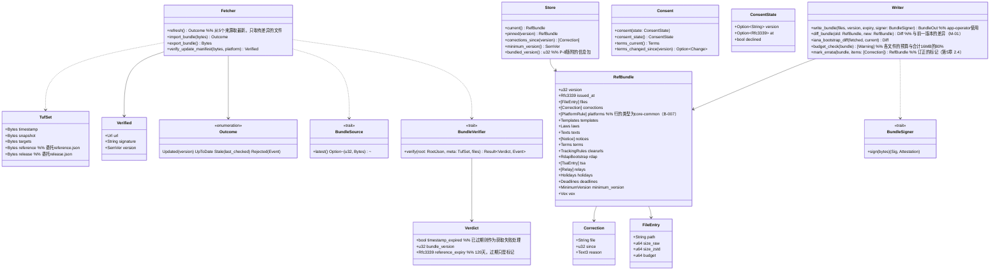

# core-ref（业务。参考信息包与更新清单的获取・TUF的验证）

## 承担的节
- [第8章 3.4 参考信息包](../../../../docs/cn/design/08_基本设计书_仓库与数据管理.md#34-参考信息包)（文件的一览、验证的5段、5个获取源、随附的信息包、订正的标记）
- [第9章 4.2 旧版本的使用者（更新的强制）](../../../../docs/cn/design/09_基本设计书_分发与更新.md#42-旧版本的使用者强制更新)、[4.3 更新清单（静态JSON）的形式](../../../../docs/cn/design/09_基本设计书_分发与更新.md#43-更新说明静态json的形式)（TUF的角色・期限・存放处）
- [第12章 3.1 使用NRSD的服务所必需的](../../../../docs/cn/design/12_基本设计书_与法务的接点.md#31-使用nrsd的服务所必须的内容)（同意的记录）
- 职责与外部的组件：[第11章 7.1](../../../../docs/cn/design/11_基本设计书_开发基础.md#71-rust组件的划分)

## 依赖
- 下层：[core-common](core-common.md)、[core-store](core-store.md)（`Schema`、`AtomicFile`、`Paths`）、[core-net](core-net.md)（`Http::fetch`、`Sources`、`Scheduler`）。
- 依赖的反转：`BundleSource`由本区块定义、core-sync实现（来自其他终端・对方的信息包）。`BundleSigner`由本区块定义、app-operator实现（硬件令牌的签名）。
- 与外部的边界B-330（来自公开页面・镜像的HTTPS GET。经core-net）。

## 类图

## 桥（本区块所有的操作）
|编号|操作（上图）|使用方|由来|
|---|---|---|---|
|B-220|`Fetcher::refresh`|app-client|第8章 3.4|
|B-221|`Store::current`（各表）|rights・guidance・work・app-client（向case・identity由app-client传递）|第8章 3.4、第7章、第5章、第12章|
|B-222|`Fetcher::verify_update_manifest`|app-client|第9章 4.3|
|B-223|`Consent`（只有`refresh`遵从同意。更新清单的验证不依赖同意）|app-client|第12章 3.1、4.3|
|B-224|`Store::minimum_version`|app-client|第9章 4.2|
|B-225|`Store::pinned`|work|第5章 4|
|B-226|`Fetcher::import_bundle`・`export_bundle`（文件・同步・随身套件。首次启动以此导入随附的信息包）|app-client・sync|第8章 3.4|
|B-227|`Store::corrections_since`|app-client・rights|第8章 3.4|
|B-228|`BundleSource`（定义。实现在core-sync）|sync|第8章 3.4|
|B-229|`RefBundle`的形式与`Writer::write_bundle`|app-operator|第8章 3.4|
|B-310的一部分|`BundleSigner`（定义。实现在app-operator）|app-operator|第8章 3.4|
- 发布网站的判定由core-common的`Platforms::detect`（B-007）进行，本区块只把`platforms.json`读为core-common的`[PlatformRule]`。使用方（core-identity B-081、core-case B-181）传入表（同一判定不放在2处）。

## 算法（trait之后）
|trait|实现|切换|由来|
|---|---|---|---|
|`BundleVerifier`|tough（TUF 1.0的顺序：root → timestamp → snapshot → targets → 委托）。root从随附的初版沿版本的连锁更新|固定|第8章 3.4、第9章 4.3|

## 数据设计（本区块持有形式的记录）
|记录|形式|栏|由来|
|---|---|---|---|
|`reference/<版本>/index.json`（`nrsd.reference/1`）|JSON|`schema`、`version`、`issued_at`、`files[]`（`FileEntry`）、`corrections[]`（`Correction`）|第8章 3.4|
|`reference/<版本>/`的各文件（`nrsd.ref.<名称>/1`）|JSON（以zstd获取，解压后存放）・Markdown|`platforms`（1行：`id`、`name`（3种语言）、`hosts[]`、`paths[]`、`profile_limit`、`c2pa_survives`、`windows{copyright, portrait}`（`url`、`method`、`jp_art22`、`notes`）、`sources`、`checked_at`。第7章 2.1）、`laws`（第7章 4）、`deadlines`・`holidays`（第7章 6.3）、`tsa`（`id`、`name`、`url`、`roots`（PEM）、`kind`（`free`・`paid`）、`auth`（`none`・`basic`）、`order`。第3章 4）、`relays`（`url`、`region`、`operator`）、`notices`（编号、日期、种类、3种语言的题与正文、期限）、`terms`（版本、生效日）、`minimum_version`（`app`、`reason`、`date`）、`clearurls`、`rdap-bootstrap/`、`vex`（CSAF 2.0）、`templates/<种类>.<语言>.md`（第7章 3.3）、`texts/`（第5章 3.7）|第8章 3.4、第7章 2.1・3.3・4・6.3、第9章 4.2、第11章 5.3|
|`reference/latest.json`|JSON|`version`、`index_sha256`（不作为信任的依据）|第8章 3.4|
|`tuf/`（获取的TUF元数据的副本：`root.json`的版本连锁、`timestamp`・`snapshot`・`targets`・`reference`・`release`）|JSON|TUF规范1.0的形式|第9章 4.3|
|`consent.json`（`nrsd.consent/1`）|JSON|`ConsentState`的3栏|第12章 3.1|
|随附的信息包（P-8）|`reference/`的初版与`root.json`的初版|同上|第8章 3.4|
- `Store::minimum_version`读取参考信息的`minimum-version.json`与更新清单的TUF（委托`release`的targets的custom）两者，返回较大者（第9章 4.2。未同意、不获取参考信息的使用者也能收到）。
- `Writer::write_bundle`生成各文件（zstd）、`index.json`、`latest.json`、委托`reference`的`targets.json`（以`BundleSigner`签名）。`snapshot.json`・`timestamp.json`由CI的`tuf-online`重新签名（第11章 DD-11-13。P-10）。
- 最后确认的日期时间（`fetch-state.json`的`last_ref_check`・`last_update_check`）以core-net的`Sources::mark_checked`写入。
- 更新清单（`update/latest.json`。`nrsd.update_manifest/1`）的栏依第9章 4.3的表。本区块只验证并返回`Verified`，分发物的获取与替换为app-client（Tauri的更新组件）。
- 标记：`Verdict.timestamp_expired`为获取失败（使用手头的），超过`reference_expiry`为“参考信息已旧”的通知（第8章 3.4的表的5），经同步・文件送达的信息包带`stale_check: date`标记（第8章 3.4）。
