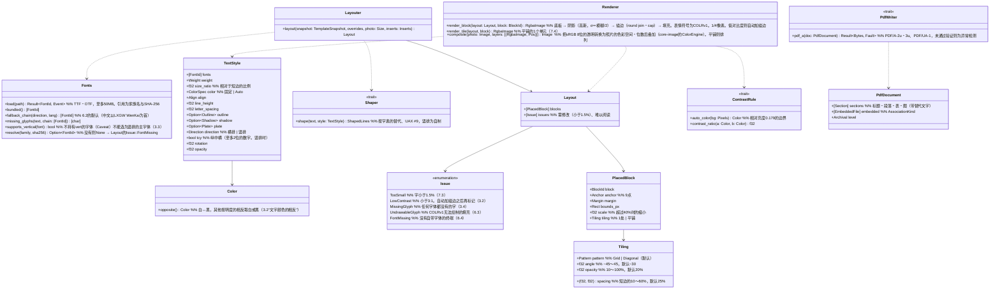

# core-render（业务。字体、文字的组合、绘制、布局、合成、PDF）

## 承担的节
- [第1章 10.11 PDF的文档](../../../../docs/cn/design/01_基本设计书_整体结构.md#1011-pdf文件)
- [第4章 3.2 格式](../../../../docs/cn/design/04_基本设计书_图片编辑与批量套用.md#32-格式)、[3.3 竖排](../../../../docs/cn/design/04_基本设计书_图片编辑与批量套用.md#33-竖排)、[3.4 缺少的字](../../../../docs/cn/design/04_基本设计书_图片编辑与批量套用.md#34-缺字)、[3.5 绘制](../../../../docs/cn/design/04_基本设计书_图片编辑与批量套用.md#35-绘制)、[6.2 替代字体的顺序](../../../../docs/cn/design/04_基本设计书_图片编辑与批量套用.md#62-备用字体的序列)、[6.4 自带的字体](../../../../docs/cn/design/04_基本设计书_图片编辑与批量套用.md#64-带入的字体)、[7.1 位置与大小](../../../../docs/cn/design/04_基本设计书_图片编辑与批量套用.md#71-位置与大小)、[7.3 放不下的情况](../../../../docs/cn/design/04_基本设计书_图片编辑与批量套用.md#73-放不下时)、[7.4 平铺](../../../../docs/cn/design/04_基本设计书_图片编辑与批量套用.md#74-平铺)
- 职责与外部的组件：[第11章 7.1](../../../../docs/cn/design/11_基本设计书_开发基础.md#71-rust组件的划分)

## 依赖
- 下层：[core-common](core-common.md)、[core-image](core-image.md)（`Image`、`ColorEngine`：把绘制的透明图片匹配到照片的色彩空间与位数）。
- 模板・作业的结构（图层、组、插入）由core-work持有，本区块只接收`TemplateSnapshot`（组合所需的副本）。

## 类图

## 桥（本区块所有的操作）
|编号|操作（上图）|使用方|由来|
|---|---|---|---|
|B-110|`Fonts`|work|第4章 6、3.4|
|B-111|`Layouter::layout`|work|第4章 7.1、7.3、7.4|
|B-112|`Renderer::render_block`|work|第4章 3.5、6.3|
|B-113|`Renderer::composite`|sign|第4章 3.5|
|B-114|`ContrastRule`|work|第4章 3.2|
|B-115|`PdfWriter::pdf_a`|backup・case・app-client（线索的导出）|第1章 10.11|
- 平铺只绘制重复的1个单元后排列（第4章 7.4）。旋转的中心为组的中心（第4章 3.5）。

## 算法（trait之后）
|trait|实现|切换|由来|
|---|---|---|---|
|`Shaper`|HarfRust。竖排（`vert`、vhea・vmtx、英数字的旋转、纵中横）为自制|固定|第4章 3.3|
|`ContrastRule`|WCAG的相对亮度与对比度|初始值的常量（3:1时自动描边）|第4章 3.2|
|`PdfWriter`|krilla（在CI中也用veraPDF验证）。替代为printpdf|固定|第1章 10.11、第11章 12|

## 数据设计
- 本区块不写入记录。自带字体的文件由core-work放在`assets/`（SHA-256的名称。第8章 2.1），本区块接收路径后读取。
- `TextStyle`的栏与范围・默认值依第4章 3.2的表，`PlacedBlock`的基准点・边距・缩小依7.1・7.3，平铺的栏依7.4的表。在模板的记录（`nrsd.template/2`）中持有这些的是core-work（第4章 15.1）。
