# core-rights（业务。许可范围、随附文件、权利的记载、声明的例文）

## 承担的节
- [第2章 2.2 展示声明码的位置的上限](../../../../docs/cn/design/02_基本设计书_签名信息与比对.md#22-揭示声明码处的上限)
- [第3章 3.3 权利表示的语言](../../../../docs/cn/design/03_基本设计书_签名处理.md#33-权利标示的语言)、[3.6 文件的权利的记载](../../../../docs/cn/design/03_基本设计书_签名处理.md#36-文件的权利记载iptc的照片元数据)
- [第5章 2.1 选项](../../../../docs/cn/design/05_基本设计书_权利文书.md#21-选项o-04许可范围的选项的决定)、[2.3 与图片的关联](../../../../docs/cn/design/05_基本设计书_权利文书.md#23-与图片的关联)、[2.4 销售后的变更](../../../../docs/cn/design/05_基本设计书_权利文书.md#24-销售后的变更)、[3.1 构成](../../../../docs/cn/design/05_基本设计书_权利文书.md#31-构成)、[3.2 共通部分的骨架](../../../../docs/cn/design/05_基本设计书_权利文书.md#32-共通部分的骨架)、[3.4 改写的检测](../../../../docs/cn/design/05_基本设计书_权利文书.md#34-改写的检测)、[3.6 机器可读的许可范围（ODRL）](../../../../docs/cn/design/05_基本设计书_权利文书.md#36-机器可读的许可范围odrl)、[3.8 国家与语言的代码](../../../../docs/cn/design/05_基本设计书_权利文书.md#38-国家与语言的代码)、[5 国家](../../../../docs/cn/design/05_基本设计书_权利文书.md#5-国家)、[6.1 例文的档次](../../../../docs/cn/design/05_基本设计书_权利文书.md#61-文字示例的档位)
- 职责与外部的组件：[第11章 7.1](../../../../docs/cn/design/11_基本设计书_开发基础.md#71-rust组件的划分)

## 依赖
- 下层：[core-common](core-common.md)（`Text::text`、`NoticeCode`、`WorkId`）、[core-store](core-store.md)（`Chain::sign_embedded`：订正版的签名）、[core-hash](core-hash.md)（随附文件的SHA-256）、[core-ref](core-ref.md)（文字`texts/`、例文、发布网站的表、`pinned`的版本）。
- 不依赖设置：随附的国家・语言由调用方（core-sign・app-client）从设置读取后传入。
- 订正版：受影响作品的列举为app-client（从core-sign的作品数据与core-ref的`corrections_since`），生成为本区块，签名为core-store的`sign_embedded`（`RecordSigner`为core-identity）。

## 类图

```mermaid
classDiagram
  class PermittedScope {
    +Base base  %% P1 | P2
    +[Addon] addons  %% A1 A2 A3
    +short() String  %% P2+A1+A2
    +always_included() [Condition]
    +sns_default() PermittedScope  %% 社交平台用的默认“相当于P1：仅浏览、禁止转载”（第5章 2.1、第3章 8.2）
  }
  class Enclosure {
    +[EnclosureFile] files  %% 00_RIGHTS_README.txt、00_RIGHTS_<国家>.txt、00_RIGHTS.json
    +[(String, Hash)] hashes
  }
  class EnclosureBuilder {
    +build(scope, countries: [Country], holder: Holder, batch_id: Uuid, work_ids: [WorkId], ref_pinned: RefBundle) Enclosure
    +regenerate(work: WorkData) Enclosure
    +errata(work_ids, correction: Correction) (ErrataFile, Jws)
  }
  class Holder {
    +String handle
    +NoticeCode notice_code
    +[Url] accounts
    +Option~Party~ grantor  %% 经授权者的输出
    +Option~Party~ co_rights_holder
  }
  class Odrl {
    <<module>>
    +offer(scope, batch_id, holder, work_ids) JsonLd  %% 第5章 3.6的对应
  }
  class EnclosureVerifier {
    +verify(folder: Path, manifest_hashes: [(String, Hash)]) VerifyReport  %% 一致・不一致・没有・多余、ERRATA的正当性
  }
  class Deed {
    <<module>>
    +deed(scope, lang) DeedTable  %% 可以・条件・不可以
  }
  class RightsText {
    <<module>>
    +rights_fields(stream, scope, lang, holder, title) RightsFields  %% XMP・EXIF・cawg.metadata・cawg.training-mining的值
    +notice_texts(level, lang, handle, code, platform, profile_limit: Option~u32~, registration: Option) String  %% 短・中・长（第5章 6.1）。上限由调用方从platforms的列传入（第2章 2.2）
    +license_short(scope) String
  }
  class ViolationRules {
    <<trait>>
    +violations(scope, facts: RepostFacts) [ViolationCandidate]
  }
  class RepostFacts {
    +bool paid
    +bool public
    +bool c2pa_missing
    +bool pixels_identical_to_delivery
    +PlatformC2paSurvival survival
  }
  EnclosureBuilder --> Enclosure
  EnclosureBuilder ..> Odrl
  EnclosureBuilder ..> Holder
  EnclosureBuilder ..> PermittedScope
  EnclosureVerifier --> VerifyReport
  ViolationRules ..> RepostFacts
  ViolationRules ..> PermittedScope
```

## 桥（本区块所有的操作）
|编号|操作（上图）|使用方|由来|
|---|---|---|---|
|B-120|`PermittedScope`|work・sign・case・app-client|第5章 2.1|
|B-121|`EnclosureBuilder::build`|sign|第5章 3、4、3.1|
|B-122|`EnclosureVerifier::verify`|sign・app-client|第5章 3.4|
|B-123|`RightsText::notice_texts`（发布网站的上限来自表的列）|app-client|第5章 6|
|B-124|`RightsText::rights_fields`|sign|第3章 3.3、3.6|
|B-125|`Deed::deed`|app-client・P-6（同一表）|第5章 3.1|
|B-126|`EnclosureBuilder::regenerate`、`errata`|app-client|第5章 2.4、4|
|B-127|`RightsText::license_short`|work|第5章 2.1|
|B-128|`ViolationRules::violations`|case|第5章 2.3|

## 算法（trait之后）
|trait|实现|切换|由来|
|---|---|---|---|
|`ViolationRules`|第5章 2.3的候选规则（许可范围外的公开、商用的利用、比对数据去除的条件）|固定|第5章 2.3|

## 数据设计（本区块持有形式的东西。不是终端的记录而是输出）
|输出|形式|栏|由来|
|---|---|---|---|
|`00_RIGHTS_README.txt`|TXT（UTF-8、无BOM、CRLF）。日・中・英|第5章 3.2的10项|第5章 3.1、3.2|
|`00_RIGHTS_<国家>.txt`|TXT|各国部分（文字为参考信息的`texts/`。P-7）|第5章 3.1、3.3|
|`00_RIGHTS.json`|ODRL 2.2 JSON-LD（Offer）|第5章 3.6的表与例。`uid`・`assigner`・`target`的URI为`https://c2pa4cosplayer.nrsd.jp/id/…`|第5章 3.6|
|`00_RIGHTS_ERRATA.txt`＋`.sig`|TXT、JWS detached|开头为原版与订正版的SHA-256、差异、签名|第5章 2.4、3.4|
|`RightsFields`（XMP・EXIF的值）|core-image的类型|第3章 3.6的表的栏|第3章 3.6|
- 许可范围的记录处为作品数据`rights`（core-sign的页面）与清单`jp.nrsd.rights`・`cawg.metadata`・`cawg.training-mining`（第3章 3.1）。
- 随附文件的正文由参考信息的`texts/common.<语言>.md`・`texts/country.<国家>.<语言>.md`（第5章 4）填入插入`{handle}`・`{account}`・`{scope}`・`{url}`生成（规则与第4章 3.1相同。本区块不使用core-work的插入规则，而把同一规则放在core-common的`Text`一侧）。
