# core-sign（业务。C2PA签名、可信时间戳与ERS、导出的流程、作品数据）

## 承担的节
- [第2章 4.2 原图](../../../../docs/cn/design/02_基本设计书_签名信息与比对.md#42-原图)、[4.6 导出带有他人C2PA签名的图片时](../../../../docs/cn/design/02_基本设计书_签名信息与比对.md#46-导出带有他人c2pa签名的图片时)
- 第3章：[1 设计上的决定的一览](../../../../docs/cn/design/03_基本设计书_签名处理.md#1-设计决定的一览)、[3.1 记录的项目](../../../../docs/cn/design/03_基本设计书_签名处理.md#31-记录的项目)、[3.2 不记录的项目](../../../../docs/cn/design/03_基本设计书_签名处理.md#32-不记录的项目)、[3.4 操作的记录](../../../../docs/cn/design/03_基本设计书_签名处理.md#34-操作的记录)、[3.5 可信时间戳的存放处](../../../../docs/cn/design/03_基本设计书_签名处理.md#35-可信时间戳的放置处)、[3.7 按格式的嵌入](../../../../docs/cn/design/03_基本设计书_签名处理.md#37-各格式的嵌入)、[3.8 素材清单的涂黑](../../../../docs/cn/design/03_基本设计书_签名处理.md#38-素材清单的涂黑)、[4 可信时间戳](../../../../docs/cn/design/03_基本设计书_签名处理.md#4-可信时间戳)、[7.1 识别编号](../../../../docs/cn/design/03_基本设计书_签名处理.md#71-识别编号)、[7.2 作品数据的项目](../../../../docs/cn/design/03_基本设计书_签名处理.md#72-作品数据的项目o-10作品数据的记录格式的决定)、[8.1 顺序](../../../../docs/cn/design/03_基本设计书_签名处理.md#81-顺序)、[8.2 系统的差异](../../../../docs/cn/design/03_基本设计书_签名处理.md#82-系统的差异)、[9 批处理](../../../../docs/cn/design/03_基本设计书_签名处理.md#9-批量处理)、[10.1 名称与构成](../../../../docs/cn/design/03_基本设计书_签名处理.md#101-名称与构成)、[10.2 使用者的确认](../../../../docs/cn/design/03_基本设计书_签名处理.md#102-使用者的确认)、[11 失败的处理](../../../../docs/cn/design/03_基本设计书_签名处理.md#11-失败的处理)
- 职责与外部的组件：[第11章 7.1](../../../../docs/cn/design/11_基本设计书_开发基础.md#71-rust组件的划分)

## 依赖
- 下层：[core-common](core-common.md)、[core-store](core-store.md)（`Chain`、`AtomicFile`、`WorkIndex`、`Space`）、[core-net](core-net.md)（`post_timestamp`、`Scheduler`）、[core-hash](core-hash.md)、[core-image](core-image.md)、[core-identity](core-identity.md)（`current`、`with_signing_key`、`PastRoots`、`Grants::is_revoked`、`skeleton`、`expected_notice_code`）、[core-mark](core-mark.md)、[core-render](core-render.md)（`composite`）、[core-rights](core-rights.md)（`EnclosureBuilder::build`、`RightsText::rights_fields`、`EnclosureVerifier::verify`）、[core-work](core-work.md)（`export_plan`、`render_export`、`mark_exported`、`parallelism`）。
- 与外部的边界B-332（TSA。经core-net）。
- 授权书撤销的确认（第2章 5.4“批量导出开始时”）由app-client在开始时以`Grants::is_revoked`进行1次，本区块不按照片确认。
- `InsertContext`（插入）由本区块加上作品的识别编号后传给core-work。TSA的一览`tsa.json`由调用方从参考信息传入（本区块不依赖core-ref）。

## 类图

```mermaid
classDiagram
  class WorkData {
    +WorkId id
    +Stream stream
    +Original original
    +Output output
    +Bytes manifest
    +Rights rights
    +Option~CoRights~ co_rights
    +Signer signer
    +Tsa tsa
    +AppInfo app
    +Rfc3339 created_at
    +ClockStamp clock
    +Option~WorkId~ duplicate_of
    +[Ingredient] ingredients
  }
  class Original {
    +Hash sha256
    +Format format
    +Size px
    +Option~PdqHash~ pdq
    +Path path
    +[OriginalVersion] versions  %% 重新显影、显影前的RAW
    +Option~Rfc3339~ date_time_original
  }
  class Output {
    +Hash sha256
    +Format format
    +Size px
    +PdqHash pdq
    +IsccCode iscc
    +String file_name
    +String original_name
    +Option~NameFix~ name_fix
    +[Path] locations
  }
  class Tsa {
    +TsaState state  %% Attached | Pending
    +[TsResponse] responses
  }
  class Rights {
    +ScopeId scope_id
    +u32 scope_version
    +Option~[(String, Hash)]~ enclosure_hashes  %% 仅交付用
    +u32 ref_version
    +[(String, Hash)] text_file_hashes  %% 所用的文字文件（第5章 4）
  }
  class NrsdRights {
    +WorkId work_id
    +IsccCode iscc
    +Hash original_sha256
    +Size original_px
    +ScopeId scope_id
    +u32 scope_version
    +Option~Hash~ enclosure_sha256
    +Option~String~ co_rights_holder
    +Option~String~ grantor
    +u32 ref_version
    +[(String, Hash)] text_file_hashes
    +Option~String~ shoot  %% 拍摄名称（不放入原文件名）
  }
  class ExistingSignature {
    <<enumeration>>
    None
    OwnRoot  %% ①现在或过去的个人根证书 → 作为素材导入
    ToolOnly  %% ②相机・显影软件（无身份记录）→ parentOf、涂黑
    KnownParty  %% ③有授权书・共同权利书面的对方 → 署名
    Stranger  %% ④无关的他人的身份 → 不处理
    Tampered  %% ⑤篡改的编号 → 不处理
  }
  class Exporter {
    +export_one(session, item: ExportItem, scope, tsa_set: [TsaEntry], enclosure: Option~Enclosure~) Result~WorkData, Event~  %% 8.1的第1〜14段
    +cleanup_after_crash() Report
    +queue() ExportQueue
  }
  class ExportQueue {
    +[(Uuid session, PresetId)] items
    +push(...)
    +pop_next() Option~...~
  }
  class Inspector {
    +inspect(path) Inspection  %% 验证的编号、签名者、期望的声明码、是否自身的根证书、素材、水印、PDQ
    +status_word_key(code) String
    +verify_readback(temp_path, expected: WorkData) Result
  }
  class Inspection {
    +ExistingSignature existing  %% 第3章 2的表的①〜⑤（outsideValidity不停止，只标记）
    +[StatusCode] validation_codes
    +Option~SignerInfo~ signer
    +Option~NoticeCode~ expected_notice_code
    +Option~Period~ own_root
    +[IngredientInfo] ingredients
    +Option~WorkId~ watermark_id
    +Option~PdqHash~ pdq
    +bool similar_handle  %% UTS #39 skeleton的一致
  }
  class Timestamps {
    +timestamp(hash, tsa_set: [TsaEntry]) TsResponses  %% 3个并行，取最先的1个
    +verify_tsr(response, hash) Result
    +attach_pending_timestamps() Report
    +timestamp_chain_head() Result
    +ers_update() EvidenceRecord
    +ers_for(rows: Range) EvidenceRecord
  }
  class TsaStrategy {
    <<trait>>
    +pick(tsa_set) [TsaEntry]
  }
  class Rfc3161 {
    <<module>>
    +request(hash, nonce) Der
    +verify(response: Der, hash, roots) TsInfo  %% der・x509-cert・cms
  }
  class Ers {
    <<module>>
    +archive_timestamp(hashes) EvidenceRecord  %% RFC 4998
    +renew(record, new_ts) EvidenceRecord
  }
  class ManifestBuilder {
    +build(photo: Image, ctx, ingredients, redactions, rights: NrsdRights) ManifestDefinition  %% 3.1的断言、3.4的操作（allActionsIncluded真）、3.8的涂黑、cawg.identity（摄影者cawg.creator、Coser jp.nrsd.subject、经授权者cawg.publisher）、claim_generator、title为可移植的名称
    +sign_with_timestamp(def, bytes, tsa_set) Bytes  %% 向c2pa的Signer的可信时间戳入口传入Rfc3161（3.5的sigTst2）
  }
  class Works {
    +works(query) [WorkData]
    +work(id) WorkData
    +correct(id, correction: Correction)
    +record_published(id, published: Published)
    +link_original(id, path) Result
    +pending_timestamps_count() u32
    +verify_originals() [OriginalIssue]
    +record_original_version(id, sha256, path)
    +find_original(sha256, roots: [Path]) Option~Path~
  }
  class OriginalIssue {
    +WorkId work_id
    +IssueKind kind  %% Missing | Changed（SHA-256不同）| Unreadable
    +Path recorded_path
  }
  class Naming {
    +plan_names(session, items) [(Path temp, Path final)]  %% 10.1、3个OS的检查、连号。嵌套的文件夹在输出中复制同样的嵌套（第3章 9）。文件夹的冲突为_2、_3
    +write_index(folder, rows) Path  %% 00_INDEX.txt（3种语言的标题。连号・识别编号・原名称・拍摄名称）
  }
  class NameSanitizer {
    <<trait>>
    +fix(path) (Path, Option~NameFix~)
  }
  class SizeFitter {
    <<trait>>
    +fit(image, preset) EncodeSettings  %% 超过5MB则品质每次降2，下限80
  }
  Exporter --> WorkData
  Exporter ..> ManifestBuilder
  Exporter ..> Timestamps
  Exporter ..> Naming
  Exporter ..> Inspector
  Exporter ..> SizeFitter
  Exporter --> ExportQueue
  Timestamps ..> Rfc3161
  Timestamps ..> Ers
  Timestamps ..> TsaStrategy
  Naming ..> NameSanitizer
  Works --> WorkData
  WorkData --> Original
  WorkData --> Output
  WorkData --> Tsa
  WorkData --> Rights
  ManifestBuilder --> NrsdRights
  Inspection --> ExistingSignature
  Inspector --> Inspection
```

## 桥（本区块所有的操作）
|编号|操作（上图）|使用方|由来|
|---|---|---|---|
|B-160|`Inspector::inspect`|app-client・case|第3章 10.2、第2章 4.6|
|B-161|`Exporter::export_one`|app-client|第3章 8.1、7.2|
|B-162|`Timestamps::timestamp`、`verify_tsr`（`tsa_set`由调用方从参考信息传入）|case|第3章 4|
|B-163|`Timestamps::attach_pending_timestamps(targets, tsa_set)`（作品数据的保留与案件状况追记的保留。对象由调用方从`Works`・core-case的`Cases`收集后传入）|app-client|第3章 4、第6章 3.2|
|B-164|`Timestamps::timestamp_chain_head`、`ers_update`|app-client|第3章 4|
|B-165|`Timestamps::ers_for`|case|第3章 4|
|B-166|`Inspector::status_word_key`|app-client|第3章 10.2|
|B-167|`Works`（检索・详情・订正・原帖子・原图的关联・保留的数量）|app-client・backup|第3章 7.2、第2章 4.2|
|B-168|`Exporter::cleanup_after_crash`|app-client|第3章 9|
|B-169|`Works::verify_originals`、`record_original_version`、`find_original`|app-client・case・backup|第2章 4.2|

## 算法（trait之后）
|trait|实现|切换|由来|
|---|---|---|---|
|`TsaStrategy`|按`tsa.json`的顺序向3个并行，最先的1个放入`sigTst2`，其余放入作品数据|`tsa.json`的顺序|第3章 4|
|`NameSanitizer`|3个OS的上限・保留字・NFC/NFD的冲突|固定|第3章 10.1|
|`SizeFitter`|品质每次降2（下限80）|初始值的常量|第4章 14.1|

## 数据设计（本区块持有形式的记录与输出）
|记录|形式|栏|由来|
|---|---|---|---|
|`works/<年>/<批处理编号>.jsonl`＋`.sig`（`nrsd.work/1`。链）|JSON Lines|第3章 7.2的表（`WorkData`。订正`correction`・原帖子`published`为追加的行）|第3章 7.2|
|`state/export-queue.json`（`nrsd.export_queue/1`）|JSON|`items[]`（作业编号、预设）、临时名称的一览|第3章 9|
|`state/ers.json`（`nrsd.ers/1`）|JSON|EvidenceRecord的保存与下次更新的计划|第3章 4|
|`chain-heads.json`（`nrsd.chain_heads/1`）|JSON|捆绑的可信时间戳的对象（各stream末端的哈希）|第3章 4、第8章 2.1|
|输出：交付用的文件夹|`<日期>_<拍摄名称>_delivery/`：图片（`<拍摄名称>-<连号>-<识别编号>.<扩展名>`）、随附文件（core-rights）、`00_INDEX.txt`|第3章 10.1|第3章 10.1|
|输出：社交平台用的文件夹|`<日期>_<拍摄名称>_sns/<预设>/<原名称>_<识别编号>.<扩展名>`|第3章 10.1|第3章 10.1|
|清单（输出之中）|JUMBF（c2pa）|第3章 3.1的断言、3.4的操作、`sigTst2`的可信时间戳|第3章 3|
- 留在`app`栏的算法记录：水印的variant与模型的版本（core-mark的`model_info`）、颜色转换的组件与版本、PDQ的阈值（第3章 7.2）。
