# core-store（基础）

## 承担的节
- [第1章 8.1 数据的一览](../../../../docs/cn/design/01_基本设计书_整体结构.md#81-数据的一览)、[8.3 格式与版本](../../../../docs/cn/design/01_基本设计书_整体结构.md#83-格式与版本)、[8.4 保留与删除](../../../../docs/cn/design/01_基本设计书_整体结构.md#84-保留与删除)、[9.1 各OS的存放位置](../../../../docs/cn/design/01_基本设计书_整体结构.md#91-各操作系统的存放位置)、[10.1 数据的模型](../../../../docs/cn/design/01_基本设计书_整体结构.md#101-数据的模型)、[10.2 保存](../../../../docs/cn/design/01_基本设计书_整体结构.md#102-保存)、[10.8 语言与国家](../../../../docs/cn/design/01_基本设计书_整体结构.md#108-语言与国家)、[10.9 版本的兼容性](../../../../docs/cn/design/01_基本设计书_整体结构.md#109-版本的兼容)
- [第8章 2.1 配置](../../../../docs/cn/design/08_基本设计书_仓库与数据管理.md#21-配置)、[2.2 不出终端之外的事项](../../../../docs/cn/design/08_基本设计书_仓库与数据管理.md#22-不离开终端)、[4 完整性](../../../../docs/cn/design/08_基本设计书_仓库与数据管理.md#4-完整性)、[6.1 终端容量的参考](../../../../docs/cn/design/08_基本设计书_仓库与数据管理.md#61-终端容量的估计)
- [第9章 4.4 记录格式的迁移](../../../../docs/cn/design/09_基本设计书_分发与更新.md#44-记录格式的迁移)、[第10章 10 设置](../../../../docs/cn/design/10_基本设计书_界面与设计.md#10-设置)
- 职责与外部的组件：[第11章 7.1](../../../../docs/cn/design/11_基本设计书_开发基础.md#71-rust组件的划分)

## 依赖
- 下层：[core-common](core-common.md)。
- 依赖的反转：`RecordSigner`由本区块定义，core-identity实现并传入（签名・自身的根证书・终端编号）。

## 类图

```mermaid
classDiagram
  class Paths {
    +data_dir() Path
    +cache_dir() Path
    +log_dir() Path
    +ensure_layout()  %% 创建第8章 2.1的文件夹
  }
  class AtomicFile {
    <<module>>
    +atomic_write(path, bytes) Result  %% ~$<名称>.tmp → sync_all → MoveFileExW(REPLACE_EXISTING|WRITE_THROUGH) / rename → 文件夹的fsync
    +rename_final(temp, final) Result
    +sweep_temps(root) [Path]  %% 启动时删除残留的~$*.tmp（第1章 8.4、7.8）。输出文件夹不在对象内（core-sign）
  }
  class Jcs {
    <<module>>
    +canonicalize(json) Bytes  %% RFC 8785。组件（serde_json_canonicalizer）
    +canonicalize_ref(json) Bytes  %% 自制的最小实现。CI中确认两者一致与RFC的测试向量
  }
  class Jws {
    +Header protected  %% alg: ES256、x5c（签名用与个人根证书）、sigT（JAdES）
    +Bytes signature  %% detached。正文为JCS的输出
  }
  class RecordSigner {
    <<trait>>
    +sign(bytes) Jws
    +own_roots() [Cert]
    +device_id() DeviceId
  }
  class ChainRead {
    +[Row] rows
    +Option~u64~ broken_after  %% “链已断”的标记（隔离的行的seq）
  }
  class Chain {
    +append(stream, body: Json) Row
    +read(stream) ChainRead
    +head(stream) Hash
    +verify(stream) ChainReport
    +quarantine(row)
    +write_head(stream)
    +check_head(stream) Result
    +merge_rows(stream, rows: [Row]) MergeReport
    +sign_embedded(json) Json
    +verify_embedded(json) EmbeddedSigner
  }
  class Row {
    +Hash prev
    +u64 seq
    +DeviceId device
    +ClockStamp clock  %% core-common B-006
    +Json body
    +Jws sig
  }
  class Head {
    +u64 seq
    +Hash last_bytes_sha256
    +Jws sig
  }
  class EmbeddedSigner {
    +Cert signer_root
    +NoticeCode notice_code
  }
  class MergeReport {
    +u32 added
    +[Conflict] conflicts
  }
  class MergePolicy {
    <<trait>>
    +resolve(local: Row, remote: Row) Resolution
  }
  class Schema {
    +validate(schema_id, json) Result
    +version_of(json) Version
    +migrate_all() MigrationReport  %% 第9章 4.4的①〜④：确认空余 → 复制到migration-backup/ → 迁移 → 验证（签名・件数・版本）
    +rollback(from_backup) Result  %% 失败时。此后只读
    +migration_backup() Path
    +schema_json(schema_id) bytes
    +list() [SchemaId]
  }
  class SettingEntry {
    +Value value
    +Rfc3339 updated_at
    +DeviceId device
  }
  class Settings {
    +get(key) Value
    +set(key, value)  %% 附updated_at与device保存
    +is_device_scoped(key) bool  %% device.的前缀
    +merge_remote(entries: [SettingEntry])  %% 不依赖终端的项目取较新者（第10章 10）
  }
  class RunMarker {
    +start()
    +clean_exit()
    +last_exit_was_clean() bool
  }
  class SafeArchive {
    +zip_write(entries, limits) Path
    +zip_read(path, limits) [Entry]
  }
  class ZipLimits {
    +u32 max_entries
    +u64 max_total_bytes
  }
  class Retention {
    +sweep() [Removed]  %% 启动时：日志90天、崩溃时的报告10件・30天、缩小图像超过1GB、迁移的副本30天、残留的临时文件（AtomicFile::sweep_temps）
    +sweep_assets(unreferenced: [Hash]) [Removed]  %% 仅在备份归并时（第1章 8.4）。候选由core-backup从core-work收集
  }
  class WorkIndex {
    +lookup(work_id) Location
    +lookup_by_hash(sha256) [WorkId]
    +lookup_by_text_hash(sha256) [WorkId]  %% 从所用的文字文件（订正版的列举。第5章 2.4）
    +rebuild()
  }
  class SessionLock {
    +acquire(dir) Lock
    +is_stale() bool
    +release()
  }
  class Space {
    <<module>>
    +free_space(path) u64
  }
  class Startup {
    <<module>>
    +verify_all_on_startup() ChainReport  %% 从末端开始。把日期时间放在state/last-verify，每天至多1次
  }
  Chain --> Row
  Chain --> Head
  Chain --> ChainRead
  Chain ..> RecordSigner
  Chain ..> Jcs
  Chain ..> Jws
  Chain ..> MergePolicy
  Chain ..> AtomicFile
  Chain ..> Schema
  Settings --> SettingEntry
  Settings ..> AtomicFile
  WorkIndex ..> Chain
  Retention ..> Paths
  SafeArchive ..> ZipLimits
```

## 桥（本区块所有的操作）
|编号|操作（上图）|使用方|由来|
|---|---|---|---|
|B-020|`Paths`|全部写入者、app-client|第1章 9.1、第8章 2.1|
|B-021|`AtomicFile`|全部写入者|第1章 10.2|
|B-022|`Chain`（追加・读取・验证・末端・隔离・对齐・JSON内的签名）|sign・case・identity・sync・backup・rights|第1章 8.3、第8章 4、第2章 DD-2-10|
|B-023|`RecordSigner`（定义。实现在core-identity）|identity|第1章 8.3|
|B-024|`Schema`|全部写入者|第1章 8.3、10.9、第9章 4.4|
|B-025|`Settings`|全部读取者|第10章 10、第1章 10.8|
|B-026|`RunMarker`|app-client|第8章 2.1|
|B-027|`SafeArchive`|work・backup・case・app-client|第1章 10.2|
|B-028|`Retention::sweep`（启动时）、`sweep_assets(unreferenced)`（备份归并时。候选由core-backup从core-work的`assets_gc_candidates`传入）|app-client・backup|第1章 8.4、第8章 6.1|
|B-033|`Jcs`、`Jws`（记录电子签名的形式。授权书的`signatures`・WACZ的签名也是同一形式）|identity・case・sign・rights|第1章 8.3|
|B-029|`WorkIndex`|case・sign|第8章 2.1|
|B-030|`SessionLock`|work|第1章 10.2|
|B-031|`Space::free_space`|work・backup・sign|第8章 6.1|
|B-032|`Startup::verify_all_on_startup`|app-client|第8章 4|
- `verify_embedded`返回的根证书与声明码视为谁的，由使用方判断（core-identity B-085・B-089）。

## 算法（trait之后）
|trait|实现|切换|由来|
|---|---|---|---|
|`MergePolicy`|第1章 8.3的对齐规则|固定|第1章 8.3|

## 数据设计（本区块持有形式的记录）
- 存放处与写入者依第8章 2.1的表，`schema`的名称与JSON Schema的存放处依第1章 8.3。正文由其他区块定义的记录在该区块的页面。

|记录|形式|栏|由来|
|---|---|---|---|
|链的行（全部`.jsonl`）|JSON Lines。1行＝`Row`|`prev`、`seq`、`device`、`clock`（core-common的`ClockStamp`。可信时间戳在正文或`timestamped`的行）、正文、`sig`|第1章 8.3、10.7|
|末端的记录`<stream>.sig`|JSON|`seq`、`sha256`、`sig`（`Head`）|第1章 8.3|
|隔离`<stream>/quarantine/`|原行原样|—|第1章 8.3|
|`settings.json`（`nrsd.settings/1`）|JSON|第10章 10的表的`区分.项目` → `{value, updated_at, device}`。按终端的项目带`device.`前缀|第10章 10|
|`works/index.json`（`nrsd.work_index/1`）|JSON|`by_work_id{识别编号 → file, line}`、`by_sha256{哈希 → [识别编号]}`、`by_text_sha256{文字文件的哈希 → [识别编号]}`|第8章 2.1|
|`state/running`、`state/seq`、`state/last-verify`|标记、整数、日期时间|`seq`由core-common的`Clock::monotonic_seq`写入（存放处由app-client经`Clock::init(state_dir)`传入）|第8章 2.1|
|`migration-backup/<原版本>/`|原文件的副本|—|第9章 4.4|
|`state/`的其他文件|JSON・标记|栏见持有者的页面（common・net・sign・app-client）|第8章 2.1|
- 上限的初始值见第1章 8.4与第8章 6.1。
- 作业版本的备份（超过5个的旧版本。第1章 8.4、第4章 11.4）是`sessions/`内的事项，故由core-work的`Sessions`删除。本区块的`sweep`不触碰`sessions/`。
