# core-sync（业务。终端的链接与同步、已确认的对方与文件的直接交付）

## 承担的节
- [第2章 5.5 对方的添加（文件的交付）](../../../../docs/cn/design/02_基本设计书_签名信息与比对.md#55-对方的添加文书的交接)
- [第8章 5.4 终端之间的同步](../../../../docs/cn/design/08_基本设计书_仓库与数据管理.md#54-终端之间的同步)
- 只读：第1章 10.10（QR的`link`・`contact`。形式为core-common）、第1章 12（中继的一览`relays.json`。形式为core-ref）、第8章 5.5（终端成为备份的存放处）。

## 依赖
- 下层：[core-common](core-common.md)（`Qr`・`AppUrl::Link`・`AppUrl::Contact`、`Clock`）、[core-store](core-store.md)（`Chain`：末端的交换与缺少行的追加・验证。`Settings::merge_remote`：不依赖终端的项目）、[core-net](core-net.md)（`Reachability`、`Scheduler`、`Limits::for_target`（Direct・Dht）、不使用中继的设置的读取）、[core-identity](core-identity.md)（`current`（个人根证书与签名用证书的链）、`Keystore`（终端密钥。以`with_signing_key`对随机数签名。以`export_keys`／`import_keys`在链接时交付密钥）、`Grants`（文件的导入）、`os_user_verify`）、[core-ref](core-ref.md)（`relays.json`、`BundleSource`的实现）、[core-work](core-work.md)（`Merge::merge_remote`）。
- 上层：[app-client](app-client.md)（G-18对方、G-20终端、启动时的`sync_now`、收到的文件・模板的通知）。[core-backup](core-backup.md)的`Device`的存放处由app-client以`backup_folder`连接。
- 与外部的边界B-335（直接连接：iroh的QUIC、公开的中继、pkarr的DHT）。不经过HTTP，故不使用core-net的`Http`。

## 类图

```mermaid
classDiagram
  class Endpoint {
    +NodeId node  %% 终端的公钥
    +start(relays, relay_mode) Endpoint  %% iroh。ALPN c2pa4cosplayer/sync/1
    +connect(peer: NodeId) Conn
    +accept() Conn
  }
  class Link {
    +link_qr() Qr  %% 向新终端出示
    +link_from(src: Qr | CodePhrase) Result~Device~  %% 确认之后，经线路交付密钥（export_keys）
    +devices() [Device]  %% 上限5台
    +remove_device(id)
    +announce_removed()  %% “已移除此终端”的行（记录清除之前。第9章 2.3）
    +challenge(conn) Result  %% 证书链与对随机数签名的相互确认
  }
  class Device {
    +DeviceId id
    +NodeId node
    +String name
    +Option~Rfc3339~ last_synced
  }
  class CodePhrase {
    +String phrase  %% 1个编号与PGP词表的2个词
    +new() CodePhrase
    +publish(node, ttl: 10min)  %% Argon2id → Ed25519 → pkarr
    +resolve(phrase) NodeId
  }
  class Pake {
    <<trait>>
    +agree(conn, phrase) SessionKey  %% SPAKE2（RFC 9382）
  }
  class Contacts {
    +contact_qr() Qr
    +contact_passphrase() CodePhrase
    +add_contact(src: Qr | CodePhrase) Pending
    +safety_number(peer) String  %% 60位按5位×12
    +confirm(peer)
    +peers() [Peer]
    +remove(peer)
  }
  class Peer {
    +PeerId id
    +NodeId node
    +NoticeCode notice_code
    +PeerState state  %% Pending | Confirmed
  }
  class SafetyNumber {
    <<trait>>
    +compute(mine, theirs) String  %% SHA-512 ×5200、前30字节
  }
  class Transfer {
    +send_document(peer, doc: Document) Result  %% 送达前排队
    +send_template(peer, tpl: Path) Result
    +receive(conn) Inbound  %% 文件交给Grants::import，模板为“收到的模板”
    +outbox() [Queued]
  }
  class Sync {
    +sync_now() SyncReport  %% 末端的交换 → 缺少的行 → blobs → Merge
    +backup_folder() Path  %% 接收对方终端的备份
    +exchange_heads(conn) [(Stream, DeviceId, u64)]
  }
  class SyncReport {
    +[(DeviceId, u32)] rows_received
    +u32 blobs_received
    +[Conflict] conflicts  %% 同一device・seq而内容不同的行（第1章 8.3）
    +Option~u32~ bundle_version_offered  %% 对方的参考信息的版本（BundleSource）
  }
  class Blobs {
    +fetch(conn, hash: Blake3) Path  %% iroh-blobs。可从中途继续
  }
  Link ..> Endpoint
  Link ..> CodePhrase
  Link ..> Pake
  Link --> Device
  Contacts ..> Endpoint
  Contacts ..> CodePhrase
  Contacts ..> SafetyNumber
  Contacts --> Peer
  Transfer ..> Endpoint
  Sync ..> Endpoint
  Sync ..> Blobs
```

## 桥（本区块所有的操作）
|编号|操作（上图）|使用方|由来|
|---|---|---|---|
|B-260|`Link`（`link_qr`・`link_from`・`devices`・`remove_device`）|app-client|第8章 5.4、第10章 G-20|
|B-261|`Contacts`（QR・口令・添加・安全编号・确认・一览・删除）|app-client|第2章 5.5|
|B-262|`Transfer::send_document`（收到之物交给`Grants::import`）|app-client|第2章 5.5|
|B-263|`Transfer::send_template`|app-client|第8章 5.4|
|B-264|`Sync::sync_now`、`backup_folder`|app-client|第8章 5.4|

## 算法（trait之后）
|trait|实现|切换|由来|
|---|---|---|---|
|`SafetyNumber`|Signal方式（版本0、个人根证书的SPKI、声明码 → SHA-512 ×5200 → 30位×2 → 60位）|固定|第2章 5.5|
|`CodePhrase`|Magic Wormhole的形式。以Argon2id生成Ed25519的种子，在pkarr（BEP 44）记录10分钟|固定|第8章 5.4|
|`Pake`|SPAKE2（RFC 9382）|固定|第8章 5.4|
|传输|QUIC的直接连接（iroh），中继只用于NAT打洞，大的内容用iroh-blobs（BLAKE3）|不使用中继的设置（G-20）|第8章 5.4|

## 数据设计
|记录|形式|栏|由来|
|---|---|---|---|
|`peers.json`（`nrsd.peers/1`。最上层。包含在备份中・不同步）|JSON|终端：`Device`的栏（终端编号、公钥、名称、链接的日期时间、最后同步的日期时间、备份的存放处）。对方：`Peer`的栏（声明码、根证书的SHA-256、名称、确认的日期时间、已知的终端编号）|第8章 2.1、5.4、第2章 5.5|
|`state/outbox/`（`nrsd.outbox/1`）|文件・模板的队列（按对方）|发送对象、文件的SHA-256、创建的日期时间|第2章 5.5|
|终端密钥（密钥存储。core-identity）|—|iroh的`NodeId`的秘密密钥由终端密钥（第2章 7.1）导出|第2章 7.1、第8章 5.4|
|线路上的形式|CBOR（ALPN `c2pa4cosplayer/sync/1`）|`Hello`（证书链、随机数）、`Prove`（签名）、`Heads`、`Rows`、`Blob`（BLAKE3）、`Doc`、`Tpl`|第8章 5.4|
