# ui（界面P-3。WebView的HTML・CSS・TypeScript。仅显示与输入）

## 承担的节
- 第10章：[2.1 方向](../../../../docs/cn/design/10_基本设计书_界面与设计.md#21-方向初步方案)、[2.2 字体](../../../../docs/cn/design/10_基本设计书_界面与设计.md#22-字体)、[2.3 颜色](../../../../docs/cn/design/10_基本设计书_界面与设计.md#23-颜色)、[2.5 文字的大小与间隔的档次](../../../../docs/cn/design/10_基本设计书_界面与设计.md#25-文字大小与间隔的阶段)、[2.6 组件的一览](../../../../docs/cn/design/10_基本设计书_界面与设计.md#26-部件的一览)、[2.7 易读性的定义](../../../../docs/cn/design/10_基本设计书_界面与设计.md#27-易读性的定义wcag-22)、[3.1 界面的一览](../../../../docs/cn/design/10_基本设计书_界面与设计.md#31-界面的一览)、[3.2 迁移](../../../../docs/cn/design/10_基本设计书_界面与设计.md#32-转移)、[3.3 主要界面的布局](../../../../docs/cn/design/10_基本设计书_界面与设计.md#33-主要界面的布局初步方案)、[3.4 大量一览的显示](../../../../docs/cn/design/10_基本设计书_界面与设计.md#34-大量一览的显示)、[3.5 各界面的规格](../../../../docs/cn/design/10_基本设计书_界面与设计.md#35-各界面的规格)（G-01〜G-25）、[3.6 确认窗口的一览](../../../../docs/cn/design/10_基本设计书_界面与设计.md#36-确认窗口的一览)、[3.7 通知的一览](../../../../docs/cn/design/10_基本设计书_界面与设计.md#37-通知的一览)、[5 语言](../../../../docs/cn/design/10_基本设计书_界面与设计.md#5-语言)、[6.1 首次的引导](../../../../docs/cn/design/10_基本设计书_界面与设计.md#61-首次的指引)、[6.2 法律的提示](../../../../docs/cn/design/10_基本设计书_界面与设计.md#62-法律的指引)、[6.3 错误与帮助](../../../../docs/cn/design/10_基本设计书_界面与设计.md#63-错误与帮助)、[7 显示的关照](../../../../docs/cn/design/10_基本设计书_界面与设计.md#7-对显示的考虑)、[9 意见受理渠道](../../../../docs/cn/design/10_基本设计书_界面与设计.md#9-意见受理渠道)
- 第4章：[9.1 选择・移动](../../../../docs/cn/design/04_基本设计书_图片编辑与批量套用.md#91-选择移动)、[9.2 显示](../../../../docs/cn/design/04_基本设计书_图片编辑与批量套用.md#92-显示)、[9.3 键的分配一览](../../../../docs/cn/design/04_基本设计书_图片编辑与批量套用.md#93-按键分配的一览)、[10.5 履历的一览](../../../../docs/cn/design/04_基本设计书_图片编辑与批量套用.md#105-历史的一览)、[13.1 图片编辑界面的2个状态](../../../../docs/cn/design/04_基本设计书_图片编辑与批量套用.md#131-图片编辑界面的两种状态)
- [第3章 10.3 在发布网站・Cloud的留存](../../../../docs/cn/design/03_基本设计书_签名处理.md#103-在发布网站云端的保留)（G-11的一句话）、[第5章 2.2 面向非技术者的说明](../../../../docs/cn/design/05_基本设计书_权利文书.md#22-面向非技术人员的说明)、[6.2 与权利性比对的关系](../../../../docs/cn/design/05_基本设计书_权利文书.md#62-与权利性比对的关系)（G-04的提示）、[第7章 6.1 流程](../../../../docs/cn/design/07_基本设计书_法律应对指引.md#61-流程)、[7 界线](../../../../docs/cn/design/07_基本设计书_法律应对指引.md#7-界线)（G-17的常设文字）、[第12章 6 返回界面之物](../../../../docs/cn/design/12_基本设计书_与法务的接点.md#6-返回界面的内容)
- 作为界面文字承担的节：[第2章 3.3 在验证器中的显示](../../../../docs/cn/design/02_基本设计书_签名信息与比对.md#33-在验证器中的显示)（G-13的提示）、[4.5 引入前的照片](../../../../docs/cn/design/02_基本设计书_签名信息与比对.md#45-导入前的照片)（G-01・G-22的文字）。
- 只读：第10章 4（要求与界面的对应）、10（设置的项目。值为app-client的`get_settings`）、第1章 6.2（CSP、许可、外部文字的处理）。

## 依赖
- 下层：仅[app-client](app-client.md)（调用Tauri的命令B-280〜B-293，订阅B-294的通知，启动时传递B-295）。不直接触碰Rust的核心。不持有文件・通信・密钥・绘制的处理（第1章 6.1）。
- 在界面中进行的处理为显示与输入的确认（栏的形式检查。业务的确认在核心）、一览的虚拟化、编辑界面中元素的拖动（绘制叠加核心的`composite`的结果。第4章 9.4）、以`Intl`显示日期・数值、文字的套用。
- 外部：文字文件（P-4。ICU MessageFormat的JSON。B-323）、生成的命令类型与许可的一览（P-13。B-324）、随附的字体・向导的图片（P-8）。
- 依赖的反转：通知（`Event`）的类型由app-client定义，ui订阅。

## 类图（界面侧的结构。TypeScript的模块）

```mermaid
classDiagram
  class App {
    +boot(webview_info)  %% B-295 → get_startup_state → 按状态的最初界面
    +route(screen: ScreenId, params)
  }
  class Router {
    +go(screen, params)
    +back()
    +can_open(screen, app_state) bool  %% 第10章 3.2的条件、第1章 7的8个状态
  }
  class ScreenId {
    <<enumeration>>
    G01_Welcome
    G02_Consent
    G03_Identity
    G04_Notice
    G05_BackupSetup
    G06_Restore
    G07_Home
    G08_ExportSelect
    G09_BulkApply
    G10_Scope
    G11_ExportRun
    G12_Works
    G13_Verify
    G14_Register
    G15_Cases
    G16_CaseDetail
    G17_Guidance
    G18_GrantsContacts
    G19_KeysNotice
    G20_Settings
    G21_Notices
    G22_Help
    G23_About
    G24_Clues
    G25_Editor
  }
  class Api {
    <<generated>>
    +invoke(cmd, args) Promise  %% 从P-13生成。B-280〜B-293的类型
  }
  class EventBus {
    +on(kind: Event, handler)  %% progress, notice, save_state, update_ready, startup_prompt, dropped_files, peer_event
  }
  class Store {
    +AppState app_state
    +Settings settings
    +[Notice] notices
    +Map~ScreenId,ScreenState~ screens  %% 输入中途的值
  }
  class I18n {
    +t(key, args) string  %% intl-messageformat、<界面>.<组件>.<角色>、err.<编号>.*
    +set_language(lang)
    +lang_attr(lang) string  %% ja / zh-Hans / en
    +format_date(utc, tz) string  %% 必定附时差
  }
  class Theme {
    +tokens  %% 第10章 2.3的名称。不把值直接写入组件
    +mode: Light | Dark | System
    +scale: 0.9..2.0  %% 不使用Tauri的zoomHotkeysEnabled（第10章 2.5）
    +reduce_motion bool
    +privacy_mask bool  %% 隐藏声明所在账号与案件的URL（第10章 7）
    +min_window 1024x700  %% 比此小的窗口中左侧导航只显示图标（第10章 3.3）
  }
  class Components {
    PrimaryButton
    SecondaryButton
    DangerButton
    Field
    Choice
    Stepper
    Grid
    Table
    Banner
    ConfirmDialog
    Progress
    Mascot
  }
  class VirtualList {
    +render(visible_range)  %% 第10章 3.4
  }
  class EditorMode {
    <<enumeration>>
    EditTemplate  %% “修改模板”
    EditSession  %% “修改作业”（此作业的全部照片 / 仅此照片 的切换）
  }
  class HistoryPanel {
    +list()  %% 从新到旧，按下某步则回退到该处（第4章 10.5）
  }
  class ScopeCard {
    +render(scope)  %% 一句话的说明与带图的可以・不可以的例子（第5章 2.2）
  }
  class EditorCanvas {
    +EditorMode mode
    +select(ids, additive)
    +drag(delta)
    +resize(handle, delta)
    +rotate(delta, snap15)
    +snap(guides)
    +zoom(level)  %% 等倍时请求从原尺寸重新绘制
    +compare_before_after(held)
    +numeric_inputs(pos, size, rot)  %% 第4章 9.1
    +keymap  %% 第4章 9.3
  }
  class Dialogs {
    +confirm(kind) Promise~Choice~  %% 第10章 3.6的一览。默认不设在不可撤销的一侧
  }
  class Notices {
    +banner(notice)  %% 不自动消失
    +list()
  }
  class A11y {
    +focus_order(screen)
    +lang_attrs()
    +contrast_check()  %% CI。第10章 2.7
  }
  App --> Router
  App --> Store
  App ..> Api
  App ..> EventBus
  Router --> ScreenId
  Components ..> Theme
  Components ..> I18n
  EditorCanvas ..> Api
  EditorCanvas --> EditorMode
  Dialogs ..> I18n
  Notices ..> EventBus
```

## 界面的收纳方法（界面 × 调用的命令 × 接收的通知 × 可打开的状态）
- 核心侧的时序（S-01〜S-12）到达界面之处收纳于此。状态为第1章 7的8个（首次之前・仅核验・未同意・通常・超过20年・低于最低版本・迁移失败・继承）。可打开状态的条件依第10章 3.2，只读状态下可用的依第8章 5.3・第9章 4.2・4.4。
|界面|调用的命令（app-client的表）|接收的通知|可打开的状态|
|---|---|---|---|
|G-01〜G-02|B-280|—|首次之前（G-01也是仅核验的入口）|
|G-03〜G-04|B-281|—|首次之前、通常（从G-19修改时）|
|G-05〜G-06|B-282|progress、dropped_files（G-06）|首次之前（G-06从G-01）、通常、低于最低版本（仅创建备份）、继承（G-05不可）|
|G-07|B-283|notice（上端的横幅）、update_ready、dropped_files|通常、未同意、超过20年（导出・登记的入口不能按）、低于最低版本（同左）、迁移失败・继承（只读）|
|G-08〜G-11|B-284、B-292（G-09的修改）|progress、save_state、notice（需修改・空余）|通常、未同意|
|G-12|B-285|notice（原图的关联、订正版）|通常、未同意、超过20年、低于最低版本、迁移失败・继承（只读。随附文件的重新生成可）|
|G-13|B-285、B-293|dropped_files|全部状态（不留记录）|
|G-14〜G-16|B-286、B-293|progress（获取・可信时间戳）、dropped_files（G-14）、notice（期限）|通常、未同意（G-14〜G-16）。超过20年・低于最低版本时G-14不可，G-16的证据一套的取出可。迁移失败・继承时G-15・G-16只读（取出可）|
|G-17|B-287、B-293|—|通常、未同意（参考信息为手头的版本。旧则在上端通知）|
|G-18|B-288|peer_event（文件・模板已送达）|通常、未同意|
|G-19|B-289|notice（密钥的期限）|通常、未同意、超过20年（重新制作的入口）|
|G-20|B-290|peer_event（来自对方终端的连接）、notice|通常、未同意、超过20年、低于最低版本（随身套件・从文件更新）。迁移失败・继承为只读|
|G-21〜G-23|B-291、B-293|notice|全部状态（G-21在首次之前只在条款变更时）|
|G-24|B-285|—|与G-13相同|
|G-25|B-292、B-293|save_state、notice（保存的失败）|通常、未同意|
|启动的窗口（界面之前）|—|startup_prompt（口令）、OS的dialog（CPU）|—|
- 对界面的追加要求到来时，先追加本表的行（命令・通知・状态），其次app-client的表（B-28x），其次按核心页面的桥的顺序往下。

## 桥
- 本区块不所有桥（为调用方）。调用的命令与订阅的通知依[app-client](app-client.md)的表（B-280〜B-295）。
- 外部的形式：文字文件（B-323。键的编法依第10章 5）、生成的命令类型与许可的一览（B-324。P-13）。

## 算法（留在界面侧的东西）
|事项|实现|由来|
|---|---|---|
|颜色的对比度|在CI中以WCAG的公式计算第10章 2.3的全部组合，确认7:1・3:1|第10章 2.7|
|一览的虚拟化|只绘制可见的行。缩小图像为核心缓存的URL（`asset://`）|第10章 3.4|
|吸附・对齐・数值输入|依第4章 9.1的表（0.1%・1%・0.5%・15度）|第4章 9.1|
|显示的放大|第4章 9.2。超过缩小图像的倍率时向核心请求原尺寸的裁切|第4章 9.2、9.4|

## 数据设计（放在界面侧的东西）
|数据|存放处|内容|由来|
|---|---|---|---|
|输入中途的值|内存（`Store.screens`）。只有G-03的草稿经命令保存到核心|栏的值|第2章 2.1|
|已读的通知、窗口的大小|核心（`settings.json`、tauri-plugin-window-state）|—|第10章 10|
|文字|`i18n/<lang>.json`（P-4）|ICU MessageFormat|第10章 5|
|主题的值|CSS的变量（第10章 2.3的名称）|颜色、间隔（4像素的档次）、文字的档次|第10章 2.3、2.5|
- 界面不持有记录。不使用localStorage等（记录全部在核心。第1章 6.1）。
