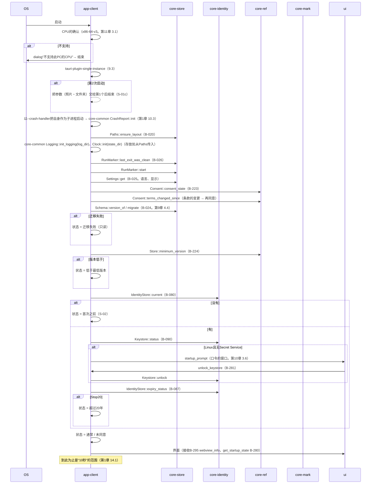
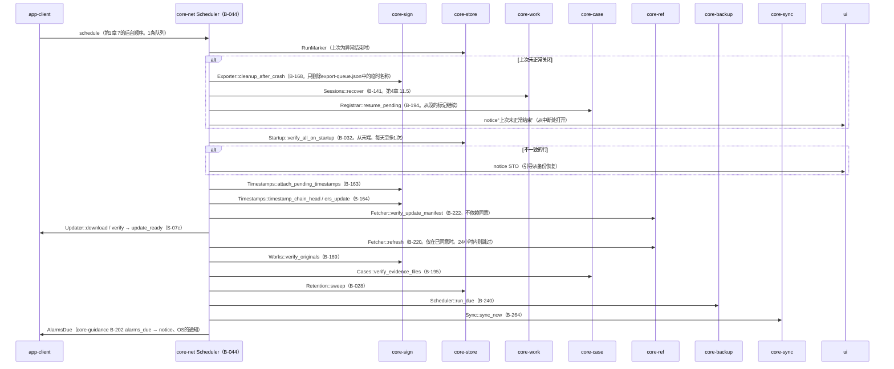
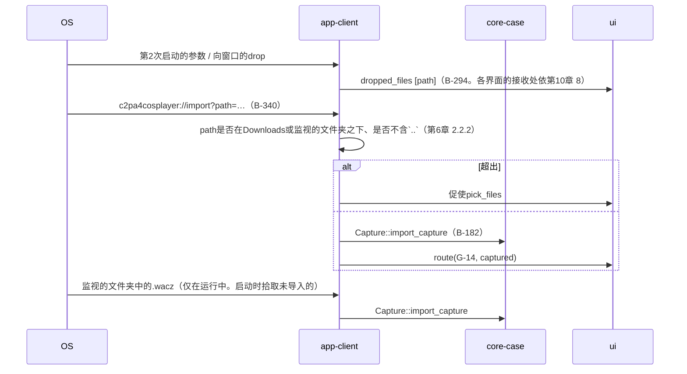
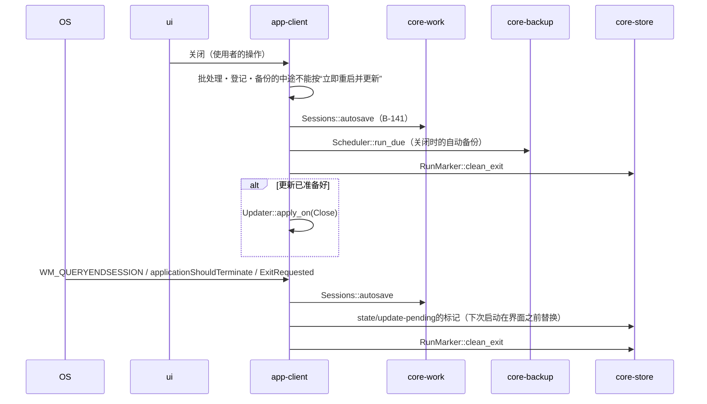

# S-01 启动

由来：第1章 7（启动的顺序、8个状态）、7.8、9.3、第8章 4、第9章 4.1・4.4、第11章 3.1、第12章 4.3。

## S-01a 通常的启动（到显示界面为止。串行）

## S-01b 显示界面之后的后台（1条队列。第1章 7）

## S-01c 第2次启动・拖入的文件・deep-link

## S-01d 关闭・OS的关机（第9章 4.1）

## 遗漏（事后发现并修正）
- 启动的串行段中的“条款变更的确认”（第12章 4.3）不在app-client页面`Startup::run`的注记中 → 在app-client.md的`Startup`中加了`terms_changed_since`（与本文件的S-01a一致）。
- 放置与读取`state/update-pending`的时机只在app-client的数据设计中，启动的串行（第1章 7）中没有“在显示界面之前替换”的位置 → 因第9章 4.1的OS关机项中有“下次启动时、在显示界面之前”，在第1章 7启动顺序的开头加了“若有`state/update-pending`则用已验证的分发物替换（第9章 4.1）”。
- 后台队列最后的“期限的通知”（第7章 6.3中未启动期间的部分）不在第1章 7的后台顺序中 → 加在第1章 7后台顺序的末尾。
