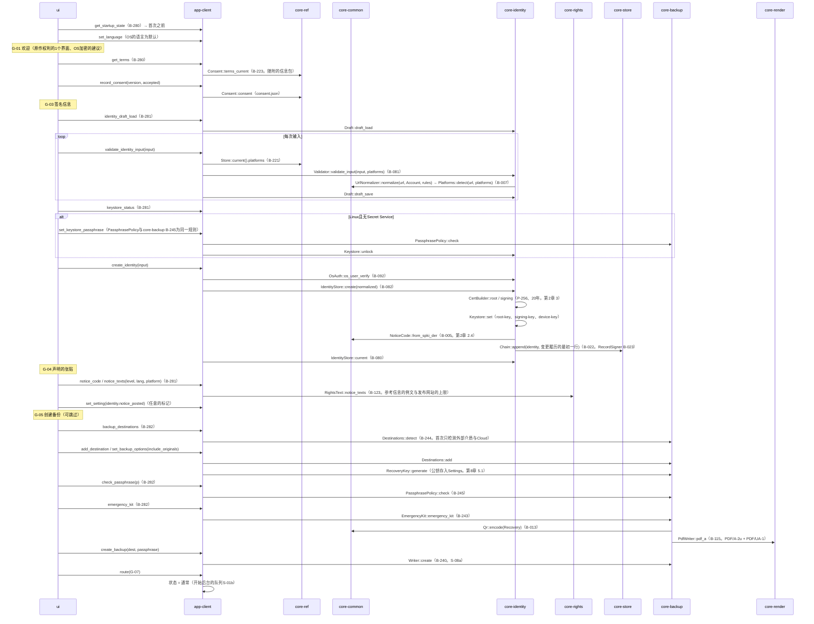

# S-02 首次（G-01 → G-02 → G-03 → G-04 → G-05 → G-07）

由来：第1章 7.1、第2章 2.1・2.3・2.4・3・7.1、第8章 5.1・5.5、第10章 3.2・6.1、第12章 4.3。

## 遗漏（事后发现并修正）
- 恢复密钥何时生成在第8章 5.1（决定最初的备份存放处时）中有，但core-backup页面的桥中没有“生成”的操作 → 因core-backup.md的图中有`RecoveryKey::generate`，在core-backup.md的桥表B-244注记了B-244的`Destinations::add`首次时调用`RecoveryKey::generate`。
- 首次的G-03中Linux密钥存储口令强度的规则为第2章 7.5“与备份的口令相同”→ app-client使用core-backup的`PassphrasePolicy`（B-245）。因core-identity不依赖core-backup，口令的确认由app-client先进行，只把通过的交给`Keystore::unlock`（app-client.md的依赖中1行）。
- 生成终端密钥（`device-key`）的时机未在core-identity页面的`IdentityStore::create`中明记 → 在core-identity.md的`create`的注记中加了“也生成终端密钥（第2章 7.1）”。
