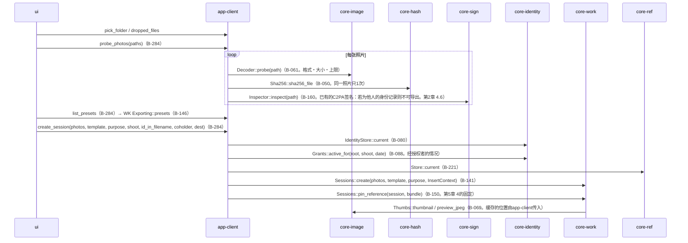
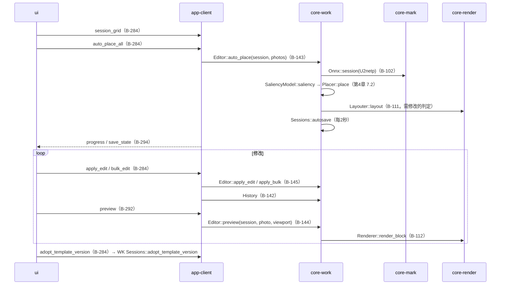
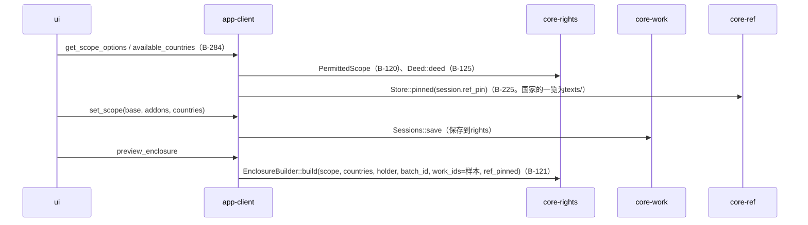
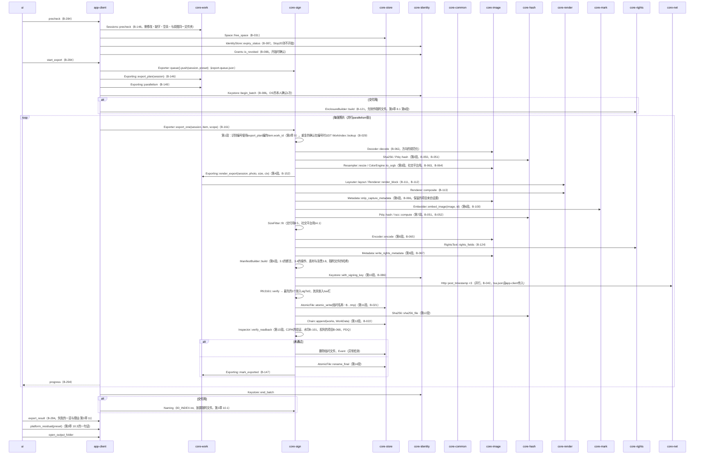
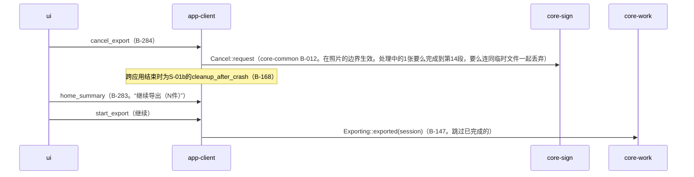

# S-03 导出（G-08 → G-09 → G-10 → G-11）

由来：第1章 7.2、第3章 2・8.1（14段）・9・10・11、第4章 7.2・11・12・14、第5章 3・4、第2章 4.6・5.4。

## S-03a 照片与用途（G-08）→ 作业

## S-03b 批量套用（G-09）

## S-03c 许可范围（G-10。仅交付用）

## S-03d 执行（G-11。第3章 8.1的14段）

## S-03e 取消・中断・继续

## 遗漏（事后发现并修正）
- 开始时的“授权书撤销的确认”（第2章 5.4）不在app-client的precheck流程中 → 本文件把`Grants::is_revoked`放在precheck之后，并在core-sign.md的依赖中加了1行：core-sign.md依赖中的`Grants::is_revoked`不是按照片而是在开始时由app-client调用。
- 传入`tsa.json`之处：core-sign不依赖core-ref（core-sign.md），故`export_one`的参数需要`tsa_set` → 在core-sign.md的`Exporter::export_one`的参数中加了`tsa_set`。
- “先制作”随附文件（第3章 8.1 第9段）是在批处理最初的1次，但`00_RIGHTS.json`持有全部照片的识别编号一览（第5章 3.1），识别编号在第1段按照片编号，故在第1张照片的第9段时一览未确定 → 在第3章 9决定识别编号在批处理开始时为全部照片编号（`Exporting::export_plan`为各`ExportItem`持有`WorkId`。在core-work.md的B-146注记）。
- `Keystore::begin_batch`的位置（OS的本人确认在批处理中1次）在第2章 7.4中有但不在流程图中 → 放在本文件中（页面已有）。

## 加入规格的内容
- 第3章 9：识别编号在批处理开始时为全部照片编号，随附文件以该编号在最初制作1次。
