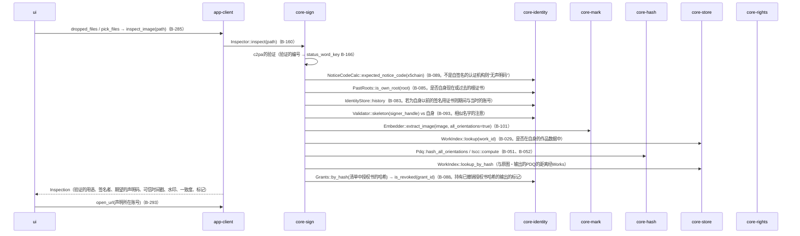
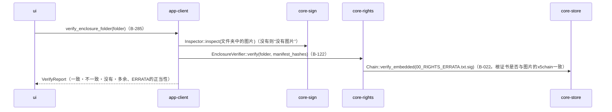
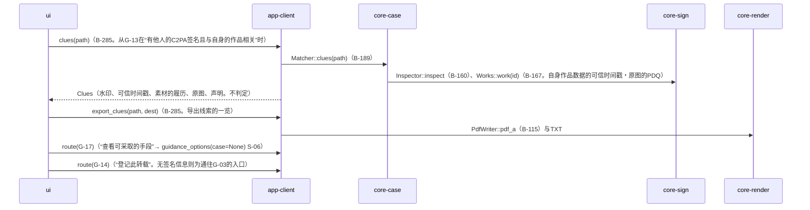

# S-04 核验（G-13）・线索的比较（G-24）

由来：第3章 10.2、第2章 4.1・4.4・5.1、第5章 3.4、第6章 4.1、第10章 G-13・G-24。不留记录（第10章 G-13）。

## S-04a 核验图片

## S-04b 核验随附文件的文件夹（第5章 3.4）

## S-04c 线索的比较（G-24）

## 遗漏（事后发现并修正）
- 第2章 4.4“线索的一览除证据一套外也可导出”的形式（TXT还是PDF）在规格中没有 → 定为与第6章 3.4的报告相同（TXT与PDF/A-3u），由core-case.md的`Bundle::export_bundle(include_clues)`承担。G-24单独的“线索的取出”由app-client的`export_clues`以同一形式写出（本文件）。在第2章 4.4加了“形式与第6章 3.4的报告相同”。
- G-13的“持有已撤销授权书哈希的输出的标记”（第2章 5.1）所需的“清单中授权书的哈希 → 授权书的编号”的查法在core-identity的`Grants`中没有 → 在core-identity.md的`Grants`中加了`by_hash(sha256) Option<Document>`。
