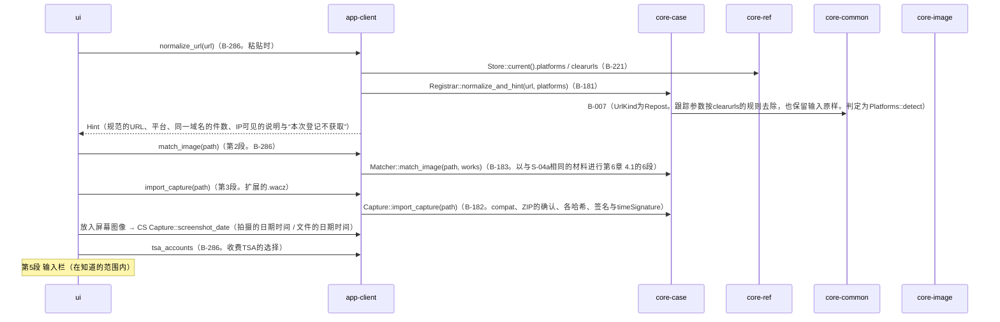
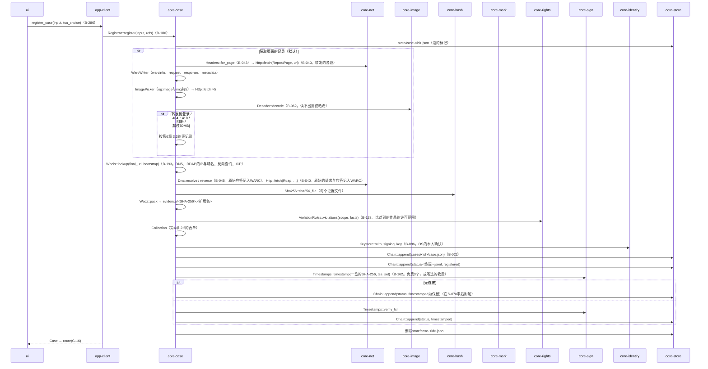
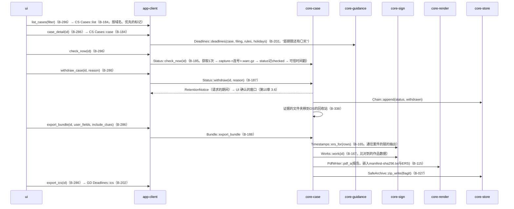

# S-05 转载的登记（G-14）、案件（G-15・G-16）

由来：第1章 7.3、第6章 2.1（第1〜6段）・2.2・2.2.1・2.2.2・2.4・2.5・3.2・3.3・3.4・4・5・6・7、第10章 G-14〜G-16。

## S-05a 登记的界面（第1〜5段）

## S-05b 登记（第6段。按段在state/做标记）

## S-05c 案件的一览・详情・当前状态・撤回・证据一套

## 遗漏（事后发现并修正）
- app-client传入`register`的`refs`（参考信息的窗口一览・判定的表・RDAP的引导・`tsa.json`）的形式在core-case.md的依赖中有，但`Registrar::register`的参数名为`refs: RefBundle`，指向core-ref的类型 → 因core-case不依赖core-ref，改为只含所需表的类型`CaseRefs { platforms, rdap_bootstrap, tsa }`（core-case.md的图）。
- 证据合计1GB的确认（第6章 2.4）在第6段的流程中“在何处停止”不明 → `Cases::evidence_size`在获取前（页面记录的上限与屏幕图像合计的估算）与获取后（实测）调用2次，超过则拒绝导入并提示“作为另外的案件”（加在core-case.md的`Registrar::register`的注记中）。
- 案件的“可信时间戳的保留”（G-14的状态）在下次连接时事后附加的途径只有core-sign的`attach_pending_timestamps`（作品数据的保留）→ `attach_pending_timestamps`也以案件状况追记的保留为对象（在core-sign.md的B-163注记。对象的列举从core-case的`Cases`接收）。
