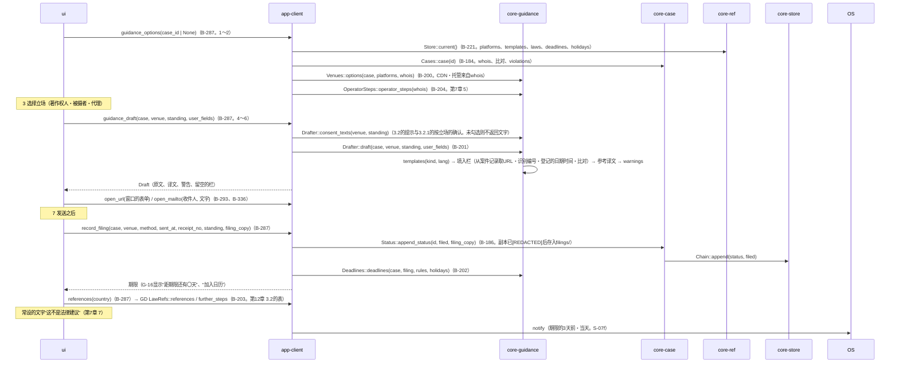

# S-06 应对的指引（G-17）

由来：第7章 3.1〜3.4・5・6.1・6.3・7、第6章 6.1、第12章 3.2、第10章 G-17。

## 遗漏（事后发现并修正）
- 申诉副本的`[REDACTED]`化（第6章 6.1）由谁进行：知道使用者的栏的是core-guidance（`Draft.user_fields`），保存为core-case → `Drafter::draft`也返回“副本用的文字”（把使用者的栏替换为`[REDACTED]`的版本），app-client把它作为`append_status`的`filing_copy`传入。在core-guidance.md的`Draft`中加了`redacted_copy: String`。
- 事业者的应答（`response`）・删除・再发布的记录从G-16直接调用`append_status`（不经过G-17）。app-client.md的B-286的命令中没有`record_status(id, kind, fields)`→ 加了（`record_filing`为G-17用，`record_status`为G-16用）。
