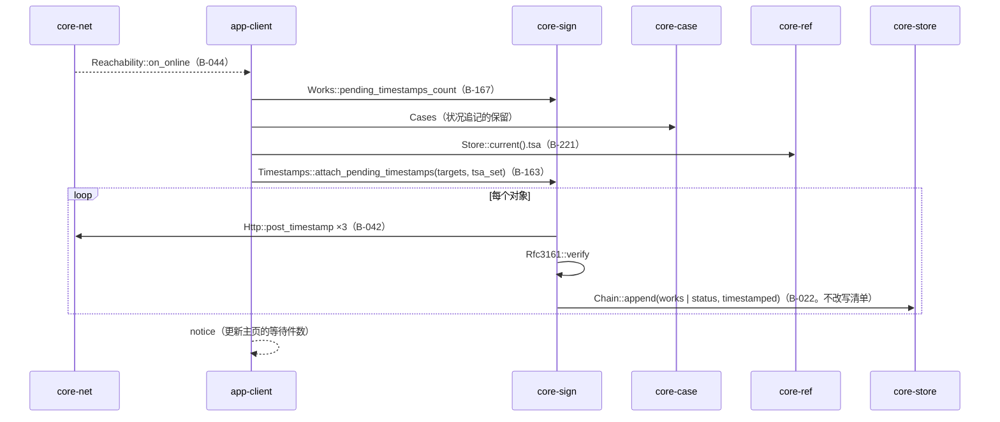
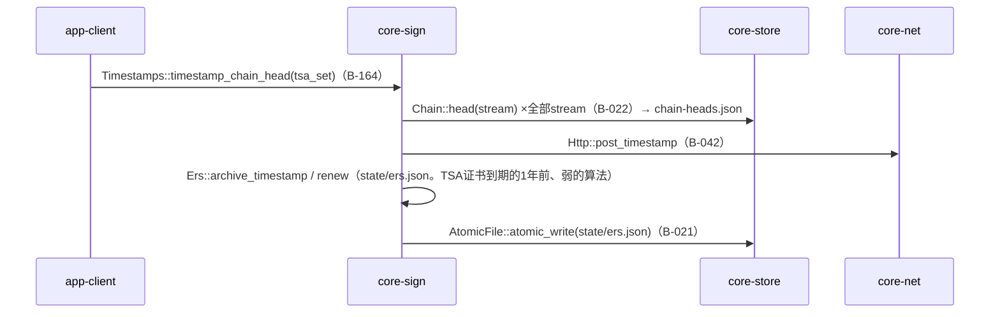
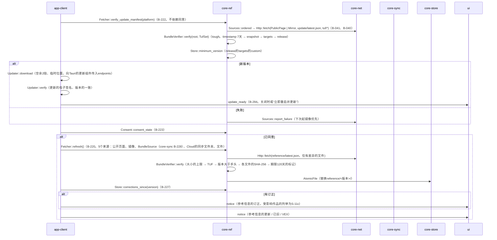
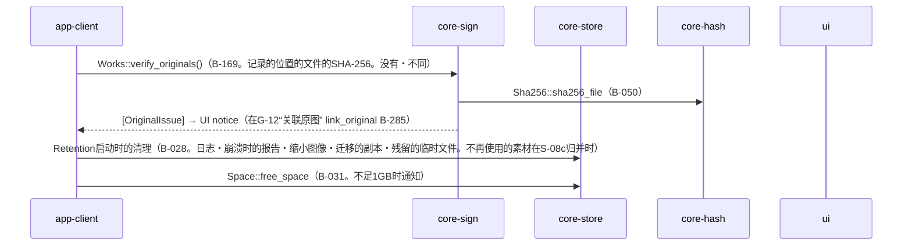
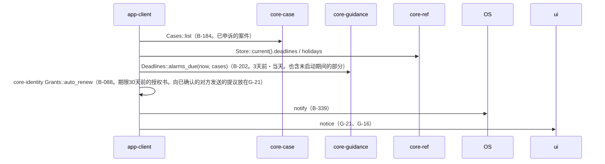

# S-07 后台的队列（无界面操作而运行的东西）

由来：第1章 7（后台的顺序）、7.5、7.9、第3章 4（保留与事后附加、捆绑的可信时间戳、ERS）、第8章 3.4・4・5.5、第9章 4.1〜4.4、第2章 4.2、第1章 8.4、第7章 6.3、第11章 5.3。起点为S-01b（启动）、`Scheduler`（core-net B-044。每24小时・每小时・线路的恢复）、关闭时。

## S-07a 可信时间戳的事后附加（连接时）

## S-07b 捆绑的可信时间戳与ERS（每天1次与每次连接）

## S-07c 更新清单与参考信息（启动时与每24小时）

## S-07d 原图的确认・保留的清理・空余

## S-07e 自动备份（每小时与关闭时）→ S-08a
## S-07f 期限的通知（启动时与每天）

## 遗漏（事后发现并修正）
- 事后附加可信时间戳需要`tsa_set`，但`attach_pending_timestamps`的参数中没有 → 在core-sign.md的B-163的参数中加了`tsa_set`（与S-05中加的`targets`并列）。
- “期限通知的每天的起点”在规格中没有（第7章 6.3只有VALARM的时刻与“未启动期间的部分在下次启动时”）→ 运行中以core-net的`Scheduler`的24小时刻度运行`alarms_due`（在第1章 7后台顺序的末尾加了“每天”）。
- 把`Sources::ordered`的顺序传给更新组件（第9章 4.3的`endpoints`）的是app-client → 在app-client.md的`Updater::download`的注记中加了“把`Sources::ordered`传给endpoints”。
