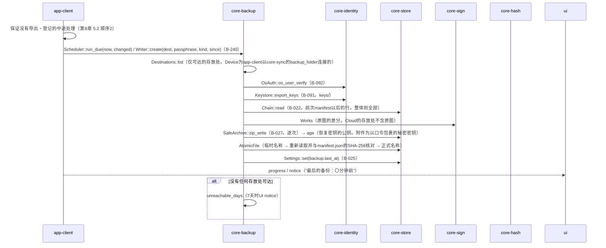
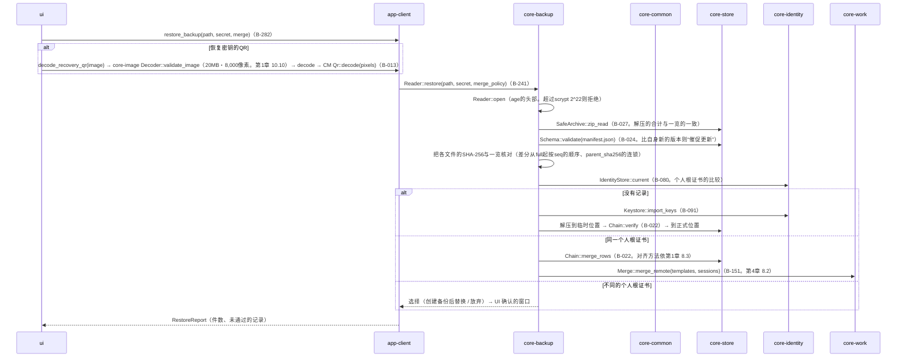
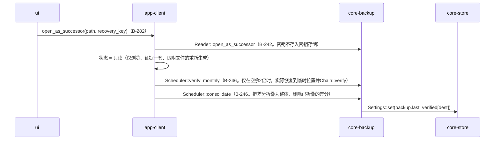

# S-08 备份（创建、恢复、作为继承打开、每月1次的确认）

由来：第8章 5.1〜5.3・5.5・5.6・8、第1章 7.7、第10章 G-05・G-06。

## S-08a 创建（手动B-240 create、自动run_due、关闭时）

## S-08b 恢复（G-06）

## S-08c 作为继承打开・每月1次的确认・归并

## 遗漏（事后发现并修正）
- “作为继承打开”的状态不在第1章 7的7个状态中（第1章 13与第8章 5.3中有）→ 在第1章 7的状态中加了“继承（只读。第8章 5.3）”，成为8个。在app-client.md的`AppState`中加了`Successor`。
- 恢复时“比自身新的应用创建的备份”的判定依manifest.json的`record_versions`与`app_version` → 不是core-store的`Schema::validate`，而是由core-backup比较（如图）。加在core-backup.md的`Reader::open`的注记中。
