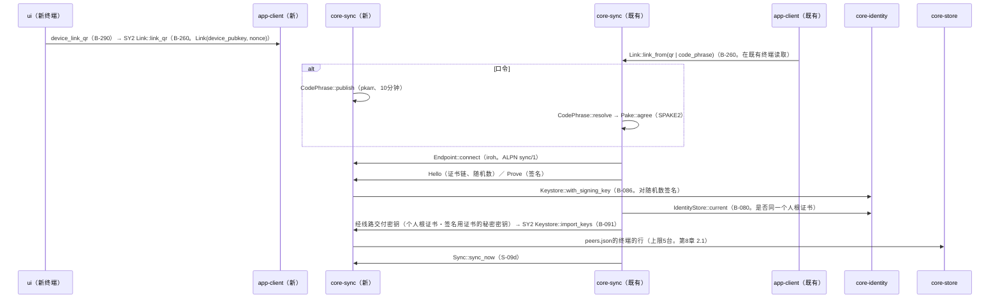
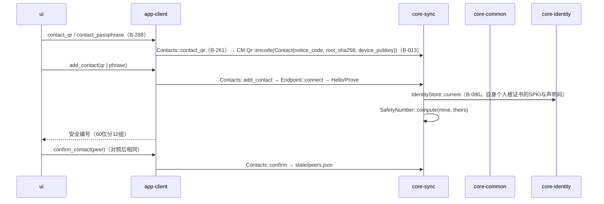
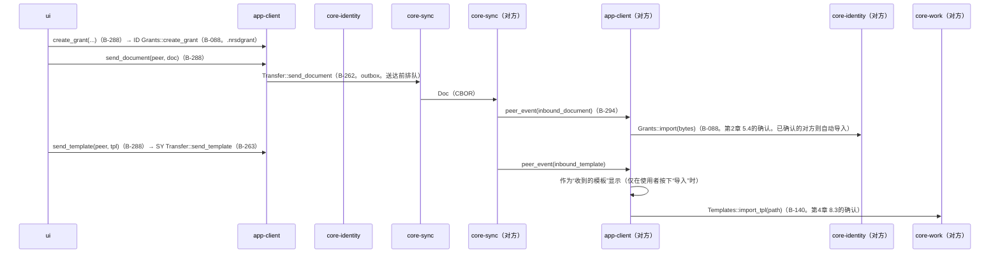
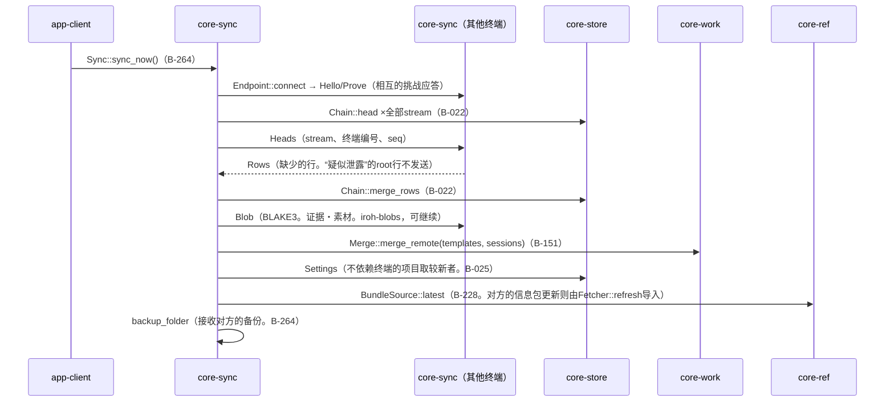

# S-09 终端的链接、对方的添加、文件的发送、对齐、接收

由来：第8章 5.4、第2章 5.5・5.4、第4章 8.3、第10章 G-18・G-20。

## S-09a 终端的链接（G-20“终端”）

## S-09b 对方的添加（G-18）

## S-09c 文件・模板的发送与接收

## S-09d 对齐（sync_now。启动时、连接时、来自对方终端的连接）

## 遗漏（事后发现并修正）
- 终端链接时“如何把密钥交给新终端”在第8章 5.4中没有（Signal的链接交付密钥。“使用同一个人根证书与签名用证书”在第1章 13・第2章 7.3）→ 在第8章 5.4的终端之间的步骤中加了“链接的确认之后，既有终端经线路（端到端加密）交付个人根证书与签名用证书的密钥，新终端存入密钥存储（与从备份恢复相同的结果）”。在core-sync.md的`Link::link_from`加了注记，在core-identity的`Keystore::import_keys`的使用方加了sync。
- 来自对方终端的连接（自身为接收侧）的起点不在app-client的页面中 → `Endpoint::accept`由core-sync在运行中常时等待，把接收的事件以`peer_event`交给app-client。在app-client.md的B-294 `peer_event`的注记中加了“inbound_document、inbound_template、sync_request”。
