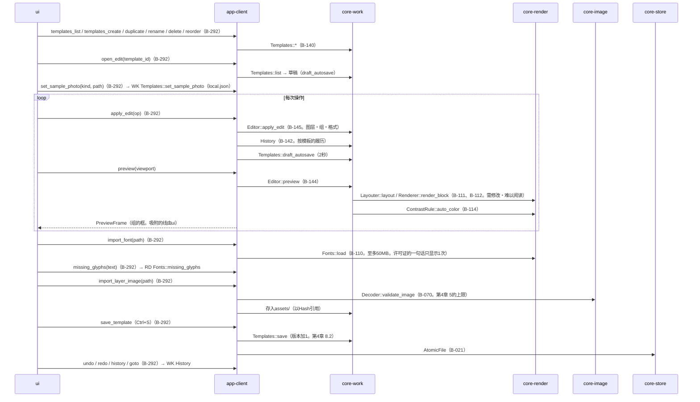
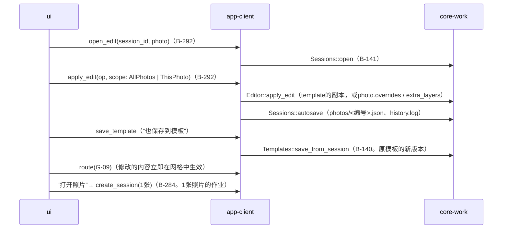
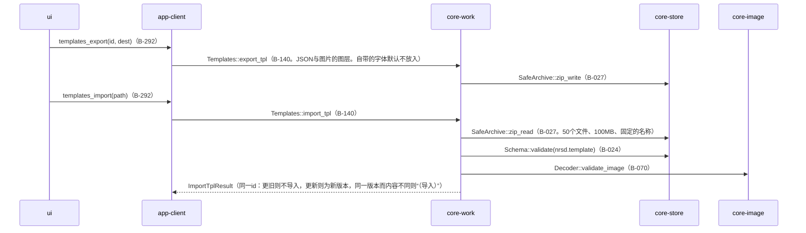

# S-10 图片编辑（G-25）与模板

由来：第4章 4・8・9・10・11・13、第10章 G-25、第4章 6.4（字体）、5（图片的图层）。

## S-10a 修改模板

## S-10b 修改作业（G-09的“修改可见签名”、“打开照片”）

## S-10c 交接（.nrsdtpl）

## 遗漏（事后发现并修正）
- 图片图层素材向`assets/`的保存与引用的计数方法（第1章 8.4“不再使用的自带素材”）不在core-work的页面中 → 在core-work.md的`Templates`中加了`assets_gc_candidates() [Hash]`。删除的时机依第1章 8.4在备份归并时，由core-backup的`consolidate`收集候选并传给core-store的`Retention::sweep_assets`（core-store.md的B-028）。
- “需修改”状态的改变（第4章 12.2的状态迁移）由谁进行 → `Editor::apply_edit`之后core-work以`Layouter::layout`的issues更新`PhotoStatus`（core-work.md的`Editor::apply_edit`的注记）。
