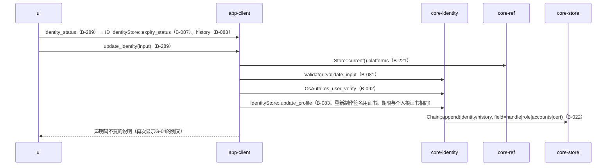
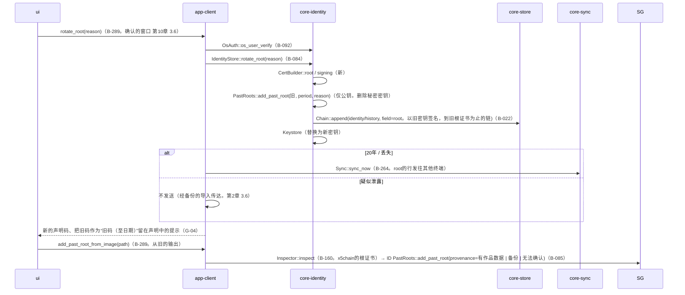
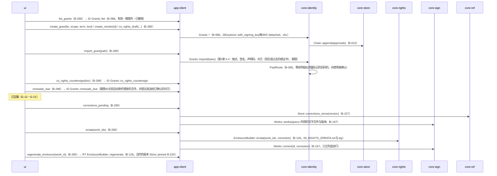

# S-11 签名信息的变更、重新制作、授权与共同权利、订正版

由来：第2章 3.4・3.6・5.1〜5.4・6・7.2、第5章 2.4、第10章 G-18・G-19、第3章 10.2的订正。

## S-11a 签名信息的变更（G-19）

## S-11b 个人根证书的重新制作（20年、丢失、疑似泄露）

## S-11c 授权・共同权利（G-18）、订正版的随附文件

## 遗漏（事后发现并修正）
- 以“所用文字文件的SHA-256”查找`Works::works(query)`的索引不在core-sign的数据设计中（作品数据的`rights`栏中有）→ 在`WorkIndex`（core-store B-029）中加了`lookup_by_text_hash(sha256)`（core-store.md）。
- 授权书更新的文件（`renews`）“自动制作”（第2章 5.1）的起点不在后台的队列中 → 以与S-07f相同的刻度运行`Grants::renewals_due`，制作的文件在G-21显示（在第1章 7后台顺序末尾的“期限的通知”中加了“授权书更新的提议（第2章 5.1）”）。
