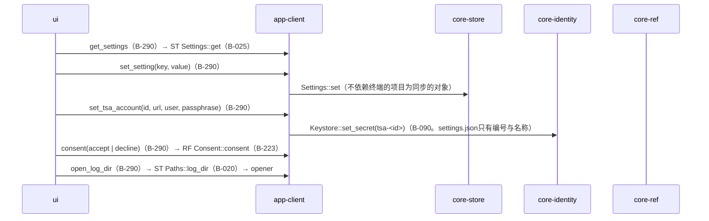
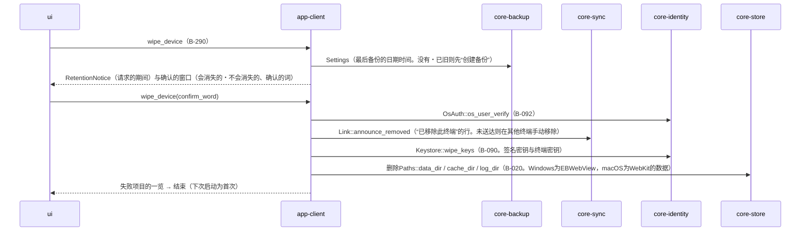
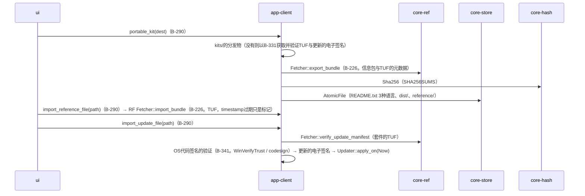
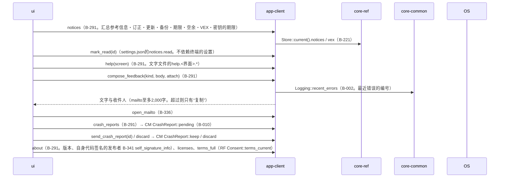

# S-12 设置、记录的清除、随身套件、参考信息与更新从文件的导入、指摘、关于本应用

由来：第10章 10・9・G-20〜G-23、第9章 2.3・4.5・5、第1章 10.3、第12章 5・6。

## S-12a 设置（G-20）

## S-12b 清除此终端的记录（第9章 2.3）

## S-12c 随身套件・从文件的导入（第9章 5、4.5）

## S-12d 通知・帮助・指摘・关于本应用（G-21〜G-23）

## 遗漏（事后发现并修正）
- 通知的已读为“不依赖终端的设置”（第10章 10的保存项），而app-client的数据设计中却设为`state/read-notices.json`（按终端）→ 改为`settings.json`的`notices.read`（不依赖终端），修正了app-client.md数据设计的行。
- “已移除此终端”的行的发送处（core-sync的操作名）不在core-sync的页面中 → 在core-sync.md的`Link`中加了`announce_removed()`（作为devices链的行发送）。
