# app-client (shell; Tauri commands, the state machine, start-up and the background queue, points of contact with the OS)

## Sections taken
- Chapter 1: [6.1 Layers of the app](../../../../docs/en/design/01_Basic Design_Overall Architecture.md#61-app-layers), [6.2 Between the screen and the core](../../../../docs/en/design/01_Basic Design_Overall Architecture.md#62-between-the-screen-and-the-core), [7 Run-time scenarios](../../../../docs/en/design/01_Basic Design_Overall Architecture.md#7-runtime-scenarios) (the start-up order and the eight states, 7.1–7.9), [9.3 Single instance](../../../../docs/en/design/01_Basic Design_Overall Architecture.md#93-single-instance)
- [Chapter 2, 2.1 Input procedure](../../../../docs/en/design/02_Basic Design_Signing Information and Matching.md#21-input-procedure)
- Chapter 9: [2.3 Procedure of “Erase this device's records”](../../../../docs/en/design/09_Basic Design_Distribution and Updates.md#23-procedure-for-erase-this-devices-records), [4.1 Flow and states](../../../../docs/en/design/09_Basic Design_Distribution and Updates.md#41-flow-and-states), [4.5 Failures and takeover](../../../../docs/en/design/09_Basic Design_Distribution and Updates.md#45-failures-and-hijacking), [5 Acquisition routes](../../../../docs/en/design/09_Basic Design_Distribution and Updates.md#5-download-routes) (making the portable kit)
- [Chapter 10, 8 Integration with the OS](../../../../docs/en/design/10_Basic Design_Screens and Design.md#8-os-integration)
- [Chapter 1, 13 Devices and people](../../../../docs/en/design/01_Basic Design_Overall Architecture.md#13-devices-and-people) (multiple devices, succession, the state of a person who only checks. The content of backups is core-backup; reconciliation is core-sync)
- Read-only: Chapter 10, 3.1 and 3.2 (screens and transitions; the command groups correspond to screens), Chapter 1, 10.6 (checking inputs), Chapter 11, 4.1 (Tauri plugins).

## Dependencies
- Below: all blocks ([core-common](core-common.md), [core-store](core-store.md), [core-net](core-net.md), [core-hash](core-hash.md) (SHA256SUMS), [core-image](core-image.md) (checking QR images), [core-render](core-render.md) (the clues PDF), [core-identity](core-identity.md), [core-mark](core-mark.md), [core-sign](core-sign.md), [core-rights](core-rights.md), [core-work](core-work.md), [core-case](core-case.md), [core-guidance](core-guidance.md), [core-ref](core-ref.md), [core-backup](core-backup.md), [core-sync](core-sync.md)). It holds no business judgment; it receives commands, passes them to the business blocks, and sends notifications to the screen (Chapter 1, 6.1).
- Above: [ui](ui.md) (calls the commands and subscribes to the notifications; the dependency inversion is that this block defines the `Event` type).
- The strength of the Linux keystore passphrase (Chapter 2, 7.5): because core-identity does not depend on core-backup, this block first passes it through `PassphrasePolicy::check` (B-245) before handing it to `Keystore::unlock`.
- Boundaries with the outside: B-331 (fetching distributables; Tauri's update component), B-336 (opener: `mailto:`, URLs, `.ics`), B-339 (OS notifications), B-340 (deep-link, watching the save folder), B-341 (OS code signature verification).
- Wiring across blocks is done by this block: passing reference information (core-ref) to core-case, core-guidance, and core-identity; putting the personal root remaking row (core-identity) onto core-sync's reconciliation; the extension's `.wacz` to core-case; the `Device` backup location from core-sync's `backup_folder` to core-backup; the `RetentionNotice` (the claim period before erasing) to ui.

## Class diagram

```mermaid
classDiagram
  class AppState {
    <<enumeration>>
    BeforeFirstRun
    VerifyOnly
    NoConsent
    Normal
    Over20Years
    BelowMinimumVersion
    MigrationFailed
    Successor  %% opened as a successor (read-only; Chapter 8, 5.3)
  }
  class Startup {
    +run() AppState  %% serial: CPU, then single instance, then the --crash-handler child process (CrashReport::init), then update-pending, then the running mark, then settings, consent, and Terms changes, then migration, then minimum version, then signing information and keystore, then screen
    +crash_handler_main()  %% entry point when launched with --crash-handler (minidumper server)
    +second_instance(args)  %% photos and folders received from a second launch
  }
  class BackgroundJobs {
    +schedule_all()  %% after start, schedules to core-net's Scheduler (B-044) in the background order of Chapter 1, 7. The queue is there (this block holds none). The kinds are core-net's JobKind
  }
  class Commands {
    +startup_cmds()  %% B-280
    +identity_cmds()  %% B-281, B-289
    +backup_cmds()  %% B-282
    +home_cmds()  %% B-283
    +export_cmds()  %% B-284
    +works_cmds()  %% B-285
    +case_cmds()  %% B-286
    +guidance_cmds()  %% B-287
    +grants_and_contacts_cmds()  %% B-288
    +settings_cmds()  %% B-290
    +notices_help_about_cmds()  %% B-291
    +template_edit_cmds()  %% B-292
    +os_cmds()  %% B-293
  }
  class Guard {
    +check_state(cmd, state) Result  %% narrows the callable commands by state
    +validate(input) Result  %% Chapter 1, 10.6
    +scope(path) Result  %% Tauri scopes
  }
  class Events {
    +emit(e: Event)
  }
  class Event {
    <<enumeration>>
    Progress
    Notice
    SaveState
    UpdateReady
    StartupPrompt
    DroppedFiles
    PeerEvent
  }
  class Updater {
    +check() Option~Available~  %% at start and every 24 hours
    +download(available) Staged  %% twice the free space, a temporary place. Passes core-net's Sources::ordered to the update component's endpoints. Not fetched on a metered connection (setting; Reachability::is_metered). The 30 minutes total and 500 MB (Chapter 1, 4.2): time via the update component's timeout; size is discarded if the measured size after fetching exceeds it (the component has no limit setting; to be measured)
    +verify(staged) Result  %% TUF (core-ref), then the update signature
    +apply_on(trigger: Close | Now | NextStart)
    +import_update_file(path) Result  %% portable kit. Up to 500 MB, code signature too
  }
  class OsBridge {
    +deep_link(url) Result  %% c2pa4cosplayer://import?path=…
    +watch_folder(path)
    +drop(paths, screen)
    +notify(kind, text)  %% completion and deadlines only
    +open_url(url)
    +open_mailto(to, subject, body)
    +pick_files(filter) [Path]
    +pick_folder() Path
  }
  class Wipe {
    +retention_notice() RetentionNotice
    +wipe_device(confirm_word) Report  %% the order of Chapter 9, 2.3
  }
  class PortableKit {
    +portable_kit(dest) Path  %% dist/, reference/, SHA256SUMS
  }
  Startup --> AppState
  Startup ..> BackgroundJobs

  Commands ..> Guard
  Commands ..> Events
  Events --> Event
  Commands ..> Updater
  Commands ..> OsBridge
  Commands ..> Wipe
  Commands ..> PortableKit
```

## Bridges (commands and notifications owned by this block; called by ui)
|No.|Command|Screen|Origin|
|---|---|---|---|
|B-280|`get_startup_state`, `set_language`, `get_terms`, `record_consent`|G-01, G-02|Chapter 1, 7.1|
|B-281|`validate_identity_input`, `identity_draft_save` / `load`, `create_identity`, `keystore_status`, `set_keystore_passphrase`, `unlock_keystore`, `notice_code`, `notice_texts(level, lang, platform)`|G-03, G-04|Chapter 2, 2.1|
|B-282|`backup_destinations`, `add_destination`, `remove_destination`, `check_passphrase`, `set_backup_options(include_originals)`, `create_backup`, `set_backup_schedule`, `emergency_kit`, `restore_backup(path, secret, merge)`, `decode_recovery_qr(image)`, `open_as_successor`|G-05, G-06|Chapter 1, 7.7|
|B-283|`home_summary`, `recover_after_crash`, `pending_timestamps`, `session_rename`, `session_delete`|G-07|Chapter 1, 7.8 and 7.9|
|B-284|`probe_photos`, `create_session`, `open_session`, `list_presets`, `session_grid`, `auto_place_all`, `bulk_edit`, `adopt_template_version`, `get_scope_options`, `available_countries`, `set_scope`, `preview_enclosure`, `precheck`, `start_export`, `cancel_export`, `export_result`, `platform_residual(preset)`, `open_output_folder`|G-08 to G-11|Chapter 1, 7.2|
|B-285|`list_works`, `work_detail`, `regenerate_enclosure`, `corrections_pending`, `errata`, `correct_work`, `record_published`, `link_original`, `search_urls`, `inspect_image`, `match_image`, `verify_enclosure_folder`, `clues`, `export_clues`|G-12, G-13, G-24|Chapter 1, 7.4|
|B-286|`normalize_url`, `match_image`, `import_capture`, `register_case`, `tsa_accounts`, `list_cases`, `case_detail`, `check_now`, `record_status(id, kind, fields)` (provider's response, removal, reposting), `export_bundle`, `withdraw_case`, `case_deadlines`, `export_ics`|G-14 to G-16|Chapter 1, 7.3; Chapter 6, 6.1|
|B-287|`guidance_options`, `guidance_draft`, `record_filing`, `references`, `operator_steps`|G-17|Chapter 7|
|B-288|`list_grants`, `create_grant`, `create_revoke`, `co_rights_draft`, `co_rights_countersign`, `import_grant`, `renewals_due`, `send_document`, `contact_qr`, `contact_passphrase`, `add_contact`, `safety_number`, `confirm_contact`, `remove_contact`, `send_template`|G-18|Chapter 2, 5|
|B-289|`identity_status`, `update_identity`, `rotate_root` (the remaking row goes to the other devices by `sync_now`), `identity_history`, `add_past_root_from_image`|G-19|Chapter 2, 3.4 and 3.6|
|B-290|`get_settings`, `set_setting`, `open_log_dir`, `device_link_qr`, `link_device`, `devices`, `remove_device`, `portable_kit`, `import_update_file`, `import_reference_file`, `set_tsa_account` / `remove_tsa_account` (to the keystore; `settings.json` holds only the number and name), `wipe_device`, `consent`|G-20|Chapter 9, 2.3 and 5; Chapter 10, 10|
|B-291|`notices` (gathers reference information, corrections, updates, backups, deadlines, free space, VEX, key expiry), `mark_read`, `help(screen)`, `compose_feedback`, `open_mailto`, `crash_reports`, `send_crash_report`, `about` (including the publisher of its own code signature), `licenses`, `terms_full`|G-21 to G-23|Chapter 10, 6.3 and 9|
|B-292|`templates_*`, `open_edit`, `preview`, `apply_edit`, `undo`, `redo`, `history`, `goto`, `import_layer_image`, `import_font`, `missing_glyphs`, `set_sample_photo`, `save_template`|G-25|Chapter 4, 9 and 13|
|B-293|`open_url`, `pick_files` / `pick_folder`|All screens|Chapter 1, 6.2; Chapter 10, 8|
|B-294|Notifications: `progress`, `notice`, `save_state`, `update_ready`, `startup_prompt`, `dropped_files`, `peer_event` (`inbound_document`, `inbound_template`, `sync_request`; from core-sync's `Endpoint::accept`) (only the CPU dialog is an OS dialog before the screen)|All screens|Chapter 1, 6.2|
|B-295|Start-up value `webview_info { user_agent, accept_language, lang }`|—|Chapter 1, 6.2|
- The commands and types are generated from the list of boundaries (the table on this page and each block's bridges) (Chapter 1, 6.2; Chapter 11, 8.1; P-13).

## Algorithms (behind traits)
- This block holds no algorithms. The CPU check (Chapter 11, 3.1) and the single instance (tauri-plugin-single-instance) are calls to components.

## Data design (records whose form this block holds)
|Record|Form|Fields|Origin|
|---|---|---|---|
|`state/running`|Empty file|Created at start, deleted on a clean exit|Chapter 8, 2.1; Chapter 1, 7.8|
|`state/update-pending`|Empty file|Placed at OS shutdown, deleted after swapping in at the next start|Chapter 9, 4.1|
|`consent.json` (`nrsd.consent/1`)|JSON|The version of the Terms consented to, date/time, language|Chapter 12, 4.3; Chapter 2, 2.1|
|`identity/draft.json` (`nrsd.identity_draft/1`; written by core-identity's `Draft`)|JSON|The first-run input in progress (Chapter 2, 2.1 “even if stopped midway”)|Chapter 2, 2.1; Chapter 8, 2.1|
|Read notices|`notices.read` in `settings.json` (device-independent; core-store's `Settings`)|Notice numbers and the date/time read|Chapter 10, 10|
|`kits/` (cache)|Folder|Copy of the distributables for the portable kit (one version)|Chapter 9, 5|
