# app-operator (shell; the operator tool M-01 and M-02. A separate executable not distributed to Users)

## Sections taken
- [Chapter 1, 19 Operator tool](../../../../docs/en/design/01_Basic Design_Overall Architecture.md#19-operator-tool) (M-01 reference information, M-02 release signing, the form of the sources, carrying out from the offline PC)
- Read-only: Chapter 8, 3.4 (the form of the package; owned by core-ref), 3.5 (the rules of the main branch), Chapter 9, 4.3 (TUF metadata), 6.1 (release procedure), DD-9-4 (where keys are kept), Chapter 11, 7.1 (`reference/`, `tools/`).

## Dependencies
- Lower blocks used: core-common, core-store (ZIP, `AtomicFile`), core-hash, core-net (fetching the IANA bootstrap; the M-01 PC only), [core-ref](core-ref.md) (`Writer::write_bundle`, `diff_bundle`, `iana_bootstrap_diff`, `budget_check`, `mark_errata`, the `BundleSigner` trait, generation and verification of TUF metadata), core-render (checking the insertions in the sources).
- Dependency inversion: `BundleSigner` is defined by core-ref and implemented by this block with the hardware token (YubiKey PIV; the PIN at every signature).
- Outside: tauri-cli (`tauri signer sign`), git (signed commits and pull requests), the hardware token, USB (M-02 never goes on the network).
- Above: none. The screens are inside this block (a separate Tauri executable; identifier `jp.nrsd.c2pa4cosplayer.operator`).

## Class diagram

```mermaid
classDiagram
  class Workspace {
    +Path clone  %% local copy of the Public Repository
    +open(path) Workspace
    +sources() Sources  %% the YAML and Markdown in reference/src/
  }
  class Editor {
    +edit_table(file: Yaml, row_id, lang) 
    +edit_text(file: Markdown)
    +validate() [Issue]  %% missing fields, insertion names, alignment of the three languages
  }
  class BundleBuilder {
    +build(sources, version) RefBundle  %% from the sources (YAML, Markdown) into core-ref's form. Diff, budget, correction marks, and writing out only call core-ref's Writer (B-229, B-310)
  }
  class IanaBootstrap {
    +fetch() Files  %% core-net's Http::fetch. The diff is core-ref's Writer::iana_bootstrap_diff
  }
  class TokenSigner {
    +sign(bytes) (Sig, Attestation)  %% the implementation of BundleSigner. Primary and spare tokens
    +sign_targets(role: reference | release, targets) Metadata
    +sign_root(root) Metadata
  }
  class Publisher {
    +commit_and_pr(workspace, message)  %% signed
    +export_usb(items, dest) Path  %% together with manifest-sha256.txt
  }
  class ReleaseSigner {
    +verify_hashes(artifacts, sums) Result
    +sign_update(artifact, version) Sig  %% tauri signer sign, the key encrypted with a passphrase
    +make_app_tar_gz(app) Path
    +make_update_json(artifacts, sigs, notes) Json  %% the form of Chapter 9, 4.3
  }
  Editor ..> Workspace
  BundleBuilder ..> Workspace
  BundleBuilder ..> TokenSigner
  Publisher ..> Workspace
  ReleaseSigner ..> TokenSigner
```

## Bridges (operations owned by this block)
|No.|Operation|Counterpart|Origin|
|---|---|---|---|
|B-310|`TokenSigner::sign` (the implementation of `BundleSigner`). M-01 calls core-ref's `diff_bundle`, `iana_bootstrap_diff`, `budget_check`, and the correction marks|core-ref|Chapter 8, 3.4|
|B-311|`ReleaseSigner` (`tauri signer sign --app-version`, `.app.tar.gz`, the update manifest)|tauri-cli|Chapter 9, 4.3 and 6.1|

## Algorithms
- This block holds no algorithms. The form of the package and TUF verification are core-ref; hashes are core-hash.

## Data design
|Record or output|Form|Fields|Origin|
|---|---|---|---|
|`reference/src/` (repository)|YAML (tables; one table per file, the row key is the number, `ja:`, `zh:`, `en:`), Markdown (long texts; one document, one language per file), native formats (the RDAP bootstrap, ClearURLs, VEX)|Chapter 1, 19|Chapter 1, 19|
|Package `reference/<version>/`, `latest.json`, `tuf/`|core-ref's form|Chapter 8, 3.4; Chapter 9, 4.3|Chapter 8, 3.4|
|USB carry-out|The `.sig` of `release/`, the update manifest, `targets.json`, `manifest-sha256.txt`|Chapter 1, 19|Chapter 1, 19|
|Settings on the operator's PC (under `jp.nrsd.c2pa4cosplayer.operator`)|JSON|Location of the clone, choice of token (primary or spare), location of the update signing key (a file encrypted with a passphrase)|Chapter 1, 19; Chapter 9, DD-9-4|
