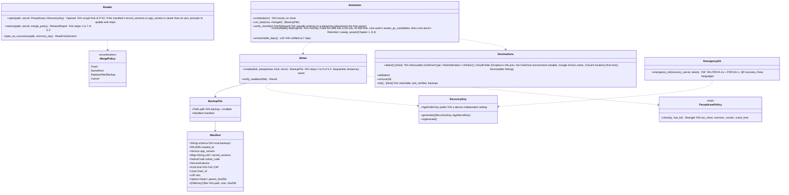

# core-backup (business; creating and restoring backups, locations, automatic backups, emergency kit)

## Sections taken
- [Chapter 2, 7.3 Multiple devices](../../../../docs/en/design/02_Basic Design_Signing Information and Matching.md#73-multiple-devices)
- Chapter 8: [5.1 Format](../../../../docs/en/design/08_Basic Design_Repository and Data Management.md#51-format), [5.2 How to create](../../../../docs/en/design/08_Basic Design_Repository and Data Management.md#52-how-it-is-made), [5.3 How to restore (import)](../../../../docs/en/design/08_Basic Design_Repository and Data Management.md#53-how-it-is-restored-import), [5.5 Backup locations and automatic backups](../../../../docs/en/design/08_Basic Design_Repository and Data Management.md#55-backup-locations-and-automatic-backups), [5.6 Guidance on where to keep backups](../../../../docs/en/design/08_Basic Design_Repository and Data Management.md#56-guidance-on-where-to-keep-backups), [8 Handling of failures](../../../../docs/en/design/08_Basic Design_Repository and Data Management.md#8-handling-failures)
- Read-only: the “included in backups” column of Chapter 8, 2.1 “Arrangement” (what goes in), the reconciliation of 5.4 (merging is by core-work's `Merge` and core-store's `Chain`).

## Dependencies
- Below: [core-common](core-common.md) (`Qr`, `AppUrl::Recovery`, `Clock`, error numbers), [core-store](core-store.md) (`Chain` (reconciliation and verification), `AtomicFile`, ZIP checks, `Space`, `Settings` (the recovery key's public key, the date/time of the last backup, locations), `Retention::sweep_assets`), [core-hash](core-hash.md) (SHA-256), [core-identity](core-identity.md) (`current`, `export_keys` / `import_keys`, `os_user_verify`), [core-render](core-render.md) (the emergency kit's PDF/A-2u + PDF/UA-1), [core-work](core-work.md) (`Merge::merge_remote` (merging templates and work sessions), `Templates::assets_gc_candidates`), [core-sign](core-sign.md) (`Works`: estimating the Original diff).
- Above: [app-client](app-client.md) (G-05, G-07 Home's “Last backup”, G-20 Settings, `run_due` at start, on close). The location of `Device` is wired by app-client from [core-sync](core-sync.md)'s `backup_folder` (this block does not depend on core-sync).
- Outside: detection of the OS's removable media and the default locations of Cloud sync folders (Chapter 8, 5.5; this block calls the OS APIs directly).

## Class diagram

## Bridges (operations owned by this block)
|No.|Operation (in the diagram above)|Used by|Origin|
|---|---|---|---|
|B-240|`Writer::create`, `Scheduler::schedule`, `run_due`|app-client|Chapter 8, 5.2 and 5.5|
|B-241|`Reader::restore`|app-client|Chapter 8, 5.3|
|B-242|`Reader::open_as_successor`|app-client|Chapter 8, 5.3; Chapter 1, 13|
|B-243|`EmergencyKit::emergency_kit`|app-client|Chapter 8, 5.1|
|B-244|`Destinations` (`detect`, `add`, `remove`, `list`. The first `add` calls `RecoveryKey::generate`)|app-client|Chapter 8, 5.5 and 5.1|
|B-245|`PassphrasePolicy::check`|app-client|Chapter 8, 5.2|
|B-246|`Scheduler::verify_monthly`, `consolidate`|app-client|Chapter 8, 5.5 and 5.6|

## Algorithms (behind traits)
|Trait|Implementation|Switching|Origin|
|---|---|---|---|
|`PassphrasePolicy`|The zxcvbn method, the bundled list (100,000 entries), length (15 characters; 8 for those who printed the emergency kit)|Constants of the initial values|Chapter 8, 5.2|
|Backup encryption|age (scrypt 2^18, encryption to the recovery key's X25519, and an attachment of the secret key wrapped with the passphrase)|Fixed|Chapter 8, 5.1|
|Choosing the diff|New chain rows and new evidence and Originals since the previous `manifest.json`. Cloud locations exclude Originals|`Dest.kind`|Chapter 8, 5.5|

## Data design
|Record or output|Form|Fields|Origin|
|---|---|---|---|
|`backup-<date/time>-<seq>.nrsdbak`|age (outer) + ZIP (`manifest.json`, `keys/`, `data/`) + an attachment of the recovery key's secret key wrapped with the passphrase|The fields of `Manifest`|Chapter 8, 5.1 and 5.6|
|Emergency kit|PDF/A-2u + PDF/UA-1, one page, three languages|The content of the emergency kit in Chapter 8, 5.1|Chapter 8, 5.1|
|Settings (placed in core-store's `Settings`; device-independent)|—|The recovery key's public key, the list of locations, the date/time of the last backup, the date/time verification last passed (per location)|Chapter 8, 5.5; Chapter 10, 10|
|`state/backup-progress.json` (`nrsd.backup_progress/1`)|JSON|The temporary name during creation, the temporary place during restoring (used for cleaning up after interruption)|Chapter 8, 8; Chapter 1, 7.8|
