# core-case (business; registering reposts, evidence preservation, case records and status, the evidence set)

## Sections taken
- Chapter 2: [4.3 Takeover of the Notice account](../../../../docs/en/design/02_Basic Design_Signing Information and Matching.md#43-takeover-of-a-notice-account), [4.4 Clues when someone posing as the rights holder appears](../../../../docs/en/design/02_Basic Design_Signing Information and Matching.md#44-clues-when-a-person-posing-as-the-rights-holder-appears)
- Chapter 6: [2.1 Procedure](../../../../docs/en/design/06_Basic Design_Registration and Evidence Preservation.md#21-procedure), [2.2 Fetching without running scripts](../../../../docs/en/design/06_Basic Design_Registration and Evidence Preservation.md#22-fetching-without-running-scripts) (2.2.1 WARC and WACZ, 2.2.2 screen images and the extension's entry point), [2.3 Input fields for evidence to keep](../../../../docs/en/design/06_Basic Design_Registration and Evidence Preservation.md#23-input-fields-for-evidence-that-should-be-kept), [2.4 Items of registration data](../../../../docs/en/design/06_Basic Design_Registration and Evidence Preservation.md#24-fields-of-registration-data), [2.5 Collection record](../../../../docs/en/design/06_Basic Design_Registration and Evidence Preservation.md#25-collection-record), [2.6 Entry point from the second stage](../../../../docs/en/design/06_Basic Design_Registration and Evidence Preservation.md#26-intake-from-phase-2), [3.1 Correspondence with what must be shown later](../../../../docs/en/design/06_Basic Design_Registration and Evidence Preservation.md#31-correspondence-with-the-items-to-be-shown-later-design-plan-103), [3.2 Timestamps](../../../../docs/en/design/06_Basic Design_Registration and Evidence Preservation.md#32-trusted-timestamps), [3.3 Fetch failures](../../../../docs/en/design/06_Basic Design_Registration and Evidence Preservation.md#33-fetch-failures), [3.4 Export](../../../../docs/en/design/06_Basic Design_Registration and Evidence Preservation.md#34-export), [4.1 How the degree of match is shown](../../../../docs/en/design/06_Basic Design_Registration and Evidence Preservation.md#41-how-the-match-level-is-shown), [4.2 What is infringed](../../../../docs/en/design/06_Basic Design_Registration and Evidence Preservation.md#42-what-is-violated), [5 Who and where (4)](../../../../docs/en/design/06_Basic Design_Registration and Evidence Preservation.md#5-who-and-where-④), [6.1 Status record](../../../../docs/en/design/06_Basic Design_Registration and Evidence Preservation.md#61-status-records), [6.2 Checking the current state](../../../../docs/en/design/06_Basic Design_Registration and Evidence Preservation.md#62-checking-the-current-status), [7 Corrections](../../../../docs/en/design/06_Basic Design_Registration and Evidence Preservation.md#7-corrections), [8 Lists and means](../../../../docs/en/design/06_Basic Design_Registration and Evidence Preservation.md#8-list-and-means)
- [Chapter 7, 6.2 Joint response and priority](../../../../docs/en/design/07_Basic Design_Legal Action Guidance.md#62-joint-action-and-priority) (how the “priority” mark is given)
- The form of the output of the extension P-14 (`extension/`) is Chapter 6, 2.2.1 and 2.2.2. This block is its importing side.

## Dependencies
- Below: [core-common](core-common.md) (URL normalization, identification numbers, `Clock`, error numbers), [core-store](core-store.md) (`Chain`, `AtomicFile`, ZIP checks, trash, `Space`), [core-net](core-net.md) (`Http::fetch` (`Target::RepostPage`, `Target::Rdap`; each hop of the redirects is `Response.exchanges`), `Dns::resolve` / `reverse` (B-045; raw responses), `Scheduler`), [core-hash](core-hash.md) (SHA-256, PDQ, ISCC), [core-image](core-image.md) (loading fetched images, the date/time of screen images), [core-identity](core-identity.md) (`with_signing_key`, notice codes), [core-mark](core-mark.md) (reading the watermark), [core-render](core-render.md) (the report's PDF/A-3u, inserting the wording of the verification procedure), [core-rights](core-rights.md) (checking against the Permitted Scope: the rules of Chapter 5, 2.3), [core-sign](core-sign.md) (`Inspector::inspect`, `Timestamps::timestamp`, `verify_tsr`, `ers_for`, `Works`).
- Reference information (the list of contact points, the platform detection table, the RDAP bootstrap, `tsa.json`) is taken from [core-ref](core-ref.md) by the caller and passed in (this block does not depend on core-ref; the row type and detection are core-common's B-007).
- Above: [core-guidance](core-guidance.md) (`case`, `list`, `append_status`, `whois`, `deadlines`), [app-client](app-client.md), [core-backup](core-backup.md) (enumerating `cases/`).
- Boundaries with the outside: repost pages (B-334), RDAP and DNS (B-333), TSA (B-332; via core-sign), the OS trash (B-338), the extension (P-14; the deep-link and the watching of the save folder are received by app-client and passed to `import_capture`).

## Class diagram

```mermaid
classDiagram
  class Case {
    +CaseId id
    +Source source  %% Manual | Auto
    +Urls urls  %% input, normalized, final
    +Platform platform
    +[WorkRef] work_refs
    +[Evidence] evidence
    +Option~Whois~ whois
    +UserNotes user_notes
    +Option~RightsRef~ rights_ref
    +[Violation] violations
    +Signer signer
    +Rfc3339 created_at
    +ClockStamp clock
    +ChainLink chain
    +Collection collection  %% the form of 2.5
    +bool page_capture_declined
  }
  class Evidence {
    +String original_name  %% only in the list
    +EvidenceKind kind  %% Warc | Wacz | Screenshot | Image | RdapWarc
    +Hash sha256
    +u64 size
    +Provenance provenance  %% UserProvided | AppFetched | Extension
    +Rfc3339 taken_at
    +Option~DateSource~ date_source  %% Exif | FileMtime | None. Asks for confirmation if it differs from the registration date/time by 24 hours or more (2.2.2)
    +bool truncated  %% cut off at 50 MB (3.3)
  }
  class Input {
    +String url
    +Option~ImageInput~ image  %% File(path) | Url (fetched in step 6)
    +Option~Path~ screenshot
    +Option~Path~ wacz
    +bool capture_page  %% default true
    +UserNotes notes
    +TsaChoice tsa  %% Free | Paid(id)
    +Rfc3339 screen_opened_at  %% start of collection (2.5)
  }
  class UserNotes {
    +Option~String~ account  %% the reposter's account name or display name
    +Option~String~ posted_at_shown
    +Option~String~ counts  %% views, likes, and so on
    +[CommercialKind] commercial  %% PaidDistribution | Advertising | Merchandise | AiTraining | NoneOrUnknown
    +[Url] other_posts
    +Option~String~ free_text
  }
  class Collection {
    +String collector_handle
    +NoticeCode collector_code
    +Rfc3339 started_at
    +Rfc3339 finished_at
    +[Url] target_urls
    +[IpAddr] server_ips
    +[(String, Hash)] evidence_hashes
    +Hash evidence_hashes_sha256  %% the target of the timestamp
    +String app_version
    +String tool_version
    +Option~Duration~ clock_skew
    +Option~ExtensionInfo~ extension  %% version, browser name and version, date/time recorded
  }
  class FetchOutcome {
    <<enumeration>>
    Ok Gone LoginRedirect Unreachable TooLarge  %% the table in Chapter 6, 3.3
  }
  class StatusRow {
    +StatusKind kind  %% registered filed response removed reposted checked timestamped withdrawn
    +Rfc3339 at
    +Option~Filing~ filing  %% contact point, method, receipt number, standing, SHA-256 of the copy
    +Option~CheckResult~ check  %% HTTP status, body hash, presence of the image, SHA-256 of the WARC
    +Option~[TsResponse]~ timestamps
    +Option~WithdrawReason~ reason
    +ChainLink chain
  }
  class Registrar {
    +register(input: Input, refs: CaseRefs) Result~Case, Event~  %% step 6. A mark in state/ per step. evidence_size is checked before fetching (estimate) and after (measured); refused if over 1 GB
    +CaseRefs refs  %% platforms, rdap_bootstrap, tsa (does not know core-ref's types)
    +normalize_and_hint(url, platforms) Hint
    +resume_pending() [Case]
    +accept_auto(registration) Result~Case~
    +search_urls(work) [Url]
  }
  class Capture {
    +fetch_page(url) (WarcFile, FetchOutcome)  %% 2.2: GET, og:image and img (largest of srcset) top 5 via html5ever, each hop of the redirects into request/response
    +import_capture(path) Captured  %% checks of the .wacz, compat.yaml, hashes, signature and timeSignature
    +screenshot_date(path) (Rfc3339, DateSource)
  }
  class WarcWriter {
    +begin(path) WarcWriter
    +warcinfo(software)
    +request(req)
    +response(resp)
    +metadata(fields)
    +resource(uri, bytes)
    +finish() Hash
  }
  class Wacz {
    +pack(warcs, pages, screenshots) WaczFile
    +unpack(path, limits) Unpacked
    +sign(datapackage_digest, signer, ts) 
    +verify(path) Verified
  }
  class Matcher {
    +match_image(path, works) MatchResult  %% watermark, then PDQ, then ISCC. The 6 levels of 4.1
    +clues(path) Clues  %% the five of Chapter 2, 4.4
    +violations(work, notes, rights) [Violation]
  }
  class Whois {
    +lookup(final_url, bootstrap) WhoisResult  %% DNS, RDAP (IP and domain), reverse lookup, ICP
  }
  class Status {
    +append_status(id, row: StatusRow, filing_copy: Option~String~)
    +check_now(id) StatusRow  %% 6.2
    +withdraw(id, reason) RetentionNotice
    +deadlines(id, rules) [VTodo]
    +ics(id) Bytes
  }
  class Bundle {
    +export_bundle(id, user_fields, include_clues) Path  %% BagIt, ZIP, the report as TXT and PDF/A-3u, the procedure document, ERS
  }
  class Cases {
    +case(id) Case
    +list(filter) [DomainSummary]  %% per domain, count, first and last, status, priority mark
    +verify_evidence_files() [Missing]
    +evidence_size(id) u64  %% the 1 GB limit
  }
  Registrar --> Case
  Registrar ..> Capture
  Registrar ..> Matcher
  Registrar ..> Whois
  Registrar ..> Status
  Capture ..> WarcWriter
  Capture ..> Wacz
  Status --> StatusRow
  Bundle ..> Cases
  Cases --> Case
  Case --> Evidence
  Case --> Collection
  Registrar ..> Input
  Input --> UserNotes
  Capture --> FetchOutcome
```

## Bridges (operations owned by this block)
|No.|Operation (in the diagram above)|Used by|Origin|
|---|---|---|---|
|B-180|`Registrar::register`|app-client|Chapter 6, 2.1 and 2.4|
|B-181|`Registrar::normalize_and_hint`|app-client|Chapter 6, 2.1; Chapter 2, 2.3|
|B-182|`Capture::import_capture`|app-client|Chapter 6, 2.2.2; Chapter 1, 4.1|
|B-183|`Matcher::match_image`|app-client|Chapter 6, 4.1|
|B-184|`Cases::case`, `list`|app-client, guidance|Chapter 6, 8; Chapter 10, G-15|
|B-185|`Status::check_now`|app-client|Chapter 6, 6.2|
|B-186|`Status::append_status`|app-client, guidance|Chapter 6, 6.1; Chapter 7, 6.1|
|B-187|`Status::withdraw` (ui shows the returned `RetentionNotice`)|app-client|Chapter 6, 7|
|B-188|`Bundle::export_bundle`|app-client|Chapter 6, 3.4|
|B-189|`Matcher::clues`|app-client|Chapter 2, 4.4|
|B-190|`Status::deadlines`, `ics`|app-client|Chapter 6, 6.1; Chapter 7, 6.3|
|B-191|`Registrar::accept_auto`|app-client|Chapter 6, 2.6|
|B-192|`Registrar::search_urls`|app-client|Chapter 6, 2.1; Chapter 10, G-12|
|B-193|`Whois::lookup`|guidance|Chapter 6, 5; Chapter 7, 5|
|B-194|`Registrar::resume_pending`|app-client|Chapter 1, 7.8; Chapter 6, 2.1|
|B-195|`Cases::verify_evidence_files`|app-client|Chapter 8, 4; Chapter 6, 7|

## Algorithms (behind traits)
|Trait|Implementation|Switching|Origin|
|---|---|---|---|
|`MatchLevel` (levels of match)|Watermark, then PDQ 0–15, then 16–31, then ISCC, then someone else's number, then cannot be confirmed|The thresholds are constants of the initial values|Chapter 6, 4.1|
|`ImagePicker` (how fetched images are chosen)|`og:image` and `` (largest of `srcset`), 5 in order of size|Constants|Chapter 6, 2.2|
|`WorkRefOrder`|Watermark match, then PDQ distance, then newest first; grouped by the Original's SHA-256|Fixed|Chapter 6, 4.1|

## Data design (records and outputs whose form this block holds)
|Record|Form|Fields|Origin|
|---|---|---|---|
|`cases/<case number>/case.json` + `.sig` (`nrsd.case/1`; chain)|JSON|The table in Chapter 6, 2.4 (`Case`), the collection record of 2.5|Chapter 6, 2.4 and 2.5|
|`cases/<case number>/status/<device number>.jsonl` + `.sig` (`nrsd.status/1`; chain)|JSON Lines|Chapter 6, 6.1 (`StatusRow`; the timestamp responses are also here)|Chapter 6, 6.1 and 3.2|
|`cases/<case number>/evidence/<SHA-256>.<extension>`|Files|WARC (`capture-<serial>.warc.gz`), WACZ, screen images, fetched images|Chapter 6, 2.4 and 2.2.1|
|`cases/<case number>/filings/<UUID v7>.txt`|TXT|Copy of the complaint (already `[REDACTED]`)|Chapter 6, 6.1|
|`state/case-<case number>.json` (`nrsd.case_progress/1`)|JSON|Marks for the completed steps of step 6 (preservation, record, save, timestamp)|Chapter 6, 2.1; Chapter 1, 7.8|
|Output: evidence set|`evidence-<case number>-<date/time>.zip` (BagIt: `data/`, `manifest-sha256.txt`, `bag-info.txt`, `tagmanifest-sha256.txt`)|The content of Chapter 6, 3.4|Chapter 6, 3.4|
|Output: `.ics`|VTODO|Deadlines (Chapter 7, 6.3)|Chapter 6, 6.1|
- `Whois` goes into the `whois` field of `case.json`; the raw request and response are placed in `evidence/` as the WARC `RdapWarc` (Chapter 6, 5).
