# core-common (base)

## Sections taken
- [Chapter 1, 8.2 System of identifiers](../../../../docs/en/design/01_Basic Design_Overall Architecture.md#82-identifier-scheme), [8.6 Multilingual file names and characters](../../../../docs/en/design/01_Basic Design_Overall Architecture.md#86-multilingual-file-names-and-characters), [10.3 Errors](../../../../docs/en/design/01_Basic Design_Overall Architecture.md#103-errors), [10.4 Operation log](../../../../docs/en/design/01_Basic Design_Overall Architecture.md#104-operation-log), [10.5 Concurrency](../../../../docs/en/design/01_Basic Design_Overall Architecture.md#105-concurrency), [10.7 Time](../../../../docs/en/design/01_Basic Design_Overall Architecture.md#107-time), [10.10 Form of URLs and QR codes](../../../../docs/en/design/01_Basic Design_Overall Architecture.md#1010-forms-of-urls-and-qr-codes)
- [Chapter 2, 2.4 How the notice code is made](../../../../docs/en/design/02_Basic Design_Signing Information and Matching.md#24-how-the-notice-code-is-made)
- Roles and external components: [Chapter 11, 7.1](../../../../docs/en/design/11_Basic Design_Development Base.md#71-how-the-rust-components-are-divided)

## Dependencies
- Below: none. Above: every block depends on it. It does not depend on tauri.

## Class diagram

```mermaid
classDiagram
  class WorkId {
    +u64 bits61
    +from_bits(u64) WorkId
    +parse(text) Result~WorkId, Fault~
    +display() String  %% 13 characters as 5-5-3. CRC-4 in the low bits
    +to_bits() u64
  }
  class NoticeCode {
    +from_spki_der(bytes) NoticeCode  %% Chapter 2, 2.4
    +parse(text) Result~NoticeCode, Fault~
    +display() String  %% NRSD-XXXXX-XXXXX-XXXXX-XXXXX
  }
  class DeviceId {
    +from_pubkey(Ed25519) DeviceId  %% first 40 bits of SHA-256, 8 Base32 characters
    +display() String
  }
  class Base32 {
    <<module>>
    +encode(bits) String
    +decode(text) Result~bits, Fault~  %% I and L to 1, O to 0, lower case to upper case
  }
  class Crc4 {
    <<module>>
    +g704(bits61) u4
  }
  class Category {
    <<enumeration>>
    IMG SIG TSA NET STO REF UPD CAS BAK INP SYN AUT
  }
  class Event {
    +Category category
    +u16 number  %% normal-path event (the "normal path" rows of the ledger)
    +Vec~Arg~ args  %% values inserted into the text. The screen applies the text
    +key() String  %% err.NNN.what / .safe / .next
  }
  class Fault {
    +Category category
    +u16 number  %% anomaly detection (the "anomaly detection" rows of the ledger; unregistered is NNN-000 plus the place detected)
    +String detail  %% written only to the log
    +raise() Fault  %% writes to the log and CrashReport::request (asks the child process for a minidump). Erring on the side of protecting the Original and records is the caller's job
  }
  class ClockStamp {
    +Rfc3339 wall
    +Option~Duration~ skew
    +u64 mono
    +bool estimated
    +bool jumped  %% the "clock changed" mark
  }
  class Clock {
    +init(state_dir)  %% location of clock.json and seq. app-client passes it
    +now_utc() Rfc3339
    +now_estimated() Estimated  %% corrected by the skew. Marked
    +stamp() ClockStamp  %% the value put in a record row (core-store's Row, the clock of Chapter 6, 2.4)
    +set_skew(sample: Duration)  %% TSA genTime minus request time. Last 10, state/clock.json
    +monotonic_seq() u64
    +detect_jump() Option~Jump~  %% wall clock going back or jumping
    +check_wall(last_record_at: Rfc3339) Option~Fault~  %% before the build date or before the last record is an anomaly
  }
  class SkewEstimator {
    <<trait>>
    +estimate(samples: [Duration]) Duration
  }
  class UrlKind {
    <<enumeration>>
    Account  %% query and fragment removed
    Repost  %% kept as entered, canonical form by the ClearURLs rules
    Venue  %% URL of a contact point
  }
  class UrlNormalizer {
    <<trait>>
    +normalize(input, kind: UrlKind, rules: TrackingRules) Result~NormalizedUrl, Event~  %% shortened URLs are not expanded
  }
  class NormalizedUrl {
    +String canonical
    +String as_entered
    +String host_punycode
    +String host_unicode
    +String path
    +bool mixed_script  %% UTS #39. A caution is added to the display
  }
  class PlatformRule {
    +PlatformId id
    +[HostPattern] hosts
    +[PathPattern] paths  %% path patterns of posts and profiles (the rows of Chapter 7, 2.1)
  }
  class Platforms {
    <<module>>
    +detect(url: NormalizedUrl, table: [PlatformRule]) Option~(PlatformId, PathKind)~  %% no match means a general site. The caller passes the table
  }
  class AppUrl {
    <<enumeration>>
    Import(path)  %% OS URL scheme only. Not put in QR codes
    Contact(code, root_hash, dev_pub)
    Link(dev_pub, nonce16)
    Recovery(age_key)
    +parse(text) Result~AppUrl, Event~  %% checks the scheme, kind, and form of the values
    +to_url() String  %% c2pa4cosplayer://<kind>?<name>=<value>
  }
  class Qr {
    <<module>>
    +encode(AppUrl) Png  %% ISO/IEC 18004, error correction M, byte mode. Import is refused
    +decode(pixels: Pixels8) Result~AppUrl, Event~  %% loading the image and its limits (10.6) are the caller's job via core-image
  }
  class Pixels8 {
    +u32 width
    +u32 height
    +Bytes rgb  %% RGB 8-bit, row order. The common pixel-plane type (received by core-hash and core-mark; made by core-image's Image)
  }
  class Progress {
    +u32 done
    +u32 total
    +Option~Seconds~ eta
  }
  class Cancel {
    +is_requested() bool
    +request()
  }
  class CrashReport {
    +init(handler: ChildProcess)  %% app-client launches the --crash-handler child process and passes it
    +request(extra: CrashExtra) Path  %% asks the child process on an anomaly detection
    +on_crash(extra)  %% OS exception. The child process writes it
    +pending() [Report]
    +discard(id)
    +keep(id)
    +set_last_operation(kind)  %% kind of the last operation
  }
  class CrashExtra {
    +String app_version
    +String os
    +Option~String~ error_number  %% unregistered is NNN-000 plus the place detected
    +String last_operation_kind
  }
  class Secret~T~ {
    +expose() &T  %% zeroize. Not shown in Debug or logs
  }
  class Logging {
    <<module>>
    +init_logging(dir)  %% tracing JSON Lines, English, info. NRSD_LOG=debug. Rotated at 10 MB, 50 MB total
    +recent_errors(n) [String]  %% newest first, 10 (initial value)
    +path_for_log(path) String  %% file name only
    +url_for_log(url) String  %% drops the query part
  }
  class Text {
    <<module>>
    +text(key, args, lang) String  %% core.<block>.<name> of the message files (Chapter 10, 5). formatjs_icu_messageformat
  }
  class Ids {
    <<module>>
    +new_id_v7() Uuid
    +case_id() String
    +sanitize_filename(name) String
  }
  WorkId ..> Base32
  WorkId ..> Crc4
  NoticeCode ..> Base32
  DeviceId ..> Base32
  Clock ..> SkewEstimator
  Clock --> ClockStamp
  Qr ..> AppUrl
  Platforms ..> PlatformRule
  UrlNormalizer ..> UrlKind
  Event ..> Category
  Fault ..> Category
  Fault ..> CrashReport
```

## Bridges (operations owned by this block; the numbers are the running numbers of the boundaries)
|No.|Operation (in the diagram above)|Used by|Origin|
|---|---|---|---|
|B-001|`Event`, `Fault`, `Category`|all|Chapter 1, 10.3|
|B-002|`Logging`, `Secret<T>`|all|Chapter 1, 10.4|
|B-004|`WorkId`, `Base32`|sign, identity, mark, app-client|Chapter 1, 8.2; Chapter 2, 2.4|
|B-005|`NoticeCode`|identity, sign, sync|Chapter 2, 2.4|
|B-006|`Clock`, `ClockStamp` (the `clock` of a record row)|all|Chapter 1, 10.7|
|B-007|`UrlNormalizer` (the caller passes `UrlKind` and the rules), `Platforms::detect`, `PlatformRule` (the row form of `platforms.json`; core-ref reads it into this type)|identity, case, ref|Chapter 1, 10.10; Chapter 7, 2.1|
|B-008|`Ids::new_id_v7`, `case_id`|store, case, work, identity|Chapter 1, 8.2|
|B-009|`Text::text` (including the insertion rules `{name}` and `{{ }}`)|rights, case, backup, sign, guidance|Chapter 1, 10.3|
|B-010|`CrashReport`|app-client|Chapter 1, 10.3; Chapter 10, 9|
|B-011|`Ids::sanitize_filename`|sign, work, store|Chapter 1, 8.6|
|B-012|`Progress`, `Cancel`|all|Chapter 1, 10.5|
|B-013|`Qr`, `AppUrl` (the content of QR codes and the four kinds of the OS URL scheme)|backup, sync, app-client|Chapter 1, 10.10|
|B-014|`Pixels8` (the common pixel-plane type. core-hash and core-mark receive this without depending on core-image)|hash, mark, image|Chapter 3, 5 and 6|
- The value of `DeviceId` is made by core-identity from the device key (B-023). This block holds only the form and the display.
- `Ids::sanitize_filename` normalizes to NFC and then replaces characters unusable on the OS with `_` (Chapter 1, 8.6). The rules for output names (Chapter 3, 10.1) are layered on top by core-sign's `NameSanitizer`.
- The `CrashReport` child process (`--crash-handler`) is launched by app-client at the very start and passed to `init` (Chapter 1, 10.3).
- This block does not know the locations (Chapter 1, 9.1) (core-store is above it). The locations for `Logging::init_logging(dir)`, `CrashReport::init`, and `Clock::init(state_dir)` (`state/clock.json`, `state/seq`) are passed by app-client from core-store's `Paths`.

## Algorithms (behind traits; the choice is in one place, `algo.rs`)
|Trait|Implementation|Switching|Origin|
|---|---|---|---|
|`SkewEstimator`|Median, outliers excluded|Fixed|Chapter 1, 10.7|
|`UrlNormalizer`|WHATWG URL, UTS #46, the ClearURLs rules|The rules are reference information|Chapter 1, 10.10|

## Data design (records this block writes)
|Record|Location|Form|Field definitions|
|---|---|---|---|
|Operation log|`logs/` in the record location (rotated at 10 MB, 50 MB total. Deletion after 90 days is core-store's `Retention::sweep`)|JSON Lines (tracing)|[Chapter 1, 10.4](../../../../docs/en/design/01_Basic Design_Overall Architecture.md#104-operation-log)|
|Crash report|`crashes/<UUID v7>/`: `minidump.dmp`, `extra.json` (the four fields of `CrashExtra`)|The same form as Breakpad|[Chapter 1, 10.3](../../../../docs/en/design/01_Basic Design_Overall Architecture.md#103-errors)|
|Clock skew samples|`state/clock.json`: `samples[]` (`requested_at`, `gen_time`, `tsa`)|JSON|[Chapter 1, 10.7](../../../../docs/en/design/01_Basic Design_Overall Architecture.md#107-time), [Chapter 8, 2.1](../../../../docs/en/design/08_Basic Design_Repository and Data Management.md#21-arrangement)|
|Error ledger (source of the generated types)|`dev/errors.yaml` (P-13). `Category` and the numbers are generated from here at build time|YAML|Chapter 1, 10.3 (the same section as the row above)|
- Form of values inside records: identification numbers as the 13-character display, notice codes as 28 characters, device numbers as 8 characters, times as RFC 3339 UTC (estimated times carry the mark `estimated: true`).
