# core-guidance (business; candidate contact points, complaint drafts, deadlines, references to each country's laws, procedure for identifying the operator)

## Sections taken
- Chapter 7: [3.1 Kinds of model texts](../../../../docs/en/design/07_Basic Design_Legal Action Guidance.md#31-kinds-of-model-text), [3.2 Guidance that personal information reaches the other party](../../../../docs/en/design/07_Basic Design_Legal Action Guidance.md#32-guidance-that-personal-information-is-passed-to-the-other-party), [3.3 Content of the model texts](../../../../docs/en/design/07_Basic Design_Legal Action Guidance.md#33-contents-of-the-model-texts) (3.3.4 portrait and privacy, 3.3.5 hosting and CDN), [3.4 Standing of the person filing](../../../../docs/en/design/07_Basic Design_Legal Action Guidance.md#34-standing-of-the-complainant), [5 Identifying the operator](../../../../docs/en/design/07_Basic Design_Legal Action Guidance.md#5-identifying-the-operator), [6.3 Display of procedural deadlines](../../../../docs/en/design/07_Basic Design_Legal Action Guidance.md#63-display-of-procedural-deadlines)
- [Chapter 12, 3.2 At the User's discretion (the System only guides)](../../../../docs/en/design/12_Basic Design_Interface with Legal.md#32-optional-for-users-the-system-only-guides)
- Read-only sections (owned by the reference information P-7): Chapter 7, 2.1 “Initial list of contact points”, 3.3.1–3.3.3 (the body of the model texts), 4 “References to each country's laws”. The forms are `platforms.json`, `templates/`, `laws.json`, `deadlines.json`, and `holidays.json` of Chapter 8, 3.4.

## Dependencies
- Below: [core-common](core-common.md) (the insertion rules `{field}`, `Clock`, language), [core-ref](core-ref.md) (each file above from `Reference::current()`), [core-case](core-case.md) (`Cases::case`, `Status::append_status`, the result of `Whois::lookup`).
- Above: [app-client](app-client.md). The screens are G-16 (case details), G-17 (response guidance), G-24 (clue comparison; `options` when there is no case).
- The fields the User enters (name, address, phone, e-mail, URL of the original post, signature) only pass through this block and are written to no record (Chapter 7, 3.1). The only thing saved is core-case's copy of the complaint (already `[REDACTED]`; Chapter 6, 6.1).

## Class diagram

```mermaid
classDiagram
  class Venue {
    +VenueId id
    +String name
    +VenueKind kind  %% Platform | Cdn | Hosting | Generic
    +NoticeType notice  %% Copyright | Portrait
    +Country country
    +Method method  %% WebForm(url) | Email(addr)
    +bool jp_article22  %% contact point by the method of Article 22
    +String note
    +[Url] sources
  }
  class Venues {
    +options(case: Option~Case~, platforms, whois) [Venue]  %% general means if none
  }
  class Standing {
    <<enumeration>>
    CopyrightHolder
    Subject
    Authorized
  }
  class Drafter {
    +templates(kind, lang) Template  %% front matter (kind, standing, venue_kinds, version, reviewed_*)
    +draft(case, venue, standing, user_fields) Draft
    +consent_texts(venue, standing) [String]  %% the personal information guidance of 3.2 and the per-standing confirmation texts of 3.2.1
  }
  class Field {
    +String name
    +FieldKind kind  %% Text | Choice(options) (the "right claimed to be infringed" of Form A is a choice; the default is the right of public transmission)
    +bool required
  }
  class Draft {
    +String text  %% in the language of the contact point's country
    +String translation  %% reference translation in the screen language
    +[Warning] warnings  %% weak match (the three results of 4.1), mismatch of standing and kind, materials for representation
    +[String] consent_texts
    +[Field] user_fields  %% fields left blank
    +[AttachmentHint] attachments  %% evidence to attach (from the content of Chapter 6, 3.4) and materials confirming that one is the copyright holder or similar (the table in 3.3.3)
    +String redacted_copy  %% a copy with the User's fields set to [REDACTED] (for core-case's filings/)
  }
  class DeadlineCalendar {
    <<trait>>
    +due(trigger_at, rule, holidays) Date
  }
  class Deadlines {
    +deadlines(case, filing, rules, holidays) [Deadline]
    +ics(case) Bytes
    +alarms_due(now, cases) [Deadline]  %% 3 days before and on the day
  }
  class Deadline {
    +DeadlineId id
    +Date due
    +String basis
    +Text text
    +Trigger trigger
    +Text overdue_advice  %% what to do when past (asking the provider, consulting an expert; 6.3)
  }
  class LawRefs {
    +references(country, laws) [LawRef]
    +further_steps(country) [Registration]  %% the table in Chapter 12, 3.2
  }
  class OperatorSteps {
    +operator_steps(whois) [Step]  %% the table in Chapter 7, 5: CDN, ICP, giving up
  }
  Venues --> Venue
  Drafter --> Draft
  Drafter ..> Standing
  Deadlines --> Deadline
  Draft --> Field
  Deadlines ..> DeadlineCalendar
```

## Bridges (operations owned by this block)
|No.|Operation (in the diagram above)|Used by|Origin|
|---|---|---|---|
|B-200|`Venues::options`|app-client|Chapter 7, 2 and 5|
|B-201|`Drafter::draft` (a `Draft` including `consent_texts`)|app-client|Chapter 7, 3|
|B-202|`Deadlines::deadlines`, `ics`, `alarms_due`|app-client|Chapter 7, 6.3|
|B-203|`LawRefs::references`, `further_steps`|app-client|Chapter 7, 4; Chapter 12, 3.2|
|B-204|`OperatorSteps::operator_steps`|app-client|Chapter 7, 5|

## Algorithms (behind traits)
|Trait|Implementation|Switching|Origin|
|---|---|---|---|
|`DeadlineCalendar`|Calendar days add the number of days. Business days are counted excluding weekends and the country's holidays in `holidays.json`|The `unit` of `deadlines.json`|Chapter 7, 6.3|
|Choosing the model text|Standing × kind of contact point × country → `templates/<kind>.<language>.md` (the depicted person is `portrait`, CDN and hosting are `hosting`, an Article 22 contact point is `jp_form_a`)|The front matter `standing` and `venue_kinds` of the reference information|Chapter 7, 3.1 and 3.4|

## Data design
- This block holds no records on the device. What it reads is the reference information (Chapter 8, 3.4); the only thing it writes is core-case's status append (B-186).
|Output|Form|Fields|Origin|
|---|---|---|---|
|Complaint text|TXT (original and reference translation)|The model text with its fields filled in. Not saved in the app|Chapter 7, 3.3|
|`.ics`|iCalendar (RFC 5545)|The VTODO and VALARM of Chapter 7, 6.3|Chapter 7, 6.3|
