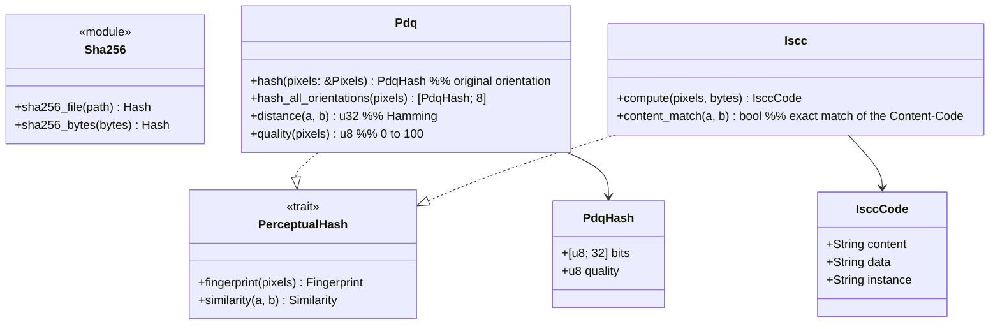

# core-hash (business)

## Sections taken
- [Chapter 3, 6 Matching hashes](../../../../docs/en/design/03_Basic Design_Signing.md#6-matching-hash) (PDQ, ISCC, guide distances, 8 orientations, quality score)
- Roles and external components: [Chapter 11, 7.1](../../../../docs/en/design/11_Basic Design_Development Base.md#71-how-the-rust-components-are-divided)

## Dependencies
- Below: [core-common](core-common.md).

## Class diagram

## Bridges (operations owned by this block)
|No.|Operation (in the diagram above)|Used by|Origin|
|---|---|---|---|
|B-050|`Sha256`|sign, case, work, backup, rights, image, app-client (SHA256SUMS)|Chapter 3, 2|
|B-051|`Pdq`|sign, case|Chapter 3, 6; Chapter 6, 4|
|B-052|`Iscc`|sign, case|Chapter 3, 6|
- The thresholds (distances 15 and 31, quality 50) are not held by this block. The judgment is core-case's `MatchPolicy`.
- `Pixels` is core-common's `Pixels8` (B-014). It is made from core-image's `Image` and passed by the caller (core-hash does not depend on core-image).

## Algorithms (behind traits)
|Trait|Implementation|Switching|Origin|
|---|---|---|---|
|`PerceptualHash`|PDQ (pdqhash; pdq-rs if it does not match the upstream test values), ISCC (iscc-lib)|Both are always computed|Chapter 3, 6; Chapter 11, DD-11-4|

## Data design
- This block writes no records. Form of values: PDQ is 256 bits (64 hexadecimal characters) plus the quality score; ISCC is the three strings of ISO 24138. They are recorded in work data (Chapter 3, 7.2; core-sign's page) and case records (Chapter 6, 2.4; core-case's page).
