# core-identity (business; signing information, certificates, keystore, notice code, documents)

## Sections taken
- [Chapter 2, 2.3 Checking inputs](../../../../docs/en/design/02_Basic Design_Signing Information and Matching.md#23-input-validation), [3.1 Structure](../../../../docs/en/design/02_Basic Design_Signing Information and Matching.md#31-structure), [3.2 Requirements for the signing certificate](../../../../docs/en/design/02_Basic Design_Signing Information and Matching.md#32-requirements-for-the-signing-certificate-c2pa-specification), [3.4 Expiry and input mistakes](../../../../docs/en/design/02_Basic Design_Signing Information and Matching.md#34-expiry-and-input-errors), [3.5 Each item](../../../../docs/en/design/02_Basic Design_Signing Information and Matching.md#35-fields), [3.6 Past personal roots](../../../../docs/en/design/02_Basic Design_Signing Information and Matching.md#36-past-personal-roots), [4.1 Matching with the Notice account](../../../../docs/en/design/02_Basic Design_Signing Information and Matching.md#41-matching-with-the-notice-account), [5.1 Authorizations](../../../../docs/en/design/02_Basic Design_Signing Information and Matching.md#51-authorization), [5.2 Joint rights](../../../../docs/en/design/02_Basic Design_Signing Information and Matching.md#52-joint-rights-photographer-and-cosplayer), [5.3 Form of documents](../../../../docs/en/design/02_Basic Design_Signing Information and Matching.md#53-document-format), [5.4 Checking documents](../../../../docs/en/design/02_Basic Design_Signing Information and Matching.md#54-checking-documents), [6 Rights holder information](../../../../docs/en/design/02_Basic Design_Signing Information and Matching.md#6-rights-holder-information), [7.1 Generation and storage](../../../../docs/en/design/02_Basic Design_Signing Information and Matching.md#71-generation-and-storage), [7.2 Loss and leaks](../../../../docs/en/design/02_Basic Design_Signing Information and Matching.md#72-loss-and-leaks), [7.4 Authentication when using the app](../../../../docs/en/design/02_Basic Design_Signing Information and Matching.md#74-authentication-when-using-the-app), [7.5 Storage method per OS](../../../../docs/en/design/02_Basic Design_Signing Information and Matching.md#75-storage-method-per-os), [7.6 Handling when used](../../../../docs/en/design/02_Basic Design_Signing Information and Matching.md#76-handling-during-use), [8 Handling of failures](../../../../docs/en/design/02_Basic Design_Signing Information and Matching.md#8-handling-failures)
- Roles and external components: [Chapter 11, 7.1](../../../../docs/en/design/11_Basic Design_Development Base.md#71-how-the-rust-components-are-divided)

## Dependencies
- Below: [core-common](core-common.md) (`NoticeCode`, `WorkId`, `UrlNormalizer`, `Platforms::detect`, `PlatformRule`, `Ids`), [core-store](core-store.md) (`Chain`, `AtomicFile`, `Paths`, `Schema`).
- Dependency inversion: this block implements core-store's `RecordSigner` and passes it in (`sign` uses the signing certificate's key, `own_roots` the current and past personal roots, `device_id` is from the device key).
- Does not depend on core-ref: the posting site detection table is passed by the caller (app-client) from B-221.
- Boundary with the outside B-337 (OS keystore, OS user verification).

## Class diagram

```mermaid
classDiagram
  class Input {
    +String handle
    +Role role
    +[String] accounts
  }
  class Normalized {
    +String handle
    +Role role
    +[NormalizedUrl] accounts
  }
  class FieldError {
    +Field field
    +Event reason
  }
  class Validator {
    +validate_input(input, platforms: [PlatformRule]) Result~Normalized, [FieldError]~  %% detection is core-common's Platforms::detect
    +skeleton(name) String
    +restriction_level(name) Level
  }
  class Draft {
    +draft_save(input)
    +draft_load() Option~Input~
  }
  class Identity {
    +CertChain cert_chain
    +NoticeCode notice_code
    +String handle
    +Role role
    +[NormalizedUrl] accounts
    +Serial signing_serial
  }
  class IdentityStore {
    +current() Identity
    +create(n: Normalized) Identity
    +update_profile(n: Normalized) Identity
    +rotate_root(reason: RotateReason) HistoryRow
    +history() [Change]
    +expiry_status() ExpiryStatus  %% 19 and 20 years from epoch.json (the day the first timestamp was obtained, or the creation day if none)
    +set_epoch(first_timestamp: Date)  %% first time only. extend_root (notAfter to 40 years later), then remake the signing certificate with the same key, then a cert row in the history (Chapter 2, 3.1)
  }
  class RotateReason {
    <<enumeration>>
    TwentyYears LostWithoutBackup SuspectedLeak
  }
  class ExpiryStatus {
    <<enumeration>>
    Ok Warn19 Stop20
  }
  class CertBuilder {
    +root(handle, not_after) Cert  %% Chapter 2, 3.5: self-signed, cA true, path length 0, keyCertSign, SKI is the SHA-1 of the public key, serial is a 128-bit random number, notBefore 2020-01-01, GeneralizedTime from 2050 on
    +signing(root, handle, accounts: [Url]) Cert  %% cA false, digitalSignature, EKU c2pa-kp-claimSigning + id-kp-documentSigning, SAN is the URIs in input order, AKI is the root's SKI
    +extend_root(root, new_not_after) Cert
  }
  class PastRoots {
    +is_own_root(cert) Option~Period~
    +past_roots() [PastRoot]
    +add_past_root(cert, period, reason, provenance: Provenance)
  }
  class PastRoot {
    +Cert cert
    +NoticeCode notice_code
    +Period period
    +RotateReason reason
    +bool suspected_leak
    +bool unverifiable
  }
  class Keystore {
    +status() KeystoreStatus
    +unlock(passphrase)
    +with_signing_key(reason, f)
    +begin_batch()
    +end_batch()
    +export_keys() Secret~Pkcs8~
    +import_keys(Secret~Pkcs8~)
    +device_key() Ed25519
    +device_id() DeviceId
    +set_secret(name, Secret)
    +get_secret(name) Secret
    +delete_secret(name)
    +wipe_keys()
  }
  class OsAuth {
    +os_user_verify(reason) bool  %% LAContext.evaluatePolicy / IUserConsentVerifierInterop / polkit. Can be turned off in settings (G-20). True if the OS does not support it. Automatic jobs do not call it (Chapter 2, 7.4)
  }
  class Grants {
    +create_grant(to: NoticeCode, scope, term, text) Document  %% default term 90 days, text up to 500 characters
    +create_revoke(target_id) Document
    +co_rights_draft(...) Document
    +co_rights_countersign(doc) Document
    +import(bytes) ImportResult  %% the five checks of Chapter 2, 5.4. Result and date/time go to approvals/<device>.jsonl
    +list() [Document]
    +renewals_due() [Document]  %% 30 days before expiry
    +auto_renew() [Document]  %% automatically makes a new authorization with renews 30 days before (Chapter 2, 5.1). Sending is app-client via core-sync
    +active_for(root_fp, shoot, date) [Document]  %% the shoot name is an exact, case-insensitive match after NFC and trimming; the term is in calendar days, both ends inclusive (Chapter 2, 5.3)
    +is_revoked(grant_id) bool
    +by_hash(sha256) Option~Document~  %% looked up from the authorization hash in the manifest (the mark in G-13)
  }
  class Document {
    +Kind kind
    +Uuid id
    +Issuer issuer
    +Option~Counterparty~ counterparty
    +Option~Scope~ scope
    +Option~Term~ term
    +String text
    +Rfc3339 created_at
    +Option~Uuid~ renews
    +[Jws] signatures
  }
  class ImportResult {
    <<enumeration>>
    Imported(Document) NotForMe Invalid(Event) OutOfTerm(Document) SuspectedLeakCode(Document)
  }
  class NoticeCodeCalc {
    <<module>>
    +expected_notice_code(cert_chain) Option~NoticeCode~
  }
  IdentityStore --> Identity
  IdentityStore ..> CertBuilder
  IdentityStore ..> Keystore
  IdentityStore ..> PastRoots
  IdentityStore ..> Validator
  Grants --> Document
  Grants --> ImportResult
  Grants ..> PastRoots
  Grants ..> NoticeCodeCalc
  Keystore ..> OsAuth
```

## Bridges (operations owned by this block)
|No.|Operation (in the diagram above)|Used by|Origin|
|---|---|---|---|
|B-080|`IdentityStore::current`|sign, case, backup, sync, app-client|Chapter 2, 2 and 3|
|B-081|`Validator::validate_input`, `Draft`|app-client|Chapter 2, 2.3|
|B-082|`IdentityStore::create` (makes the three: personal root, signing certificate, device key)|app-client|Chapter 2, 3 and 7.1|
|B-083|`IdentityStore::update_profile`, `history`|app-client|Chapter 2, 3.4 and 6|
|B-084|`IdentityStore::rotate_root`|app-client|Chapter 2, 3.6, 6, and 7.2|
|B-085|`PastRoots`|sign, store, app-client|Chapter 2, 3.6|
|B-086|`Keystore::with_signing_key`, `begin_batch` / `end_batch`|sign, case, store (inside the `RecordSigner` implementation)|Chapter 2, 7.4 and 7.6|
|B-087|`IdentityStore::expiry_status`, `set_epoch`|app-client, sign|Chapter 2, 3.4 and 8|
|B-088|`Grants`|app-client, sync, sign|Chapter 2, 5 and 5.3|
|B-089|`NoticeCodeCalc::expected_notice_code`|sign, case, P-6 (the same computation)|Chapter 2, 4.1 and DD-2-9|
|B-090|`Keystore` (status, unlock, device key, secret items, wipe)|app-client, sync|Chapter 2, 7.5 and 8|
|B-091|`Keystore::export_keys` / `import_keys`|backup, sync (handed over the wire when linking a device)|Chapter 2, 7.1; Chapter 8, 5.4|
|B-092|`OsAuth::os_user_verify`|backup, sync, app-client|Chapter 2, 7.4|
|B-093|`Validator::skeleton`, `restriction_level`|sign|Chapter 2, 2.3 and 4.1|

## Algorithms
- There are no switchable algorithms. The certificate items (3.5), the notice code computation (core-common), and UTS #39 (unicode-security) are fixed.

## Data design (records whose form this block holds)
|Record|Form|Fields|Origin|
|---|---|---|---|
|`identity/draft.json` (`nrsd.identity_draft/1`)|JSON|The three fields of `Input`|Chapter 2, 2.1|
|Certificates in `identity/`|PEM/DER|The personal root and the signing certificate (the columns of 3.5). Keys are in the OS keystore|Chapter 2, 3 and 7.5|
|`identity/epoch.json` (`nrsd.epoch/1`)|JSON|`first_timestamp_date`, `root_created_at`|Chapter 2, 3.4|
|`identity/history/<device number>.jsonl` + `.sig` (`nrsd.history/1`; chain)|JSON Lines|The five fields of Chapter 2, 6. A `root` row holds the new root certificate, reason, and date/time, signed with the old key|Chapter 2, 6 and 3.6|
|`identity/past_roots/<SKI>.json` (`nrsd.past_root/1`)|JSON|The six fields of `PastRoot`|Chapter 2, 3.6|
|`approvals/<device number>.jsonl` + `.sig` (import rows; chain)|JSON Lines|`doc_id`, `kind`, `imported_at`, `result`, `out_of_term`|Chapter 2, 5.4|
|`approvals/docs/<kind>-<id>.nrsdgrant` (`nrsd.grant/1`)|JSON|The fields of `Document` (the table in Chapter 2, 5.3)|Chapter 2, 5.3|
|Items in the OS keystore|The four kinds of Chapter 2, 7.5|PKCS#8, Ed25519, TSA accounts|Chapter 2, 7.5|
|Key file (Linux without Secret Service)|age|The two keys|Chapter 2, 7.5|
