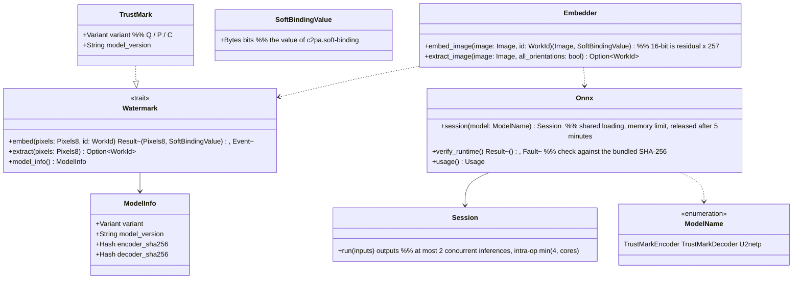

# core-mark (business; invisible watermark, shared ONNX runtime)

## Sections taken
- [Chapter 3, 5 Invisible watermark](../../../../docs/en/design/03_Basic Design_Signing.md#5-invisible-watermark) (method, reading in 8 orientations, inference limits, bundled hash check, 16-bit, processing time)
- Roles and external components: [Chapter 11, 7.1](../../../../docs/en/design/11_Basic Design_Development Base.md#71-how-the-rust-components-are-divided), [DD-11-14](../../../../docs/en/design/11_Basic Design_Development Base.md#1-list-of-design-decisions)

## Dependencies
- Below: [core-common](core-common.md) (`WorkId`, `Fault`, `Pixels8`), [core-image](core-image.md) (`Image`, `ColorEngine::to_8bit`: handling of the 16-bit residual).
- Loading and sharing the ONNX runtime belongs to this block; core-work's auto-placement (u2netp) also uses `Onnx::session` (only the model in use is loaded; Chapter 3, 5).

## Class diagram

## Bridges (operations owned by this block)
|No.|Operation (in the diagram above)|Used by|Origin|
|---|---|---|---|
|B-100|`Embedder::embed_image`, `Watermark::model_info`|sign|Chapter 3, 5|
|B-101|`Embedder::extract_image` (matching reads 8 orientations; read-back only the original orientation)|sign, case|Chapter 3, 5; Chapter 6, 4|
|B-102|`Onnx::session`|work, app-client (lazy loading at start)|Chapter 3, 5|
|B-103|`Onnx::verify_runtime`|app-client|Chapter 3, 5 and DD-11-14|
- The watermark variant and model version are recorded in the `app` of the output's work data and case records (core-sign and core-case copy them from `model_info()`).
- `Onnx::session(model)` does not hold the watermark and auto-placement models at the same time (loads the one in use and releases the other; Chapter 4, 14.4). The ONNX runtime is loaded dynamically (ort's `load-dynamic`). If `verify_runtime` does not match, it is a `Fault` (anomaly detection) and no output without a watermark is produced (Chapter 3, 5).

## Algorithms (behind traits)
|Trait|Implementation|Switching|Origin|
|---|---|---|---|
|`Watermark`|TrustMark Q (default), P, C|Decided by measurement, fixed per version (recorded in the output)|Chapter 3, DD-3-2 and 5|

## Data design
- This block writes no records. Bundled assets (P-8): `assets/models/encoder_Q.onnx` and `decoder_Q.onnx` (Chapter 11, 4.3), the shared ONNX runtime component. The expected SHA-256 values are embedded at build time from `assets/manifest.json` (Chapter 11, 6).
- Form of values: `SoftBindingValue` is the embedded bit string (the 61 data bits of TrustMark BCH_5). Recording in the manifest is core-sign (Chapter 3, 3.1).
