# core-net (base)

## Sections taken
- [Chapter 1, 4.2 Communication with the outside](../../../../docs/en/design/01_Basic Design_Overall Architecture.md#42-communication-with-the-outside) (table of counterparts, timeouts and limits, retries, order of sources, proxy servers, TLS, metered-connection detection)
- Roles and external components: [Chapter 11, 7.1](../../../../docs/en/design/11_Basic Design_Development Base.md#71-how-the-rust-components-are-divided)

## Dependencies
- Below: [core-common](core-common.md).
- Boundaries with the outside: all HTTP of B-330 to B-334 goes through this block (the direct connection B-335 is core-sync's iroh; the keystore B-337 is core-identity).

## Class diagram

```mermaid
classDiagram
  class Target {
    <<enumeration>>
    PublicPage Mirror Tsa Rdap Dns RepostPage Direct Dht  %% the rows of the table in Chapter 1, 4.2. For Direct and Dht, core-sync uses only Limits
  }
  class Limits {
    +Duration connect
    +Duration total
    +u64 max_bytes
    +u8 max_redirects  %% 0 for the TSA POST
    +for_target(Target) Limits  %% the values of the table in Chapter 1, 4.2 (constants of this block, in one place)
  }
  class RawExchange {
    +Bytes request_head  %% for recording the WARC request
    +Bytes response_head
    +Url url
  }
  class Response {
    +Bytes body
    +Headers headers
    +Url final_url
    +IpAddr ip
    +Option~String~ tls_subject
    +Option~String~ tls_issuer
    +[RawExchange] exchanges  %% each hop of the redirects (Chapter 6, 2.2.1)
  }
  class Http {
    +fetch(target: Target, url, headers: Headers) Result~Response, Event~  %% streams and cuts off at the limit
    +post_timestamp(tsa_url, request_der, auth: Option~Basic~) Result~Bytes, Event~  %% does not follow redirects. Paid TSAs use Basic (Chapter 3, 4)
  }
  class DnsAnswer {
    +[IpAddr] a
    +[IpAddr] aaaa
    +[String] ptr
    +Bytes raw  %% raw response data (evidence)
  }
  class Dns {
    +resolve(name) Result~DnsAnswer, Event~  %% hickory-resolver, the OS DNS servers, connect 5 s, total 10 s
    +reverse(ip) Result~DnsAnswer, Event~
  }
  class Headers {
    +for_page(user_agent, accept_language) Headers  %% sends no Cookie or Referer
    +for_app() Headers  %% c2pa4cosplayer/<version>
  }
  class Sources {
    +ordered() [Source]
    +report_failure(source)
    +report_bad_content(source)
    +mark_checked(kind: Ref | Update)  %% last_ref_check / last_update_check in fetch-state.json
  }
  class Source {
    +Url base
    +u32 failures
    +Rfc3339 last_checked
  }
  class Reachability {
    +on_online(callback)  %% macOS NWPathMonitor, Windows INetworkListManager, Linux NetworkManager D-Bus
    +is_online() bool
    +is_metered() bool  %% GetConnectionCost, NWPath.isExpensive/isConstrained, connection.metered
  }
  class RetryPolicy {
    <<trait>>
    +delays(target) [Duration]  %% 1, 4, 16 seconds (with jitter), then on line recovery and hourly
  }
  class Scheduler {
    +schedule(kind: JobKind, job)
    +run_pending()  %% a single queue. The order of priority is Chapter 1, 7. Does not interfere with the User's processing
    +every(Duration, kind, job)  %% hourly, every 24 hours, daily ticks
  }
  class JobKind {
    <<enumeration>>
    CleanupAfterCrash VerifyChains PendingTimestamps ChainHeadTimestamp RefAndUpdate VerifyOriginals VerifyEvidence Retention Backup DeviceSync Alarms Renewals  %% the background order of Chapter 1, 7
  }
  class Proxy {
    <<module>>
    +system_proxy() Option~ProxyConf~  %% WinHTTP, macOS, environment variables
  }
  class Tls {
    <<module>>
    +platform_verifier() Verifier  %% rustls-platform-verifier
  }
  Http ..> Target
  Http ..> Limits
  Http --> RawExchange
  Dns --> DnsAnswer
  Http --> Response
  Http ..> Headers
  Http ..> Proxy
  Http ..> Tls
  Sources --> Source
  Scheduler ..> RetryPolicy
  Scheduler ..> Reachability
  Scheduler ..> JobKind
```

## Bridges (operations owned by this block)
|No.|Operation (in the diagram above)|Used by|Origin|
|---|---|---|---|
|B-040|`Http::fetch`|ref, case|Chapter 1, 4.2|
|B-041|`Sources`|ref, app-client|Chapter 1, 4.2|
|B-042|`Http::post_timestamp`|sign|Chapter 3, 4|
|B-043|`Headers::for_page`|case|Chapter 1, 4.2; Chapter 6, DD-6-8|
|B-044|`Reachability`, `RetryPolicy`, `Scheduler` (the only queue for background jobs; app-client calls `schedule` here)|ref, sign, case, sync, app-client|Chapter 1, 4.2, 10.5, and 7|
|B-045|`Dns::resolve` / `reverse` (with the raw response)|case|Chapter 1, 4.2; Chapter 6, 5|
|B-046|`Limits::for_target` (timeouts for `Direct` and `Dht`)|sync|Chapter 1, 4.2|
- The values of `Limits` are taken per `Target` from the table in Chapter 1, 4.2 (constants held by this block; the caller only passes a `Target`).
- Fetching a repost page is done by this block, streaming the body and cutting off at the limit (Chapter 1, 4.2 “the response is written while streaming”). It neither renders nor interprets (interpretation is core-case).

## Algorithms (behind traits)
|Trait|Implementation|Switching|Origin|
|---|---|---|---|
|`RetryPolicy`|The same three tries as AWS exponential backoff, then on the line-recovery event and hourly. Timestamps are not retried but go to the next TSA (core-sign's `TsaStrategy`); repost pages only once|Constants of the initial values|Chapter 1, 4.2|

## Data design (records whose form this block holds)
|Record|Form|Fields|Origin|
|---|---|---|---|
|`state/fetch-state.json` (`nrsd.fetch_state/1`)|JSON|`sources[]` (the three fields of `Source`), `last_ref_check`, `last_update_check`|Chapter 1, 4.2; Chapter 8, 2.1|
- The queue (`Scheduler`) exists only in memory. Pending jobs themselves (pending timestamps, backup schedules) are in each owner's records, and each owner calls `schedule` again at every start.
