# core-ref (business; fetching the reference information package and update manifest, TUF verification)

## Sections taken
- [Chapter 8, 3.4 Reference information package](../../../../docs/en/design/08_Basic Design_Repository and Data Management.md#34-reference-information-package) (list of files, the five verification steps, the five sources, the bundled package, correction marks)
- [Chapter 9, 4.2 Users of old versions (forced updates)](../../../../docs/en/design/09_Basic Design_Distribution and Updates.md#42-users-of-old-versions-forced-updates), [4.3 Form of the update manifest (static JSON)](../../../../docs/en/design/09_Basic Design_Distribution and Updates.md#43-form-of-the-update-manifest-static-json) (TUF roles, expiry, locations)
- [Chapter 12, 3.1 What is required to use NRSD's service](../../../../docs/en/design/12_Basic Design_Interface with Legal.md#31-required-for-using-nrsds-services) (consent record)
- Roles and external components: [Chapter 11, 7.1](../../../../docs/en/design/11_Basic Design_Development Base.md#71-how-the-rust-components-are-divided)

## Dependencies
- Below: [core-common](core-common.md), [core-store](core-store.md) (`Schema`, `AtomicFile`, `Paths`), [core-net](core-net.md) (`Http::fetch`, `Sources`, `Scheduler`).
- Dependency inversions: this block defines `BundleSource`, implemented by core-sync (packages from another device or a contact). This block defines `BundleSigner`, implemented by app-operator (signing with the hardware token).
- Boundary with the outside B-330 (HTTPS GET from the public page and mirror; via core-net).

## Class diagram

```mermaid
classDiagram
  class RefBundle {
    +u32 version
    +Rfc3339 issued_at
    +[FileEntry] files
    +[Correction] corrections
    +[PlatformRule] platforms  %% the row type is core-common (B-007)
    +Templates templates
    +Laws laws
    +Texts texts
    +[Notice] notices
    +Terms terms
    +TrackingRules clearurls
    +RdapBootstrap rdap
    +[TsaEntry] tsa
    +[Relay] relays
    +Holidays holidays
    +Deadlines deadlines
    +MinimumVersion minimum_version
    +Vex vex
  }
  class FileEntry {
    +String path
    +u64 size_raw
    +u64 size_zstd
    +u64 budget
  }
  class Correction {
    +String file
    +u32 since
    +Text3 reason
  }
  class Fetcher {
    +refresh() Outcome  %% the latest from the five sources. Only the changed files
    +import_bundle(bytes) Outcome
    +export_bundle() Bytes
    +verify_update_manifest(bytes, platform) Verified
  }
  class Outcome {
    <<enumeration>>
    Updated(version) UpToDate Stale(last_checked) Rejected(Event)
  }
  class Verified {
    +Url url
    +String signature
    +SemVer version
  }
  class BundleVerifier {
    <<trait>>
    +verify(root: RootJson, meta: TufSet, files) Result~Verdict, Event~
  }
  class TufSet {
    +Bytes timestamp
    +Bytes snapshot
    +Bytes targets
    +Bytes reference  %% delegation reference.json
    +Bytes release  %% delegation release.json
  }
  class Verdict {
    +bool timestamp_expired  %% if expired, treated as a fetch failure
    +u32 bundle_version
    +Rfc3339 reference_expiry  %% 120 days. Expiry is only a mark
  }
  class Store {
    +current() RefBundle
    +pinned(version) RefBundle
    +corrections_since(version) [Correction]
    +minimum_version() SemVer
    +bundled_version() u32  %% the bundled package of P-8
  }
  class Consent {
    +consent(state: ConsentState)
    +consent_state() ConsentState
    +terms_current() Terms
    +terms_changed_since(version) Option~Change~
  }
  class ConsentState {
    +Option~String~ version
    +Option~Rfc3339~ at
    +bool declined
  }
  class BundleSource {
    <<trait>>
    +latest() Option~(u32, Bytes)~
  }
  class BundleSigner {
    <<trait>>
    +sign(bytes) (Sig, Attestation)
  }
  class Writer {
    +write_bundle(files, version, expiry, signer: BundleSigner) BundleOut  %% used by app-operator
    +diff_bundle(old: RefBundle, new: RefBundle) Diff  %% difference from the previous version (M-01)
    +iana_bootstrap_diff(fetched, current) Diff
    +budget_check(bundle) [Warning]  %% each file's budget and 80% of the 16 MB total
    +mark_errata(bundle, items: [Correction]) RefBundle  %% correction marks (Chapter 5, 2.4)
  }
  Fetcher ..> BundleVerifier
  Fetcher ..> BundleSource
  Fetcher --> Outcome
  Fetcher --> Verified
  Fetcher ..> TufSet
  BundleVerifier --> Verdict
  Store --> RefBundle
  RefBundle --> FileEntry
  RefBundle --> Correction
  Writer ..> BundleSigner
  Writer --> RefBundle
```

## Bridges (operations owned by this block)
|No.|Operation (in the diagram above)|Used by|Origin|
|---|---|---|---|
|B-220|`Fetcher::refresh`|app-client|Chapter 8, 3.4|
|B-221|`Store::current` (each table)|rights, guidance, work, app-client (app-client passes it on to case and identity)|Chapter 8, 3.4; Chapters 7, 5, and 12|
|B-222|`Fetcher::verify_update_manifest`|app-client|Chapter 9, 4.3|
|B-223|`Consent` (only `refresh` follows consent; verification of the update manifest does not depend on consent)|app-client|Chapter 12, 3.1 and 4.3|
|B-224|`Store::minimum_version`|app-client|Chapter 9, 4.2|
|B-225|`Store::pinned`|work|Chapter 5, 4|
|B-226|`Fetcher::import_bundle`, `export_bundle` (file, sync, portable kit. The first start imports the bundled package with this)|app-client, sync|Chapter 8, 3.4|
|B-227|`Store::corrections_since`|app-client, rights|Chapter 8, 3.4|
|B-228|`BundleSource` (definition; implemented by core-sync)|sync|Chapter 8, 3.4|
|B-229|The form of `RefBundle` and `Writer::write_bundle`|app-operator|Chapter 8, 3.4|
|Part of B-310|`BundleSigner` (definition; implemented by app-operator)|app-operator|Chapter 8, 3.4|
- Posting site detection is done by core-common's `Platforms::detect` (B-007); this block only reads `platforms.json` into core-common's `[PlatformRule]`. The users (core-identity B-081, core-case B-181) pass the table (the same detection is not held in two places).

## Algorithms (behind traits)
|Trait|Implementation|Switching|Origin|
|---|---|---|---|
|`BundleVerifier`|tough (the TUF 1.0 order: root, then timestamp, then snapshot, then targets, then delegations). The root is updated from the bundled initial version through the sequence of versions|Fixed|Chapter 8, 3.4; Chapter 9, 4.3|

## Data design (records whose form this block holds)
|Record|Form|Fields|Origin|
|---|---|---|---|
|`reference/<version>/index.json` (`nrsd.reference/1`)|JSON|`schema`, `version`, `issued_at`, `files[]` (`FileEntry`), `corrections[]` (`Correction`)|Chapter 8, 3.4|
|Each file in `reference/<version>/` (`nrsd.ref.<name>/1`)|JSON (fetched as zstd, stored decompressed), Markdown|`platforms` (one row: `id`, `name` (three languages), `hosts[]`, `paths[]`, `profile_limit`, `c2pa_survives`, `windows{copyright, portrait}` (`url`, `method`, `jp_art22`, `notes`), `sources`, `checked_at`; Chapter 7, 2.1), `laws` (Chapter 7, 4), `deadlines` and `holidays` (Chapter 7, 6.3), `tsa` (`id`, `name`, `url`, `roots` (PEM), `kind` (`free`, `paid`), `auth` (`none`, `basic`), `order`; Chapter 3, 4), `relays` (`url`, `region`, `operator`), `notices` (number, date, kind, title and body in three languages, deadline), `terms` (version, effective date), `minimum_version` (`app`, `reason`, `date`), `clearurls`, `rdap-bootstrap/`, `vex` (CSAF 2.0), `templates/<kind>.<language>.md` (Chapter 7, 3.3), `texts/` (Chapter 5, 3.7)|Chapter 8, 3.4; Chapter 7, 2.1, 3.3, 4, and 6.3; Chapter 9, 4.2; Chapter 11, 5.3|
|`reference/latest.json`|JSON|`version`, `index_sha256` (not used as a basis of trust)|Chapter 8, 3.4|
|`tuf/` (copies of the fetched TUF metadata: the sequence of `root.json` versions, `timestamp`, `snapshot`, `targets`, `reference`, `release`)|JSON|The form of the TUF specification 1.0|Chapter 9, 4.3|
|`consent.json` (`nrsd.consent/1`)|JSON|The three fields of `ConsentState`|Chapter 12, 3.1|
|Bundled package (P-8)|The initial version of `reference/` and the initial `root.json`|Same as above|Chapter 8, 3.4|
- `Store::minimum_version` reads both the reference information's `minimum-version.json` and the TUF of the update manifest (the custom field of the `release` delegation's targets) and returns the larger (Chapter 9, 4.2; it also reaches Users who did not consent and do not fetch reference information).
- `Writer::write_bundle` makes each file (zstd), `index.json`, `latest.json`, and the `targets.json` of the `reference` delegation (signed with `BundleSigner`). `snapshot.json` and `timestamp.json` are re-signed by CI's `tuf-online` (Chapter 11, DD-11-13; P-10).
- The date/time of the last check (`last_ref_check` and `last_update_check` in `fetch-state.json`) is written with core-net's `Sources::mark_checked`.
- The fields of the update manifest (`update/latest.json`; `nrsd.update_manifest/1`) are the table in Chapter 9, 4.3. This block only verifies and returns `Verified`; fetching and swapping in the distributables is app-client (Tauri's update component).
- Marks: `Verdict.timestamp_expired` is a fetch failure (the local copy is used); exceeding `reference_expiry` is the notice “reference information is old” (row 5 of the table in Chapter 8, 3.4); a package that arrived by sync or from a file carries the mark `stale_check: date` (Chapter 8, 3.4).
