# core-render (business; fonts, text composition, drawing, layout, compositing, PDF)

## Sections taken
- [Chapter 1, 10.11 PDF documents](../../../../docs/en/design/01_Basic Design_Overall Architecture.md#1011-pdf-documents)
- [Chapter 4, 3.2 Formatting](../../../../docs/en/design/04_Basic Design_Image Editing and Batch Application.md#32-formatting), [3.3 Vertical writing](../../../../docs/en/design/04_Basic Design_Image Editing and Batch Application.md#33-vertical-writing), [3.4 Missing glyphs](../../../../docs/en/design/04_Basic Design_Image Editing and Batch Application.md#34-missing-glyphs), [3.5 Drawing](../../../../docs/en/design/04_Basic Design_Image Editing and Batch Application.md#35-drawing), [6.2 Order of fallback fonts](../../../../docs/en/design/04_Basic Design_Image Editing and Batch Application.md#62-fallback-font-order), [6.4 Fonts brought in](../../../../docs/en/design/04_Basic Design_Image Editing and Batch Application.md#64-imported-fonts), [7.1 Position and size](../../../../docs/en/design/04_Basic Design_Image Editing and Batch Application.md#71-position-and-size), [7.3 When it does not fit](../../../../docs/en/design/04_Basic Design_Image Editing and Batch Application.md#73-when-it-does-not-fit), [7.4 Tiling](../../../../docs/en/design/04_Basic Design_Image Editing and Batch Application.md#74-tiling)
- Roles and external components: [Chapter 11, 7.1](../../../../docs/en/design/11_Basic Design_Development Base.md#71-how-the-rust-components-are-divided)

## Dependencies
- Below: [core-common](core-common.md), [core-image](core-image.md) (`Image`, `ColorEngine`: matching the drawn transparent image to the photo's color space and bit depth).
- The structure of templates and work sessions (layers, blocks, insertions) belongs to core-work; this block only receives a `TemplateSnapshot` (the copy needed for composition).

## Class diagram

```mermaid
classDiagram
  class Fonts {
    +load(path) Result~FontId, Event~  %% TTF and OTF, up to 50 MB. Referenced by family name and SHA-256
    +bundled() [FontId]
    +fallback_chain(direction, lang) [FontId]  %% the defaults of 6.2 (LXGW WenKai first for Chinese)
    +missing_glyphs(text, chain: [FontId]) [char]
    +supports_vertical(font) bool  %% a font without vert (Caveat) cannot be chosen as the main font for vertical writing (3.3)
    +resolve(family, sha256) Option~FontId~  %% None if absent, then Layout's Issue::FontMissing
  }
  class Color {
    +opposite() Color  %% white and black swap; others become white or black by opposite lightness (3.2 "opposite of the text color")
  }
  class Tiling {
    +Pattern pattern  %% Grid | Diagonal (default)
    +f32 angle  %% -45 to 45, default -30
    +(f32, f32) spacing  %% 10 to 60% of the short side, default 25%
    +f32 opacity  %% 10 to 100%, default 20%
  }
  class Issue {
    <<enumeration>>
    TooSmall  %% text under 1.5% (7.3)
    LowContrast  %% under 3:1. Marked after adding an outline automatically (3.2)
    MissingGlyph  %% a character in no font (3.4)
    UndrawableGlyph  %% a COLRv1 fill that cannot be drawn (6.3)
    FontMissing  %% a device without the brought-in font (6.4)
  }
  class TextStyle {
    +[FontId] fonts
    +Weight weight
    +f32 size_ratio  %% ratio to the short side
    +ColorSpec color  %% fixed | Auto
    +Align align
    +f32 line_height
    +f32 letter_spacing
    +Option~Outline~ outline
    +Option~Shadow~ shadow
    +Option~Plate~ plate
    +Direction direction  %% horizontal | vertical
    +bool tcy  %% tate-chu-yoko (numbers up to 2 digits; in vertical writing)
    +f32 rotation
    +f32 opacity
  }
  class Shaper {
    <<trait>>
    +shape(text, style: TextStyle) ShapedLines  %% per-grapheme fallback, UAX #9, vertical writing is own implementation
  }
  class Layout {
    +[PlacedBlock] blocks
    +[Issue] issues  %% needs fixing (under 1.5%), hard to read
  }
  class PlacedBlock {
    +BlockId block
    +Anchor anchor  %% 9 points
    +Margin margin
    +Rect bounds_px
    +f32 scale  %% shrinking when over 40%
    +Tiling tiling  %% single | tiled
  }
  class Layouter {
    +layout(snapshot: TemplateSnapshot, overrides, photo: Size, inserts: Inserts) Layout
  }
  class Renderer {
    +render_block(layout: Layout, block: BlockId) RgbaImage  %% plate, then shadow (Gaussian, sigma = blur/2), then outline (round join and cap), then fill. Emoji are COLRv1. 1/4 pixel. An outline is added automatically on low contrast
    +render_tile(layout, block) RgbaImage  %% one repeat of the tiling (7.4)
    +composite(photo: Image, layers: [(RgbaImage, Pos)]) Image  %% converts sRGB 8-bit transparency to the photo's color space and bit depth and overlays (core-image's ColorEngine). Tiling is laid out
  }
  class ContrastRule {
    <<trait>>
    +auto_color(bg: Pixels) Color  %% boundary at relative luminance 0.179
    +contrast_ratio(a: Color, b: Color) f32
  }
  class PdfWriter {
    <<trait>>
    +pdf_a(doc: PdfDocument) Result~Bytes, Fault~  %% PDF/A-2u and 3u, PDF/UA-1; anomaly detection if it fails validation
  }
  class PdfDocument {
    +[Section] sections  %% headings, paragraphs, tables, figures (with alternative text)
    +[EmbeddedFile] embedded  %% AssociationKind
    +Archival level
  }
  Layouter --> Layout
  Layouter ..> Shaper
  Layouter ..> Fonts
  Layout --> PlacedBlock
  Layout --> Issue
  PlacedBlock --> Tiling
  TextStyle --> Color
  Renderer ..> Layout
  Renderer ..> ContrastRule
  Renderer ..> TextStyle
  PdfWriter ..> PdfDocument
```

## Bridges (operations owned by this block)
|No.|Operation (in the diagram above)|Used by|Origin|
|---|---|---|---|
|B-110|`Fonts`|work|Chapter 4, 6 and 3.4|
|B-111|`Layouter::layout`|work|Chapter 4, 7.1, 7.3, and 7.4|
|B-112|`Renderer::render_block`|work|Chapter 4, 3.5 and 6.3|
|B-113|`Renderer::composite`|sign|Chapter 4, 3.5|
|B-114|`ContrastRule`|work|Chapter 4, 3.2|
|B-115|`PdfWriter::pdf_a`|backup, case, app-client (exporting clues)|Chapter 1, 10.11|
- Tiling draws one repeat once and lays it out (Chapter 4, 7.4). The center of rotation is the center of the block (Chapter 4, 3.5).

## Algorithms (behind traits)
|Trait|Implementation|Switching|Origin|
|---|---|---|---|
|`Shaper`|HarfRust. Vertical writing (`vert`, vhea and vmtx, rotation of Latin characters and digits, tate-chu-yoko) is own implementation|Fixed|Chapter 4, 3.3|
|`ContrastRule`|WCAG relative luminance and contrast ratio|Constants of the initial values (outline automatically at 3:1)|Chapter 4, 3.2|
|`PdfWriter`|krilla (also validated with veraPDF in CI). The alternative is printpdf|Fixed|Chapter 1, 10.11; Chapter 11, 12|

## Data design
- This block writes no records. Files of brought-in fonts are placed by core-work in `assets/` (named by SHA-256; Chapter 8, 2.1), and this block receives the path and reads them.
- The fields, ranges, and defaults of `TextStyle` are the table in Chapter 4, 3.2; the anchors, margins, and shrinking of `PlacedBlock` are 7.1 and 7.3; the tiling fields are the table in 7.4. Holding these inside the template record (`nrsd.template/2`) is core-work (Chapter 4, 15.1).
