# core-rights (business; Permitted Scope, Enclosed Document, rights metadata, example notice texts)

## Sections taken
- [Chapter 2, 2.2 Limits of where the notice code is displayed](../../../../docs/en/design/02_Basic Design_Signing Information and Matching.md#22-limits-of-the-places-where-notice-codes-are-posted)
- [Chapter 3, 3.3 Language of rights notices](../../../../docs/en/design/03_Basic Design_Signing.md#33-language-of-rights-statements), [3.6 Rights metadata in files](../../../../docs/en/design/03_Basic Design_Signing.md#36-the-files-rights-statement-iptc-photo-metadata)
- [Chapter 5, 2.1 Options](../../../../docs/en/design/05_Basic Design_Rights Documents.md#21-options-decision-on-o-04options-for-the-permitted-scope), [2.3 Linking to images](../../../../docs/en/design/05_Basic Design_Rights Documents.md#23-linking-to-images), [2.4 Changes after sale](../../../../docs/en/design/05_Basic Design_Rights Documents.md#24-changes-after-sale), [3.1 Structure](../../../../docs/en/design/05_Basic Design_Rights Documents.md#31-structure), [3.2 Outline of the common part](../../../../docs/en/design/05_Basic Design_Rights Documents.md#32-outline-of-the-common-part), [3.4 Detecting rewriting](../../../../docs/en/design/05_Basic Design_Rights Documents.md#34-detecting-rewriting), [3.6 Machine-readable Permitted Scope (ODRL)](../../../../docs/en/design/05_Basic Design_Rights Documents.md#36-machine-readable-permitted-scope-odrl), [3.8 Country and language codes](../../../../docs/en/design/05_Basic Design_Rights Documents.md#38-country-and-language-codes), [5 Countries](../../../../docs/en/design/05_Basic Design_Rights Documents.md#5-countries), [6.1 Levels of example texts](../../../../docs/en/design/05_Basic Design_Rights Documents.md#61-levels-of-sample-text)
- Roles and external components: [Chapter 11, 7.1](../../../../docs/en/design/11_Basic Design_Development Base.md#71-how-the-rust-components-are-divided)

## Dependencies
- Below: [core-common](core-common.md) (`Text::text`, `NoticeCode`, `WorkId`), [core-store](core-store.md) (`Chain::sign_embedded`: signing corrected versions), [core-hash](core-hash.md) (SHA-256 of the Enclosed Document), [core-ref](core-ref.md) (texts `texts/`, example texts, the posting site table, the `pinned` version).
- Does not depend on settings: the countries and languages to enclose are read from the settings and passed by the caller (core-sign, app-client).
- Corrected versions: listing the affected works is app-client (from core-sign's work data and core-ref's `corrections_since`), generation is this block, signing is core-store's `sign_embedded` (the `RecordSigner` is core-identity).

## Class diagram

```mermaid
classDiagram
  class PermittedScope {
    +Base base  %% P1 | P2
    +[Addon] addons  %% A1 A2 A3
    +short() String  %% P2+A1+A2
    +always_included() [Condition]
    +sns_default() PermittedScope  %% the social media default "P1 equivalent: viewing only, no reposting" (Chapter 5, 2.1; Chapter 3, 8.2)
  }
  class Enclosure {
    +[EnclosureFile] files  %% 00_RIGHTS_README.txt, 00_RIGHTS_<country>.txt, 00_RIGHTS.json
    +[(String, Hash)] hashes
  }
  class EnclosureBuilder {
    +build(scope, countries: [Country], holder: Holder, batch_id: Uuid, work_ids: [WorkId], ref_pinned: RefBundle) Enclosure
    +regenerate(work: WorkData) Enclosure
    +errata(work_ids, correction: Correction) (ErrataFile, Jws)
  }
  class Holder {
    +String handle
    +NoticeCode notice_code
    +[Url] accounts
    +Option~Party~ grantor  %% output of an authorized person
    +Option~Party~ co_rights_holder
  }
  class Odrl {
    <<module>>
    +offer(scope, batch_id, holder, work_ids) JsonLd  %% the correspondence of Chapter 5, 3.6
  }
  class EnclosureVerifier {
    +verify(folder: Path, manifest_hashes: [(String, Hash)]) VerifyReport  %% match, mismatch, missing, extra; legitimacy of ERRATA
  }
  class Deed {
    <<module>>
    +deed(scope, lang) DeedTable  %% can, conditions, cannot
  }
  class RightsText {
    <<module>>
    +rights_fields(stream, scope, lang, holder, title) RightsFields  %% values of XMP, EXIF, cawg.metadata, cawg.training-mining
    +notice_texts(level, lang, handle, code, platform, profile_limit: Option~u32~, registration: Option) String  %% short, medium, long (Chapter 5, 6.1). The caller passes the limit from the platforms column (Chapter 2, 2.2)
    +license_short(scope) String
  }
  class ViolationRules {
    <<trait>>
    +violations(scope, facts: RepostFacts) [ViolationCandidate]
  }
  class RepostFacts {
    +bool paid
    +bool public
    +bool c2pa_missing
    +bool pixels_identical_to_delivery
    +PlatformC2paSurvival survival
  }
  EnclosureBuilder --> Enclosure
  EnclosureBuilder ..> Odrl
  EnclosureBuilder ..> Holder
  EnclosureBuilder ..> PermittedScope
  EnclosureVerifier --> VerifyReport
  ViolationRules ..> RepostFacts
  ViolationRules ..> PermittedScope
```

## Bridges (operations owned by this block)
|No.|Operation (in the diagram above)|Used by|Origin|
|---|---|---|---|
|B-120|`PermittedScope`|work, sign, case, app-client|Chapter 5, 2.1|
|B-121|`EnclosureBuilder::build`|sign|Chapter 5, 3, 4, and 3.1|
|B-122|`EnclosureVerifier::verify`|sign, app-client|Chapter 5, 3.4|
|B-123|`RightsText::notice_texts` (the posting site limit comes from the table column)|app-client|Chapter 5, 6|
|B-124|`RightsText::rights_fields`|sign|Chapter 3, 3.3 and 3.6|
|B-125|`Deed::deed`|app-client, P-6 (the same table)|Chapter 5, 3.1|
|B-126|`EnclosureBuilder::regenerate`, `errata`|app-client|Chapter 5, 2.4 and 4|
|B-127|`RightsText::license_short`|work|Chapter 5, 2.1|
|B-128|`ViolationRules::violations`|case|Chapter 5, 2.3|

## Algorithms (behind traits)
|Trait|Implementation|Switching|Origin|
|---|---|---|---|
|`ViolationRules`|The candidate rules of Chapter 5, 2.3 (publication outside the Permitted Scope, commercial use, the condition of removed matching data)|Fixed|Chapter 5, 2.3|

## Data design (what this block gives form to; outputs, not device records)
|Output|Form|Fields|Origin|
|---|---|---|---|
|`00_RIGHTS_README.txt`|TXT (UTF-8, no BOM, CRLF). Japanese, Chinese, English|The 10 items of Chapter 5, 3.2|Chapter 5, 3.1 and 3.2|
|`00_RIGHTS_<country>.txt`|TXT|The per-country part (the texts are the reference information's `texts/`; P-7)|Chapter 5, 3.1 and 3.3|
|`00_RIGHTS.json`|ODRL 2.2 JSON-LD (Offer)|The table and example of Chapter 5, 3.6. The URIs of `uid`, `assigner`, and `target` are `https://c2pa4cosplayer.nrsd.jp/id/…`|Chapter 5, 3.6|
|`00_RIGHTS_ERRATA.txt` + `.sig`|TXT, JWS detached|The SHA-256 of the original and the corrected version at the head, the difference, the signature|Chapter 5, 2.4 and 3.4|
|`RightsFields` (XMP and EXIF values)|core-image's type|The fields of the table in Chapter 3, 3.6|Chapter 3, 3.6|
- The Permitted Scope is recorded in the work data's `rights` (core-sign's page) and in the manifest's `jp.nrsd.rights`, `cawg.metadata`, and `cawg.training-mining` (Chapter 3, 3.1).
- The body of the Enclosed Document is made by filling the insertions `{handle}`, `{account}`, `{scope}`, and `{url}` in the reference information's `texts/common.<language>.md` and `texts/country.<country>.<language>.md` (Chapter 5, 4) (the rules are the same as Chapter 4, 3.1; this block does not use core-work's insertion rules but places the same rules on core-common's `Text` side).
