# core-sign (business; C2PA signing, timestamps and ERS, the export flow, work data)

## Sections taken
- [Chapter 2, 4.2 Originals](../../../../docs/en/design/02_Basic Design_Signing Information and Matching.md#42-original), [4.6 Exporting an image that carries someone else's C2PA signature](../../../../docs/en/design/02_Basic Design_Signing Information and Matching.md#46-exporting-images-that-carry-someone-elses-c2pa-signature)
- Chapter 3: [1 List of design decisions](../../../../docs/en/design/03_Basic Design_Signing.md#1-list-of-design-decisions), [3.1 Items recorded](../../../../docs/en/design/03_Basic Design_Signing.md#31-fields-recorded), [3.2 Items not recorded](../../../../docs/en/design/03_Basic Design_Signing.md#32-fields-not-recorded), [3.4 Record of operations](../../../../docs/en/design/03_Basic Design_Signing.md#34-recording-of-actions), [3.5 Where the timestamp goes](../../../../docs/en/design/03_Basic Design_Signing.md#35-where-the-timestamp-is-placed), [3.7 Embedding per format](../../../../docs/en/design/03_Basic Design_Signing.md#37-embedding-per-format), [3.8 Redacting ingredient manifests](../../../../docs/en/design/03_Basic Design_Signing.md#38-redaction-of-ingredient-manifests), [4 Timestamps](../../../../docs/en/design/03_Basic Design_Signing.md#4-trusted-timestamps), [7.1 Identification number](../../../../docs/en/design/03_Basic Design_Signing.md#71-identification-number), [7.2 Items of work data](../../../../docs/en/design/03_Basic Design_Signing.md#72-work-data-fields-decision-on-o-10recording-format-of-work-data), [8.1 Order](../../../../docs/en/design/03_Basic Design_Signing.md#81-order), [8.2 Differences between streams](../../../../docs/en/design/03_Basic Design_Signing.md#82-differences-between-streams), [9 Batch processing](../../../../docs/en/design/03_Basic Design_Signing.md#9-batch-processing), [10.1 Names and structure](../../../../docs/en/design/03_Basic Design_Signing.md#101-names-and-structure), [10.2 Checking by the User](../../../../docs/en/design/03_Basic Design_Signing.md#102-checking-by-the-user), [11 Handling of failures](../../../../docs/en/design/03_Basic Design_Signing.md#11-handling-failures)
- Roles and external components: [Chapter 11, 7.1](../../../../docs/en/design/11_Basic Design_Development Base.md#71-how-the-rust-components-are-divided)

## Dependencies
- Below: [core-common](core-common.md), [core-store](core-store.md) (`Chain`, `AtomicFile`, `WorkIndex`, `Space`), [core-net](core-net.md) (`post_timestamp`, `Scheduler`), [core-hash](core-hash.md), [core-image](core-image.md), [core-identity](core-identity.md) (`current`, `with_signing_key`, `PastRoots`, `Grants::is_revoked`, `skeleton`, `expected_notice_code`), [core-mark](core-mark.md), [core-render](core-render.md) (`composite`), [core-rights](core-rights.md) (`EnclosureBuilder::build`, `RightsText::rights_fields`, `EnclosureVerifier::verify`), [core-work](core-work.md) (`export_plan`, `render_export`, `mark_exported`, `parallelism`).
- Boundary with the outside B-332 (TSA; via core-net).
- Checking revocation of authorizations (Chapter 2, 5.4 “at the start of a batch export”) is done once at the start by app-client with `Grants::is_revoked`; this block does not check per photo.
- `InsertContext` (insertions): this block adds the work's identification number and passes it to core-work. The TSA list `tsa.json` is passed by the caller from the reference information (this block does not depend on core-ref).

## Class diagram

```mermaid
classDiagram
  class WorkData {
    +WorkId id
    +Stream stream
    +Original original
    +Output output
    +Bytes manifest
    +Rights rights
    +Option~CoRights~ co_rights
    +Signer signer
    +Tsa tsa
    +AppInfo app
    +Rfc3339 created_at
    +ClockStamp clock
    +Option~WorkId~ duplicate_of
    +[Ingredient] ingredients
  }
  class Original {
    +Hash sha256
    +Format format
    +Size px
    +Option~PdqHash~ pdq
    +Path path
    +[OriginalVersion] versions  %% re-developed, the RAW before development
    +Option~Rfc3339~ date_time_original
  }
  class Output {
    +Hash sha256
    +Format format
    +Size px
    +PdqHash pdq
    +IsccCode iscc
    +String file_name
    +String original_name
    +Option~NameFix~ name_fix
    +[Path] locations
  }
  class Tsa {
    +TsaState state  %% Attached | Pending
    +[TsResponse] responses
  }
  class Rights {
    +ScopeId scope_id
    +u32 scope_version
    +Option~[(String, Hash)]~ enclosure_hashes  %% delivery only
    +u32 ref_version
    +[(String, Hash)] text_file_hashes  %% the wording files used (Chapter 5, 4)
  }
  class NrsdRights {
    +WorkId work_id
    +IsccCode iscc
    +Hash original_sha256
    +Size original_px
    +ScopeId scope_id
    +u32 scope_version
    +Option~Hash~ enclosure_sha256
    +Option~String~ co_rights_holder
    +Option~String~ grantor
    +u32 ref_version
    +[(String, Hash)] text_file_hashes
    +Option~String~ shoot  %% shoot name (the original file name is not included)
  }
  class ExistingSignature {
    <<enumeration>>
    None
    OwnRoot  %% 1: current or past personal root, then imported as an ingredient
    ToolOnly  %% 2: camera or developing software (no identity record), then parentOf, redaction
    KnownParty  %% 3: a counterpart with an authorization or joint-rights document, then named
    Stranger  %% 4: an unrelated person's identity, then not processed
    Tampered  %% 5: a tampering code, then not processed
  }
  class Exporter {
    +export_one(session, item: ExportItem, scope, tsa_set: [TsaEntry], enclosure: Option~Enclosure~) Result~WorkData, Event~  %% steps 1 to 14 of 8.1
    +cleanup_after_crash() Report
    +queue() ExportQueue
  }
  class ExportQueue {
    +[(Uuid session, PresetId)] items
    +push(...)
    +pop_next() Option~...~
  }
  class Inspector {
    +inspect(path) Inspection  %% validation codes, signer, expected notice code, whether own root, ingredients, watermark, PDQ
    +status_word_key(code) String
    +verify_readback(temp_path, expected: WorkData) Result
  }
  class Inspection {
    +ExistingSignature existing  %% 1 to 5 of the table in Chapter 3, 2 (outsideValidity is a mark, not a stop)
    +[StatusCode] validation_codes
    +Option~SignerInfo~ signer
    +Option~NoticeCode~ expected_notice_code
    +Option~Period~ own_root
    +[IngredientInfo] ingredients
    +Option~WorkId~ watermark_id
    +Option~PdqHash~ pdq
    +bool similar_handle  %% UTS #39 skeleton match
  }
  class Timestamps {
    +timestamp(hash, tsa_set: [TsaEntry]) TsResponses  %% three in parallel, the first one
    +verify_tsr(response, hash) Result
    +attach_pending_timestamps() Report
    +timestamp_chain_head() Result
    +ers_update() EvidenceRecord
    +ers_for(rows: Range) EvidenceRecord
  }
  class TsaStrategy {
    <<trait>>
    +pick(tsa_set) [TsaEntry]
  }
  class Rfc3161 {
    <<module>>
    +request(hash, nonce) Der
    +verify(response: Der, hash, roots) TsInfo  %% der, x509-cert, cms
  }
  class Ers {
    <<module>>
    +archive_timestamp(hashes) EvidenceRecord  %% RFC 4998
    +renew(record, new_ts) EvidenceRecord
  }
  class ManifestBuilder {
    +build(photo: Image, ctx, ingredients, redactions, rights: NrsdRights) ManifestDefinition  %% the assertions of 3.1, the actions of 3.4 (allActionsIncluded true), the redactions of 3.8, cawg.identity (photographer cawg.creator, cosplayer jp.nrsd.subject, authorized person cawg.publisher), claim_generator, title is the portable name
    +sign_with_timestamp(def, bytes, tsa_set) Bytes  %% passes Rfc3161 to the timestamp entry point of c2pa's Signer (sigTst2 of 3.5)
  }
  class Works {
    +works(query) [WorkData]
    +work(id) WorkData
    +correct(id, correction: Correction)
    +record_published(id, published: Published)
    +link_original(id, path) Result
    +pending_timestamps_count() u32
    +verify_originals() [OriginalIssue]
    +record_original_version(id, sha256, path)
    +find_original(sha256, roots: [Path]) Option~Path~
  }
  class OriginalIssue {
    +WorkId work_id
    +IssueKind kind  %% Missing | Changed (different SHA-256) | Unreadable
    +Path recorded_path
  }
  class Naming {
    +plan_names(session, items) [(Path temp, Path final)]  %% 10.1, the checks of the three OSes, serial numbers. Nested folders are mirrored in the output (Chapter 3, 9). Folder collisions are _2, _3
    +write_index(folder, rows) Path  %% 00_INDEX.txt (headings in three languages; serial number, identification number, original name, shoot name)
  }
  class NameSanitizer {
    <<trait>>
    +fix(path) (Path, Option~NameFix~)
  }
  class SizeFitter {
    <<trait>>
    +fit(image, preset) EncodeSettings  %% over 5 MB lowers quality by 2 at a time, floor 80
  }
  Exporter --> WorkData
  Exporter ..> ManifestBuilder
  Exporter ..> Timestamps
  Exporter ..> Naming
  Exporter ..> Inspector
  Exporter ..> SizeFitter
  Exporter --> ExportQueue
  Timestamps ..> Rfc3161
  Timestamps ..> Ers
  Timestamps ..> TsaStrategy
  Naming ..> NameSanitizer
  Works --> WorkData
  WorkData --> Original
  WorkData --> Output
  WorkData --> Tsa
  WorkData --> Rights
  ManifestBuilder --> NrsdRights
  Inspection --> ExistingSignature
  Inspector --> Inspection
```

## Bridges (operations owned by this block)
|No.|Operation (in the diagram above)|Used by|Origin|
|---|---|---|---|
|B-160|`Inspector::inspect`|app-client, case|Chapter 3, 10.2; Chapter 2, 4.6|
|B-161|`Exporter::export_one`|app-client|Chapter 3, 8.1 and 7.2|
|B-162|`Timestamps::timestamp`, `verify_tsr` (the caller passes `tsa_set` from the reference information)|case|Chapter 3, 4|
|B-163|`Timestamps::attach_pending_timestamps(targets, tsa_set)` (pending ones of work data and of case status appends. The caller gathers the targets from `Works` and core-case's `Cases` and passes them)|app-client|Chapter 3, 4; Chapter 6, 3.2|
|B-164|`Timestamps::timestamp_chain_head`, `ers_update`|app-client|Chapter 3, 4|
|B-165|`Timestamps::ers_for`|case|Chapter 3, 4|
|B-166|`Inspector::status_word_key`|app-client|Chapter 3, 10.2|
|B-167|`Works` (search, details, corrections, original post, linking Originals, pending count)|app-client, backup|Chapter 3, 7.2; Chapter 2, 4.2|
|B-168|`Exporter::cleanup_after_crash`|app-client|Chapter 3, 9|
|B-169|`Works::verify_originals`, `record_original_version`, `find_original`|app-client, case, backup|Chapter 2, 4.2|

## Algorithms (behind traits)
|Trait|Implementation|Switching|Origin|
|---|---|---|---|
|`TsaStrategy`|Three in parallel in the order of `tsa.json`; the first goes to `sigTst2`, the rest to the work data|The order of `tsa.json`|Chapter 3, 4|
|`NameSanitizer`|The limits and reserved words of the three OSes, NFC/NFD collisions|Fixed|Chapter 3, 10.1|
|`SizeFitter`|Lower the quality by 2 at a time (floor 80)|Constants of the initial values|Chapter 4, 14.1|

## Data design (records and outputs whose form this block holds)
|Record|Form|Fields|Origin|
|---|---|---|---|
|`works/<year>/<batch number>.jsonl` + `.sig` (`nrsd.work/1`; chain)|JSON Lines|The table in Chapter 3, 7.2 (`WorkData`; the correction `correction` and the original post `published` are appended rows)|Chapter 3, 7.2|
|`state/export-queue.json` (`nrsd.export_queue/1`)|JSON|`items[]` (work session number, preset), the list of temporary names|Chapter 3, 9|
|`state/ers.json` (`nrsd.ers/1`)|JSON|Storage of the EvidenceRecord and the schedule of the next renewal|Chapter 3, 4|
|`chain-heads.json` (`nrsd.chain_heads/1`)|JSON|The targets of the bundled timestamp (the head hash of each stream)|Chapter 3, 4; Chapter 8, 2.1|
|Output: delivery folder|`<date>_<shoot name>_delivery/`: images (`<shoot name>-<serial>-<identification number>.<extension>`), the Enclosed Document (core-rights), `00_INDEX.txt`|Chapter 3, 10.1|Chapter 3, 10.1|
|Output: social media folder|`<date>_<shoot name>_sns/<preset>/<original name>_<identification number>.<extension>`|Chapter 3, 10.1|Chapter 3, 10.1|
|Manifest (inside the output)|JUMBF (c2pa)|The assertions of Chapter 3, 3.1, the actions of 3.4, the timestamp in `sigTst2`|Chapter 3, 3|
- Algorithm records kept in the `app` field: the watermark variant and model version (core-mark's `model_info`), the color conversion component and version, the PDQ threshold (Chapter 3, 7.2).
