# core-store (base)

## Sections taken
- [Chapter 1, 8.1 List of data](../../../../docs/en/design/01_Basic Design_Overall Architecture.md#81-list-of-data), [8.3 Formats and versions](../../../../docs/en/design/01_Basic Design_Overall Architecture.md#83-formats-and-versions), [8.4 Retention and deletion](../../../../docs/en/design/01_Basic Design_Overall Architecture.md#84-retention-and-deletion), [9.1 Locations per OS](../../../../docs/en/design/01_Basic Design_Overall Architecture.md#91-locations-per-os), [10.1 Data model](../../../../docs/en/design/01_Basic Design_Overall Architecture.md#101-data-model), [10.2 Saving](../../../../docs/en/design/01_Basic Design_Overall Architecture.md#102-storage), [10.8 Language and country](../../../../docs/en/design/01_Basic Design_Overall Architecture.md#108-languages-and-countries), [10.9 Version compatibility](../../../../docs/en/design/01_Basic Design_Overall Architecture.md#109-version-compatibility)
- [Chapter 8, 2.1 Arrangement](../../../../docs/en/design/08_Basic Design_Repository and Data Management.md#21-arrangement), [2.2 What does not leave the device](../../../../docs/en/design/08_Basic Design_Repository and Data Management.md#22-not-leaving-the-device), [4 Integrity](../../../../docs/en/design/08_Basic Design_Repository and Data Management.md#4-integrity), [6.1 Guide to device capacity](../../../../docs/en/design/08_Basic Design_Repository and Data Management.md#61-guide-to-device-capacity)
- [Chapter 9, 4.4 Migration of record formats](../../../../docs/en/design/09_Basic Design_Distribution and Updates.md#44-record-format-migration), [Chapter 10, 10 Settings](../../../../docs/en/design/10_Basic Design_Screens and Design.md#10-settings)
- Roles and external components: [Chapter 11, 7.1](../../../../docs/en/design/11_Basic Design_Development Base.md#71-how-the-rust-components-are-divided)

## Dependencies
- Below: [core-common](core-common.md).
- Dependency inversion: this block defines `RecordSigner`; core-identity implements it and passes it in (signing, own roots, device number).

## Class diagram

```mermaid
classDiagram
  class Paths {
    +data_dir() Path
    +cache_dir() Path
    +log_dir() Path
    +ensure_layout()  %% creates the folders of Chapter 8, 2.1
  }
  class AtomicFile {
    <<module>>
    +atomic_write(path, bytes) Result  %% ~$<name>.tmp, then sync_all, then MoveFileExW(REPLACE_EXISTING|WRITE_THROUGH) / rename, then fsync of the folder
    +rename_final(temp, final) Result
    +sweep_temps(root) [Path]  %% at start, deletes leftover ~$*.tmp (Chapter 1, 8.4 and 7.8). Output folders are out of scope (core-sign)
  }
  class Jcs {
    <<module>>
    +canonicalize(json) Bytes  %% RFC 8785. Component (serde_json_canonicalizer)
    +canonicalize_ref(json) Bytes  %% own minimal implementation. CI checks that both agree and the RFC test vectors
  }
  class Jws {
    +Header protected  %% alg: ES256, x5c (signing certificate and personal root), sigT (JAdES)
    +Bytes signature  %% detached. The body is the JCS output
  }
  class RecordSigner {
    <<trait>>
    +sign(bytes) Jws
    +own_roots() [Cert]
    +device_id() DeviceId
  }
  class ChainRead {
    +[Row] rows
    +Option~u64~ broken_after  %% the "chain broken" mark (seq of the quarantined row)
  }
  class Chain {
    +append(stream, body: Json) Row
    +read(stream) ChainRead
    +head(stream) Hash
    +verify(stream) ChainReport
    +quarantine(row)
    +write_head(stream)
    +check_head(stream) Result
    +merge_rows(stream, rows: [Row]) MergeReport
    +sign_embedded(json) Json
    +verify_embedded(json) EmbeddedSigner
  }
  class Row {
    +Hash prev
    +u64 seq
    +DeviceId device
    +ClockStamp clock  %% core-common B-006
    +Json body
    +Jws sig
  }
  class Head {
    +u64 seq
    +Hash last_bytes_sha256
    +Jws sig
  }
  class EmbeddedSigner {
    +Cert signer_root
    +NoticeCode notice_code
  }
  class MergeReport {
    +u32 added
    +[Conflict] conflicts
  }
  class MergePolicy {
    <<trait>>
    +resolve(local: Row, remote: Row) Resolution
  }
  class Schema {
    +validate(schema_id, json) Result
    +version_of(json) Version
    +migrate_all() MigrationReport  %% steps 1 to 4 of Chapter 9, 4.4: check free space, copy to migration-backup/, migrate, verify (signatures, counts, versions)
    +rollback(from_backup) Result  %% on failure. Read-only afterwards
    +migration_backup() Path
    +schema_json(schema_id) bytes
    +list() [SchemaId]
  }
  class SettingEntry {
    +Value value
    +Rfc3339 updated_at
    +DeviceId device
  }
  class Settings {
    +get(key) Value
    +set(key, value)  %% saved with updated_at and device
    +is_device_scoped(key) bool  %% the device. prefix
    +merge_remote(entries: [SettingEntry])  %% device-independent items take the newer one (Chapter 10, 10)
  }
  class RunMarker {
    +start()
    +clean_exit()
    +last_exit_was_clean() bool
  }
  class SafeArchive {
    +zip_write(entries, limits) Path
    +zip_read(path, limits) [Entry]
  }
  class ZipLimits {
    +u32 max_entries
    +u64 max_total_bytes
  }
  class Retention {
    +sweep() [Removed]  %% at start: logs 90 days, crash reports 10 and 30 days, thumbnails over 1 GB, migration copies 30 days, leftover temporary files (AtomicFile::sweep_temps)
    +sweep_assets(unreferenced: [Hash]) [Removed]  %% only at backup consolidation (Chapter 1, 8.4). core-backup collects the candidates from core-work
  }
  class WorkIndex {
    +lookup(work_id) Location
    +lookup_by_hash(sha256) [WorkId]
    +lookup_by_text_hash(sha256) [WorkId]  %% from the wording files used (listing corrected versions; Chapter 5, 2.4)
    +rebuild()
  }
  class SessionLock {
    +acquire(dir) Lock
    +is_stale() bool
    +release()
  }
  class Space {
    <<module>>
    +free_space(path) u64
  }
  class Startup {
    <<module>>
    +verify_all_on_startup() ChainReport  %% from the heads. Puts the date/time in state/last-verify, at most once a day
  }
  Chain --> Row
  Chain --> Head
  Chain --> ChainRead
  Chain ..> RecordSigner
  Chain ..> Jcs
  Chain ..> Jws
  Chain ..> MergePolicy
  Chain ..> AtomicFile
  Chain ..> Schema
  Settings --> SettingEntry
  Settings ..> AtomicFile
  WorkIndex ..> Chain
  Retention ..> Paths
  SafeArchive ..> ZipLimits
```

## Bridges (operations owned by this block)
|No.|Operation (in the diagram above)|Used by|Origin|
|---|---|---|---|
|B-020|`Paths`|all writers, app-client|Chapter 1, 9.1; Chapter 8, 2.1|
|B-021|`AtomicFile`|all writers|Chapter 1, 10.2|
|B-022|`Chain` (append, read, verify, head, quarantine, reconcile, signatures inside JSON)|sign, case, identity, sync, backup, rights|Chapter 1, 8.3; Chapter 8, 4; Chapter 2, DD-2-10|
|B-023|`RecordSigner` (definition; implemented by core-identity)|identity|Chapter 1, 8.3|
|B-024|`Schema`|all writers|Chapter 1, 8.3 and 10.9; Chapter 9, 4.4|
|B-025|`Settings`|all readers|Chapter 10, 10; Chapter 1, 10.8|
|B-026|`RunMarker`|app-client|Chapter 8, 2.1|
|B-027|`SafeArchive`|work, backup, case, app-client|Chapter 1, 10.2|
|B-028|`Retention::sweep` (at start), `sweep_assets(unreferenced)` (at backup consolidation; core-backup passes the candidates from core-work's `assets_gc_candidates`)|app-client, backup|Chapter 1, 8.4; Chapter 8, 6.1|
|B-033|`Jcs`, `Jws` (the form of record signatures; the `signatures` of authorizations and the WACZ signature have the same form)|identity, case, sign, rights|Chapter 1, 8.3|
|B-029|`WorkIndex`|case, sign|Chapter 8, 2.1|
|B-030|`SessionLock`|work|Chapter 1, 10.2|
|B-031|`Space::free_space`|work, backup, sign|Chapter 8, 6.1|
|B-032|`Startup::verify_all_on_startup`|app-client|Chapter 8, 4|
- Whose root and notice code the ones returned by `verify_embedded` are taken to be is decided by the user (core-identity B-085 and B-089).

## Algorithms (behind traits)
|Trait|Implementation|Switching|Origin|
|---|---|---|---|
|`MergePolicy`|The reconciliation rules of Chapter 1, 8.3|Fixed|Chapter 1, 8.3|

## Data design (records whose form this block holds)
- Locations and writers are the table in Chapter 8, 2.1; the `schema` names and the location of the JSON Schemas are Chapter 1, 8.3. Records whose body another block defines are on that block's page.

|Record|Form|Fields|Origin|
|---|---|---|---|
|Chain rows (all `.jsonl`)|JSON Lines. One row = `Row`|`prev`, `seq`, `device`, `clock` (core-common's `ClockStamp`; the timestamp is in the body or in a `timestamped` row), body, `sig`|Chapter 1, 8.3 and 10.7|
|Head record `<stream>.sig`|JSON|`seq`, `sha256`, `sig` (`Head`)|Chapter 1, 8.3|
|Quarantine `<stream>/quarantine/`|The original row as is|—|Chapter 1, 8.3|
|`settings.json` (`nrsd.settings/1`)|JSON|`category.item` of the table in Chapter 10, 10 → `{value, updated_at, device}`. Per-device items have the `device.` prefix|Chapter 10, 10|
|`works/index.json` (`nrsd.work_index/1`)|JSON|`by_work_id{identification number → file, line}`, `by_sha256{hash → [identification number]}`, `by_text_sha256{hash of the wording file → [identification number]}`|Chapter 8, 2.1|
|`state/running`, `state/seq`, `state/last-verify`|Mark, integer, date/time|`seq` is written by core-common's `Clock::monotonic_seq` (app-client passes the location via `Clock::init(state_dir)`)|Chapter 8, 2.1|
|`migration-backup/<original version>/`|Copies of the original files|—|Chapter 9, 4.4|
|Other files in `state/`|JSON, marks|Fields are on the owner's page (common, net, sign, app-client)|Chapter 8, 2.1|
- Initial values of the limits are in Chapter 1, 8.4 and Chapter 8, 6.1.
- Backups of work session versions (old ones beyond five; Chapter 1, 8.4; Chapter 4, 11.4) are a matter inside `sessions/`, so core-work's `Sessions` deletes them. This block's `sweep` does not touch `sessions/`.
