# core-sync (business; linking and syncing devices, confirmed contacts and direct handover of documents)

## Sections taken
- [Chapter 2, 5.5 Adding a contact (handing over documents)](../../../../docs/en/design/02_Basic Design_Signing Information and Matching.md#55-adding-contacts-handover-of-documents)
- [Chapter 8, 5.4 Syncing between devices](../../../../docs/en/design/08_Basic Design_Repository and Data Management.md#54-device-to-device-synchronization)
- Read-only: Chapter 1, 10.10 (the QR `link` and `contact`; the form is core-common), Chapter 1, 12 (the relay list `relays.json`; the form is core-ref), Chapter 8, 5.5 (a device as a backup location).

## Dependencies
- Below: [core-common](core-common.md) (`Qr`, `AppUrl::Link`, `AppUrl::Contact`, `Clock`), [core-store](core-store.md) (`Chain`: exchanging heads and appending and verifying missing rows. `Settings::merge_remote`: device-independent items), [core-net](core-net.md) (`Reachability`, `Scheduler`, `Limits::for_target` (Direct, Dht), reading the no-relay setting), [core-identity](core-identity.md) (`current` (the chain of the personal root and signing certificate), `Keystore` (the device key; signing nonces with `with_signing_key`; handing over keys at linking with `export_keys` / `import_keys`), `Grants` (importing documents), `os_user_verify`), [core-ref](core-ref.md) (`relays.json`, the implementation of `BundleSource`), [core-work](core-work.md) (`Merge::merge_remote`).
- Above: [app-client](app-client.md) (G-18 contacts, G-20 devices, `sync_now` at start, notifications of arrived documents and templates). The location of [core-backup](core-backup.md)'s `Device` is wired by app-client via `backup_folder`.
- Boundary with the outside B-335 (direct connection: iroh's QUIC, public relays, the pkarr DHT). HTTP does not pass through it, so core-net's `Http` is not used.

## Class diagram

```mermaid
classDiagram
  class Endpoint {
    +NodeId node  %% the device's public key
    +start(relays, relay_mode) Endpoint  %% iroh. ALPN c2pa4cosplayer/sync/1
    +connect(peer: NodeId) Conn
    +accept() Conn
  }
  class Link {
    +link_qr() Qr  %% shown to the new device
    +link_from(src: Qr | CodePhrase) Result~Device~  %% after the check, hands over the keys (export_keys) over the wire
    +devices() [Device]  %% at most 5 devices
    +remove_device(id)
    +announce_removed()  %% the "this device was removed" row (before erasing records; Chapter 9, 2.3)
    +challenge(conn) Result  %% mutual check of the certificate chain and signatures over nonces
  }
  class Device {
    +DeviceId id
    +NodeId node
    +String name
    +Option~Rfc3339~ last_synced
  }
  class CodePhrase {
    +String phrase  %% one number and two words from the PGP word list
    +new() CodePhrase
    +publish(node, ttl: 10min)  %% Argon2id, then Ed25519, then pkarr
    +resolve(phrase) NodeId
  }
  class Pake {
    <<trait>>
    +agree(conn, phrase) SessionKey  %% SPAKE2 (RFC 9382)
  }
  class Contacts {
    +contact_qr() Qr
    +contact_passphrase() CodePhrase
    +add_contact(src: Qr | CodePhrase) Pending
    +safety_number(peer) String  %% 60 digits as 5 digits x 12
    +confirm(peer)
    +peers() [Peer]
    +remove(peer)
  }
  class Peer {
    +PeerId id
    +NodeId node
    +NoticeCode notice_code
    +PeerState state  %% Pending | Confirmed
  }
  class SafetyNumber {
    <<trait>>
    +compute(mine, theirs) String  %% SHA-512 x 5200, first 30 bytes
  }
  class Transfer {
    +send_document(peer, doc: Document) Result  %% queued until it arrives
    +send_template(peer, tpl: Path) Result
    +receive(conn) Inbound  %% documents go to Grants::import, templates to "received templates"
    +outbox() [Queued]
  }
  class Sync {
    +sync_now() SyncReport  %% exchange heads, then missing rows, then blobs, then Merge
    +backup_folder() Path  %% receives the counterpart device's backups
    +exchange_heads(conn) [(Stream, DeviceId, u64)]
  }
  class SyncReport {
    +[(DeviceId, u32)] rows_received
    +u32 blobs_received
    +[Conflict] conflicts  %% rows with the same device and seq but different content (Chapter 1, 8.3)
    +Option~u32~ bundle_version_offered  %% the counterpart's reference information version (BundleSource)
  }
  class Blobs {
    +fetch(conn, hash: Blake3) Path  %% iroh-blobs. Resumes midway
  }
  Link ..> Endpoint
  Link ..> CodePhrase
  Link ..> Pake
  Link --> Device
  Contacts ..> Endpoint
  Contacts ..> CodePhrase
  Contacts ..> SafetyNumber
  Contacts --> Peer
  Transfer ..> Endpoint
  Sync ..> Endpoint
  Sync ..> Blobs
```

## Bridges (operations owned by this block)
|No.|Operation (in the diagram above)|Used by|Origin|
|---|---|---|---|
|B-260|`Link` (`link_qr`, `link_from`, `devices`, `remove_device`)|app-client|Chapter 8, 5.4; Chapter 10, G-20|
|B-261|`Contacts` (QR, passphrase, add, safety number, confirm, list, remove)|app-client|Chapter 2, 5.5|
|B-262|`Transfer::send_document` (what arrives goes to `Grants::import`)|app-client|Chapter 2, 5.5|
|B-263|`Transfer::send_template`|app-client|Chapter 8, 5.4|
|B-264|`Sync::sync_now`, `backup_folder`|app-client|Chapter 8, 5.4|

## Algorithms (behind traits)
|Trait|Implementation|Switching|Origin|
|---|---|---|---|
|`SafetyNumber`|The Signal method (version 0, the personal root's SPKI, the notice code, then SHA-512 x 5200, then 30 digits x 2, then 60 digits)|Fixed|Chapter 2, 5.5|
|`CodePhrase`|The form of Magic Wormhole. An Ed25519 seed by Argon2id, a 10-minute record on pkarr (BEP 44)|Fixed|Chapter 8, 5.4|
|`Pake`|SPAKE2 (RFC 9382)|Fixed|Chapter 8, 5.4|
|Transfer|Direct QUIC connection (iroh); relays only for NAT hole punching; large things via iroh-blobs (BLAKE3)|The no-relay setting (G-20)|Chapter 8, 5.4|

## Data design
|Record|Form|Fields|Origin|
|---|---|---|---|
|`peers.json` (`nrsd.peers/1`; top level; included in backups, not synced)|JSON|Devices: the fields of `Device` (device number, public key, name, date/time linked, date/time last synced, backup location). Contacts: the fields of `Peer` (notice code, SHA-256 of the root, name, date/time confirmed, known device numbers)|Chapter 8, 2.1 and 5.4; Chapter 2, 5.5|
|`state/outbox/` (`nrsd.outbox/1`)|Queue of documents and templates (per contact)|Recipient, SHA-256 of the file, date/time created|Chapter 2, 5.5|
|Device key (keystore; core-identity)|—|The secret key of iroh's `NodeId` is derived from the device key (Chapter 2, 7.1)|Chapter 2, 7.1; Chapter 8, 5.4|
|Wire form|CBOR (ALPN `c2pa4cosplayer/sync/1`)|`Hello` (certificate chain, nonce), `Prove` (signature), `Heads`, `Rows`, `Blob` (BLAKE3), `Doc`, `Tpl`|Chapter 8, 5.4|
