# ui (screens P-3; the WebView's HTML, CSS, and TypeScript. Display and input only)

## Sections taken
- Chapter 10: [2.1 Direction](../../../../docs/en/design/10_Basic Design_Screens and Design.md#21-direction-rough-proposal), [2.2 Fonts](../../../../docs/en/design/10_Basic Design_Screens and Design.md#22-fonts), [2.3 Colors](../../../../docs/en/design/10_Basic Design_Screens and Design.md#23-colors), [2.5 Steps of text size and spacing](../../../../docs/en/design/10_Basic Design_Screens and Design.md#25-steps-of-text-size-and-spacing), [2.6 List of components](../../../../docs/en/design/10_Basic Design_Screens and Design.md#26-list-of-components), [2.7 Definition of readability](../../../../docs/en/design/10_Basic Design_Screens and Design.md#27-readability-definition-wcag-22), [3.1 List of screens](../../../../docs/en/design/10_Basic Design_Screens and Design.md#31-list-of-screens), [3.2 Transitions](../../../../docs/en/design/10_Basic Design_Screens and Design.md#32-transitions), [3.3 Layout of the main screens](../../../../docs/en/design/10_Basic Design_Screens and Design.md#33-layout-of-the-main-screens-rough-proposal), [3.4 Displaying large lists](../../../../docs/en/design/10_Basic Design_Screens and Design.md#34-displaying-large-lists), [3.5 Specification per screen](../../../../docs/en/design/10_Basic Design_Screens and Design.md#35-specifications-per-screen) (G-01 to G-25), [3.6 List of confirmation dialogs](../../../../docs/en/design/10_Basic Design_Screens and Design.md#36-list-of-confirmation-dialogs), [3.7 List of notifications](../../../../docs/en/design/10_Basic Design_Screens and Design.md#37-list-of-notices), [5 Language](../../../../docs/en/design/10_Basic Design_Screens and Design.md#5-languages), [6.1 First-run guidance](../../../../docs/en/design/10_Basic Design_Screens and Design.md#61-first-run-guidance), [6.2 Legal guidance](../../../../docs/en/design/10_Basic Design_Screens and Design.md#62-legal-guidance), [6.3 Errors and help](../../../../docs/en/design/10_Basic Design_Screens and Design.md#63-errors-and-help), [7 Display considerations](../../../../docs/en/design/10_Basic Design_Screens and Design.md#7-considerations-in-display), [9 Feedback channel](../../../../docs/en/design/10_Basic Design_Screens and Design.md#9-feedback-channel)
- Chapter 4: [9.1 Selecting and moving](../../../../docs/en/design/04_Basic Design_Image Editing and Batch Application.md#91-selecting-and-moving), [9.2 Display](../../../../docs/en/design/04_Basic Design_Image Editing and Batch Application.md#92-view), [9.3 List of key bindings](../../../../docs/en/design/04_Basic Design_Image Editing and Batch Application.md#93-key-assignments), [10.5 History list](../../../../docs/en/design/04_Basic Design_Image Editing and Batch Application.md#105-history-list), [13.1 The two states of the image editing screen](../../../../docs/en/design/04_Basic Design_Image Editing and Batch Application.md#131-two-states-of-the-image-editing-screen)
- [Chapter 3, 10.3 Survival on posting sites and Cloud](../../../../docs/en/design/03_Basic Design_Signing.md#103-retention-on-posting-sites-and-in-the-cloud) (the one line in G-11), [Chapter 5, 2.2 Explanation for non-technical people](../../../../docs/en/design/05_Basic Design_Rights Documents.md#22-explanation-for-non-technical-people), [6.2 Relation to matching of rights](../../../../docs/en/design/05_Basic Design_Rights Documents.md#62-relation-to-matching-entitlement) (the guidance in G-04), [Chapter 7, 6.1 Flow](../../../../docs/en/design/07_Basic Design_Legal Action Guidance.md#61-flow), [7 Where the line is drawn](../../../../docs/en/design/07_Basic Design_Legal Action Guidance.md#7-where-the-line-is-drawn) (the permanent text in G-17), [Chapter 12, 6 What is returned to the screen](../../../../docs/en/design/12_Basic Design_Interface with Legal.md#6-what-is-returned-to-the-screens)
- Sections taken as screen text: [Chapter 2, 3.3 How it appears in verifiers](../../../../docs/en/design/02_Basic Design_Signing Information and Matching.md#33-how-validators-show-it) (the guidance in G-13), [4.5 Photos from before adoption](../../../../docs/en/design/02_Basic Design_Signing Information and Matching.md#45-photos-before-adoption) (the text in G-01 and G-22).
- Read-only: Chapter 10, 4 (correspondence of requirements and screens), 10 (setting items; the values are app-client's `get_settings`), Chapter 1, 6.2 (CSP, permissions, handling of external text).

## Dependencies
- Below: [app-client](app-client.md) only (calls the Tauri commands B-280 to B-293, subscribes to the notifications B-294, passes B-295 at start). It does not touch the Rust core directly. It holds no file, communication, key, or drawing processing (Chapter 1, 6.1).
- Processing done inside the screen: display and input checks (checking the form of fields; business checks are the core), virtualization of lists, dragging of elements on the editing screen (drawing overlays the result of the core's `composite`; Chapter 4, 9.4), display of dates and numbers by `Intl`, applying the texts.
- Outside: message files (P-4; ICU MessageFormat JSON; B-323), the generated command types and permission list (P-13; B-324), bundled fonts and guide images (P-8).
- Dependency inversion: the type of notifications (`Event`) is defined by app-client and subscribed to by ui.

## Class diagram (the structure on the screen side; TypeScript modules)

```mermaid
classDiagram
  class App {
    +boot(webview_info)  %% B-295, then get_startup_state, then the first screen by state
    +route(screen: ScreenId, params)
  }
  class Router {
    +go(screen, params)
    +back()
    +can_open(screen, app_state) bool  %% the conditions of Chapter 10, 3.2, the eight states of Chapter 1, 7
  }
  class ScreenId {
    <<enumeration>>
    G01_Welcome
    G02_Consent
    G03_Identity
    G04_Notice
    G05_BackupSetup
    G06_Restore
    G07_Home
    G08_ExportSelect
    G09_BulkApply
    G10_Scope
    G11_ExportRun
    G12_Works
    G13_Verify
    G14_Register
    G15_Cases
    G16_CaseDetail
    G17_Guidance
    G18_GrantsContacts
    G19_KeysNotice
    G20_Settings
    G21_Notices
    G22_Help
    G23_About
    G24_Clues
    G25_Editor
  }
  class Api {
    <<generated>>
    +invoke(cmd, args) Promise  %% generated from P-13. The types of B-280 to B-293
  }
  class EventBus {
    +on(kind: Event, handler)  %% progress, notice, save_state, update_ready, startup_prompt, dropped_files, peer_event
  }
  class Store {
    +AppState app_state
    +Settings settings
    +[Notice] notices
    +Map~ScreenId,ScreenState~ screens  %% values of input in progress
  }
  class I18n {
    +t(key, args) string  %% intl-messageformat, <screen>.<component>.<role>, err.<number>.*
    +set_language(lang)
    +lang_attr(lang) string  %% ja / zh-Hans / en
    +format_date(utc, tz) string  %% always with the time zone offset
  }
  class Theme {
    +tokens  %% the names of Chapter 10, 2.3. Values are not hard-coded into components
    +mode: Light | Dark | System
    +scale: 0.9..2.0  %% Tauri's zoomHotkeysEnabled is not used (Chapter 10, 2.5)
    +reduce_motion bool
    +privacy_mask bool  %% hides Notice accounts and case URLs (Chapter 10, 7)
    +min_window 1024x700  %% in a smaller window the left navigation becomes icons only (Chapter 10, 3.3)
  }
  class Components {
    PrimaryButton
    SecondaryButton
    DangerButton
    Field
    Choice
    Stepper
    Grid
    Table
    Banner
    ConfirmDialog
    Progress
    Mascot
  }
  class VirtualList {
    +render(visible_range)  %% Chapter 10, 3.4
  }
  class EditorMode {
    <<enumeration>>
    EditTemplate  %% "Edit template"
    EditSession  %% "Edit work session" (switch between all photos of this work session / this photo only)
  }
  class HistoryPanel {
    +list()  %% newest first; pressing a step goes back to it (Chapter 4, 10.5)
  }
  class ScopeCard {
    +render(scope)  %% a one-sentence explanation and illustrated examples of what can and cannot be done (Chapter 5, 2.2)
  }
  class EditorCanvas {
    +EditorMode mode
    +select(ids, additive)
    +drag(delta)
    +resize(handle, delta)
    +rotate(delta, snap15)
    +snap(guides)
    +zoom(level)  %% 100% requests a redraw from full size
    +compare_before_after(held)
    +numeric_inputs(pos, size, rot)  %% Chapter 4, 9.1
    +keymap  %% Chapter 4, 9.3
  }
  class Dialogs {
    +confirm(kind) Promise~Choice~  %% the list of Chapter 10, 3.6. The default is never the irreversible side
  }
  class Notices {
    +banner(notice)  %% not dismissed automatically
    +list()
  }
  class A11y {
    +focus_order(screen)
    +lang_attrs()
    +contrast_check()  %% CI. Chapter 10, 2.7
  }
  App --> Router
  App --> Store
  App ..> Api
  App ..> EventBus
  Router --> ScreenId
  Components ..> Theme
  Components ..> I18n
  EditorCanvas ..> Api
  EditorCanvas --> EditorMode
  Dialogs ..> I18n
  Notices ..> EventBus
```

## How the screens are accommodated (screen × commands called × notifications received × states in which it can be opened)
- Where the core-side sequences (S-01 to S-12) reach the screen is accommodated here. The states are the eight of Chapter 1, 7 (before first run, verify only, no consent, normal, over 20 years, below the minimum version, migration failed, successor). The conditions for opening are Chapter 10, 3.2; what can be used in the read-only states is Chapter 8, 5.3 and Chapter 9, 4.2 and 4.4.
|Screen|Commands called (app-client's table)|Notifications received|States in which it can be opened|
|---|---|---|---|
|G-01 to G-02|B-280|—|Before first run (G-01 is also the entrance for verify only)|
|G-03 to G-04|B-281|—|Before first run, normal (when correcting from G-19)|
|G-05 to G-06|B-282|progress, dropped_files (G-06)|Before first run (G-06 from G-01), normal, below the minimum version (creating backups only), successor (G-05 not allowed)|
|G-07|B-283|notice (the top banner), update_ready, dropped_files|Normal, no consent, over 20 years (the export and registration entrances cannot be pressed), below the minimum version (same), migration failed and successor (read only)|
|G-08 to G-11|B-284, B-292 (touch-ups in G-09)|progress, save_state, notice (needs fixing, free space)|Normal, no consent|
|G-12|B-285|notice (linking Originals, corrected versions)|Normal, no consent, over 20 years, below the minimum version, migration failed and successor (read only; regenerating the Enclosed Document is allowed)|
|G-13|B-285, B-293|dropped_files|All states (leaves no records)|
|G-14 to G-16|B-286, B-293|progress (fetching, timestamp), dropped_files (G-14), notice (deadlines)|Normal, no consent (G-14 to G-16). Over 20 years and below the minimum version: G-14 not allowed, exporting the evidence set from G-16 allowed. Migration failed and successor: G-15 and G-16 read only (export allowed)|
|G-17|B-287, B-293|—|Normal, no consent (the reference information is the local version; a notice at the top if old)|
|G-18|B-288|peer_event (a document or template arrived)|Normal, no consent|
|G-19|B-289|notice (key expiry)|Normal, no consent, over 20 years (the entrance for remaking)|
|G-20|B-290|peer_event (connection from a counterpart device), notice|Normal, no consent, over 20 years, below the minimum version (portable kit, update from a file). Migration failed and successor: read only|
|G-21 to G-23|B-291, B-293|notice|All states (G-21 before first run only when the Terms changed)|
|G-24|B-285|—|Same as G-13|
|G-25|B-292, B-293|save_state, notice (save failure)|Normal, no consent|
|Start-up dialog (before the screen)|—|startup_prompt (passphrase), OS dialog (CPU)|—|
- When a request to add to a screen comes, first add the row of this table (command, notification, state), then app-client's table (B-28x), then go down in the order of the core pages' bridges.

## Bridges
- This block owns no bridges (it is the caller). The commands it calls and the notifications it subscribes to are the table of [app-client](app-client.md) (B-280 to B-295).
- External forms: message files (B-323; the key assignment is Chapter 10, 5), the generated command types and permission list (B-324; P-13).

## Algorithms (what remains on the screen side)
|Matter|Implementation|Origin|
|---|---|---|
|Color contrast|In CI, all combinations of Chapter 10, 2.3 are computed by the WCAG formula and 7:1 and 3:1 are checked|Chapter 10, 2.7|
|List virtualization|Only the visible rows are drawn. Thumbnails are URLs of the core's cache (`asset://`)|Chapter 10, 3.4|
|Snapping, aligning, numeric entry|As in the table of Chapter 4, 9.1 (0.1%, 1%, 0.5%, 15 degrees)|Chapter 4, 9.1|
|Display zoom|Chapter 4, 9.2. Beyond the thumbnail's magnification, a full-size crop is requested from the core|Chapter 4, 9.2 and 9.4|

## Data design (what is placed on the screen side)
|Data|Location|Content|Origin|
|---|---|---|---|
|Values of input in progress|Memory (`Store.screens`). Only the draft of G-03 is saved in the core by a command|Field values|Chapter 2, 2.1|
|Read notices, window size|The core (`settings.json`, tauri-plugin-window-state)|—|Chapter 10, 10|
|Texts|`i18n/<lang>.json` (P-4)|ICU MessageFormat|Chapter 10, 5|
|Theme values|CSS variables (the names of Chapter 10, 2.3)|Colors, spacing (steps of 4 pixels), text steps|Chapter 10, 2.3 and 2.5|
- The screen holds no records. localStorage and the like are not used (all records are in the core; Chapter 1, 6.1).
