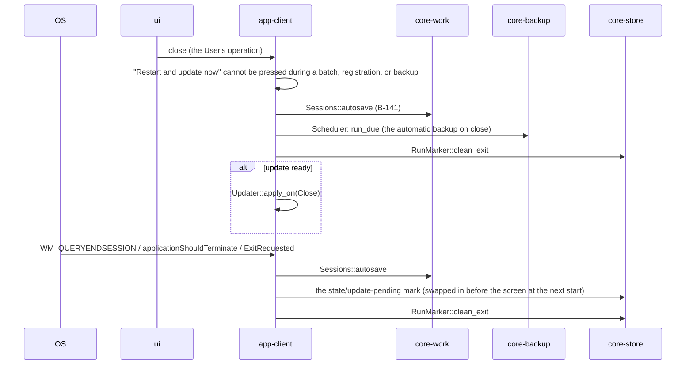

# S-01 Start-up

Origin: Chapter 1, 7 (start-up order, the eight states), 7.8, 9.3; Chapter 8, 4; Chapter 9, 4.1 and 4.4; Chapter 11, 3.1; Chapter 12, 4.3.

## S-01a Normal start-up (until the screen is shown; serial)
```mermaid
sequenceDiagram
  participant OS
  participant AC as app-client
  participant ST as core-store
  participant ID as core-identity
  participant RF as core-ref
  participant MK as core-mark
  participant UI as ui
  OS->>AC: launch
  AC->>AC: CPU check (x86-64-v3; Chapter 11, 3.1)
  alt not supported
    AC->>OS: dialog "This PC's CPU is not supported", then exit
  end
  AC->>AC: tauri-plugin-single-instance (9.3)
  alt second launch
    AC-->>AC: passes the arguments (photos, folders) to the first and exits (S-01c)
  end
  AC->>AC: launches itself as a child process with --crash-handler, then core-common CrashReport::init (Chapter 1, 10.3)
  AC->>ST: Paths::ensure_layout (B-020)
  AC->>AC: core-common Logging::init_logging(log_dir), Clock::init(state_dir) (the locations are passed from Paths)
  AC->>ST: RunMarker::last_exit_was_clean (B-026)
  AC->>ST: RunMarker::start
  AC->>ST: Settings::get (B-025; language, display)
  AC->>RF: Consent::consent_state (B-223)
  AC->>RF: Consent::terms_changed_since (Terms changed, then re-consent)
  AC->>ST: Schema::version_of / migrate (B-024; Chapter 9, 4.4)
  alt migration failed
    AC->>AC: state = migration failed (read-only)
  end
  AC->>RF: Store::minimum_version (B-224)
  alt version below
    AC->>AC: state = below the minimum version
  end
  AC->>ID: IdentityStore::current (B-080)
  alt none
    AC->>AC: state = before first run (S-02)
  else present
    AC->>ID: Keystore::status (B-090)
    alt Linux without Secret Service
      AC->>UI: startup_prompt (the passphrase dialog; Chapter 10, 3.6)
      UI->>AC: unlock_keystore (B-281)
      AC->>ID: Keystore::unlock
    end
    AC->>ID: IdentityStore::expiry_status (B-087)
    alt Stop20
      AC->>AC: state = over 20 years
    end
  end
  AC->>AC: state = normal / no consent
  AC->>UI: screen (receives B-295 webview_info; get_startup_state B-280)
  Note over AC: up to here is the "10 seconds" (Chapter 1, 14.1)
```

## S-01b Background after the screen is shown (a single queue; Chapter 1, 7)
```mermaid
sequenceDiagram
  participant AC as app-client
  participant Q as core-net Scheduler (B-044)
  participant SG as core-sign
  participant ST as core-store
  participant WK as core-work
  participant CS as core-case
  participant RF as core-ref
  participant BK as core-backup
  participant SY as core-sync
  participant UI as ui
  AC->>Q: schedule (the background order of Chapter 1, 7; a single queue)
  Q->>ST: RunMarker (if the previous run exited abnormally)
  alt previous run not closed properly
    Q->>SG: Exporter::cleanup_after_crash (B-168; deletes only the temporary names in export-queue.json)
    Q->>WK: Sessions::recover (B-141; Chapter 4, 11.5)
    Q->>CS: Registrar::resume_pending (B-194; continues from the step marks)
    Q->>UI: notice "The previous run did not end properly" (open from where it left off)
  end
  Q->>ST: Startup::verify_all_on_startup (B-032; from the heads; at most once a day)
  alt mismatching rows
    Q->>UI: notice STO (guides restoring from a backup)
  end
  Q->>SG: Timestamps::attach_pending_timestamps (B-163)
  Q->>SG: Timestamps::timestamp_chain_head / ers_update (B-164)
  Q->>RF: Fetcher::verify_update_manifest (B-222; regardless of consent)
  Q->>AC: Updater::download / verify, then update_ready (S-07c)
  Q->>RF: Fetcher::refresh (B-220; only with consent; skipped if within 24 hours)
  Q->>SG: Works::verify_originals (B-169)
  Q->>CS: Cases::verify_evidence_files (B-195)
  Q->>ST: Retention::sweep (B-028)
  Q->>BK: Scheduler::run_due (B-240)
  Q->>SY: Sync::sync_now (B-264)
  Q->>AC: AlarmsDue (core-guidance B-202 alarms_due, then notice and OS notification)
```

## S-01c Second launch, dropped files, deep-link
```mermaid
sequenceDiagram
  participant OS
  participant AC as app-client
  participant CS as core-case
  participant UI as ui
  OS->>AC: arguments of a second launch / drop onto the window
  AC->>UI: dropped_files [path] (B-294; the receiving screen per screen is Chapter 10, 8)
  OS->>AC: c2pa4cosplayer://import?path=… (B-340)
  AC->>AC: is the path under Downloads or the watched folder, and free of `..` (Chapter 6, 2.2.2)
  alt outside
    AC->>UI: prompts pick_files
  else
    AC->>CS: Capture::import_capture (B-182)
    AC->>UI: route(G-14, captured)
  end
  OS->>AC: .wacz in the watched folder (only while running; unimported ones are picked up at start)
  AC->>CS: Capture::import_capture
```

## S-01d Closing and OS shutdown (Chapter 9, 4.1)


## Gaps (found later and fixed)
- The serial start-up step “check for Terms changes” (Chapter 12, 4.3) was not in the note of `Startup::run` on app-client's page, so `terms_changed_since` was added to `Startup` in app-client.md (in line with S-01a of this file).
- When `state/update-pending` is placed and read existed only in app-client's data design, and the serial start-up (Chapter 1, 7) had no position for “swap in before showing the screen”, so, since the OS shutdown item of Chapter 9, 4.1 says “at the next start, before showing the screen”, “if `state/update-pending` exists, swap in the verified distributable (Chapter 9, 4.1)” was added at the head of the start-up order in Chapter 1, 7.
- The last item of the background queue, “deadline notices” (those missed while not running, Chapter 7, 6.3), was not in the background order of Chapter 1, 7, so it was added at the end of the background order in Chapter 1, 7.
