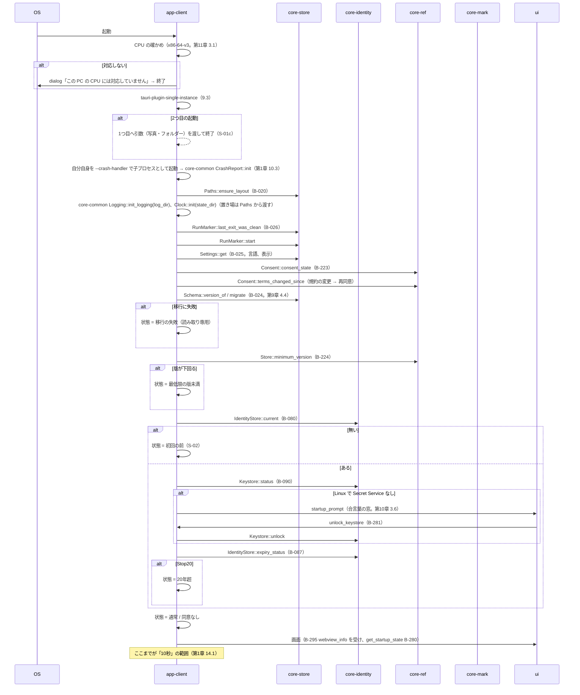
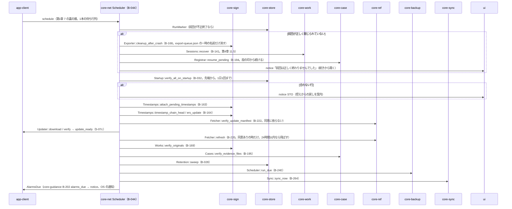
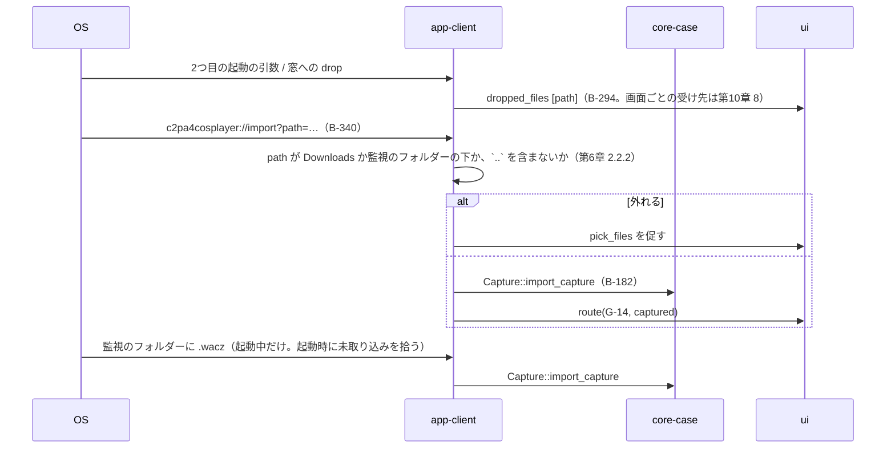
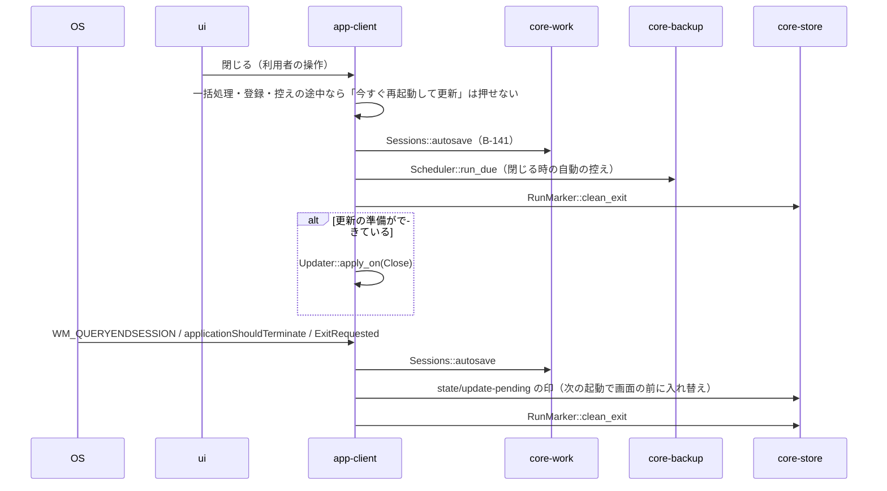

# S-01 起動

由来：第1章 7（起動の順序、8つの状態）、7.8、9.3、第8章 4、第9章 4.1・4.4、第11章 3.1、第12章 4.3。

## S-01a 通常の起動（画面を出すまで。直列）

## S-01b 画面を出した後の裏（1本の待ち行列。第1章 7）

## S-01c 2つ目の起動・落とされたファイル・deep-link

## S-01d 閉じる・OS の終了（第9章 4.1）

## 抜け（追って見つけ、直した）
- 起動の直列の段に「規約の変更の確かめ」（第12章 4.3）が app-client のページの `Startup::run` の注記に無かった → app-client.md の `Startup` に `terms_changed_since` を足した（本ファイルの S-01a に沿う）。
- `state/update-pending` を置く時と読む時が app-client のデータ設計にだけあり、起動の直列（第1章 7）に「画面を出す前に入れ替える」の位置が無かった → 第9章 4.1 の OS の終了の項に「次の起動で、画面を出す前に」とあるので、第1章 7 の起動の順序の先頭に「`state/update-pending` があれば検証済みの配布物で入れ替える（第9章 4.1）」を足した。
- 裏の待ち行列の最後の「期限の知らせ」（第7章 6.3 の起動していなかった分）が第1章 7 の裏の順に無かった → 第1章 7 の裏の順の末尾に足した。
