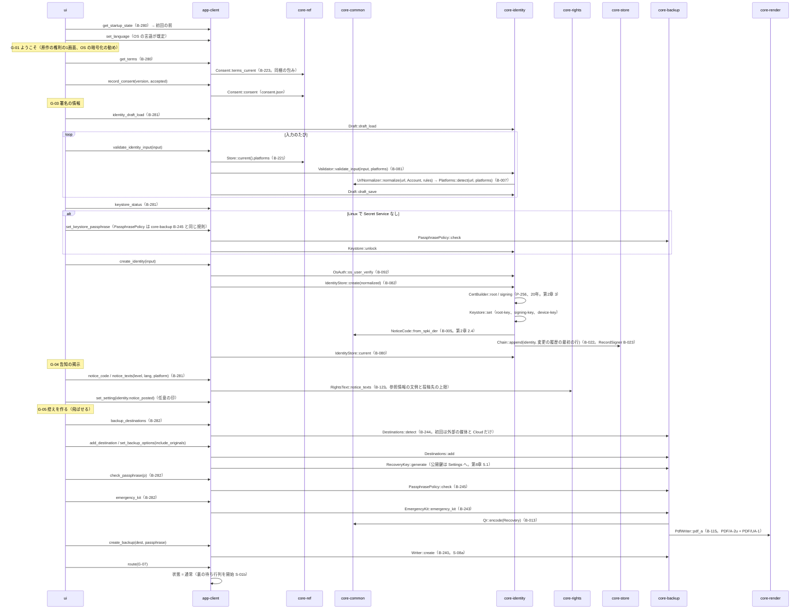

# S-02 初回（G-01 → G-02 → G-03 → G-04 → G-05 → G-07）

由来：第1章 7.1、第2章 2.1・2.3・2.4・3・7.1、第8章 5.1・5.5、第10章 3.2・6.1、第12章 4.3。

## 抜け（追って見つけ、直した）
- 回復の鍵をいつ作るかは第8章 5.1（最初の控えの置き場を決めた時）にあるが、core-backup のページの橋に「作る」操作が無かった → core-backup.md の `RecoveryKey::generate` は図にあるので、B-244 の `Destinations::add` の初回に `RecoveryKey::generate` を呼ぶと core-backup.md の橋の表 B-244 に注記した。
- 初回の G-03 で Linux の鍵保管の合言葉の強さの規則は第2章 7.5「控えの合言葉と同じ」→ app-client が core-backup の `PassphrasePolicy`（B-245）を使う。core-identity は core-backup に依存しないので、合言葉の確かめは app-client が先に行い、通ったものだけ `Keystore::unlock` に渡す（app-client.md の依存に1行）。
- 端末の鍵（`device-key`）を作る時が core-identity のページの `IdentityStore::create` に明記されていなかった → core-identity.md の `create` の注記に「端末の鍵も作る（第2章 7.1）」を足した。
