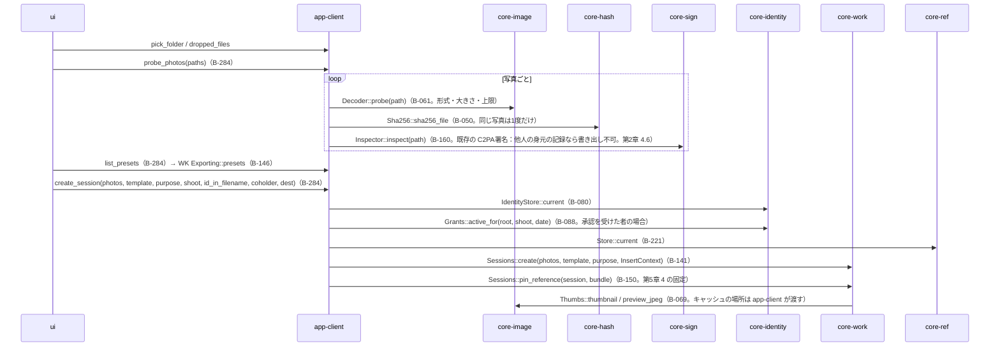
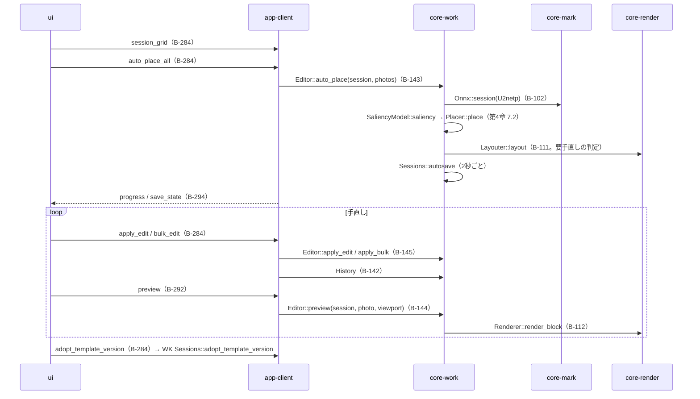
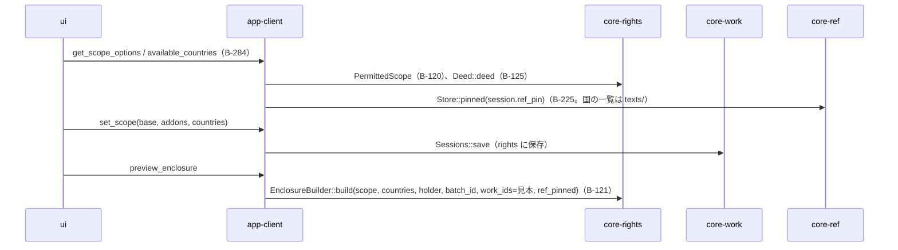
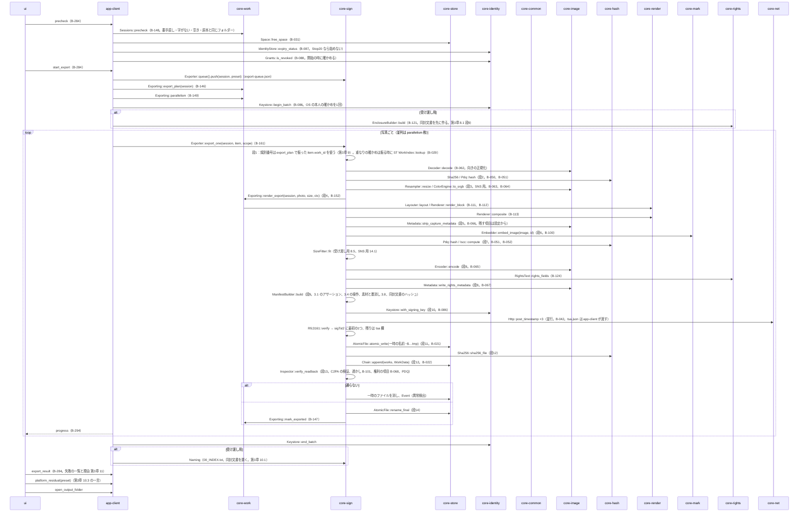
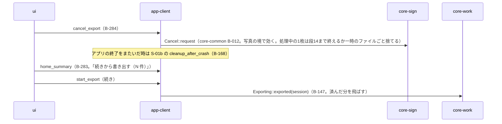

# S-03 書き出し（G-08 → G-09 → G-10 → G-11）

由来：第1章 7.2、第3章 2・8.1（14段）・9・10・11、第4章 7.2・11・12・14、第5章 3・4、第2章 4.6・5.4。

## S-03a 写真と用途（G-08）→ 作業

## S-03b 一括適用（G-09）

## S-03c 許可範囲（G-10。受け渡し用だけ）

## S-03d 実行（G-11。第3章 8.1 の14段）

## S-03e 取り消し・中断・再開

## 抜け（追って見つけ、直した）
- 開始の時の「承認書の取り消しの確かめ」（第2章 5.4）が app-client の precheck の流れに無かった → 本ファイルで `Grants::is_revoked` を precheck の後に置き、core-sign.md の依存の `Grants::is_revoked` は写真ごとではなく開始の時に app-client が呼ぶ旨を core-sign.md の依存に1行足した。
- `tsa.json` を渡す所：core-sign は core-ref に依存しない（core-sign.md）ので、`export_one` の引数に `tsa_set` が要る → core-sign.md の `Exporter::export_one` の引数に `tsa_set` を足した。
- 同封文書を「先に作る」（第3章 8.1 段9）のは一括処理の最初に1度だが、`00_RIGHTS.json` は全写真の識別番号の一覧を持ち（第5章 3.1）、識別番号は段1で写真ごとに振るため、最初の写真の段9の時点で一覧が確定しない → 識別番号を一括処理の開始の時に全写真の分を振ると第3章 9 に決めた（`Exporting::export_plan` が `WorkId` を各 `ExportItem` に持つ。core-work.md の B-146 に注記）。
- `Keystore::begin_batch` の位置（OS の本人の確かめを一括処理で1回）は第2章 7.4 にあるが流れの図に無かった → 本ファイルに置いた（ページは既にある）。

## 仕様に足した
- 第3章 9：識別番号は一括処理の開始の時に全写真の分を振り、同封文書はその番号で最初に1度作る。
